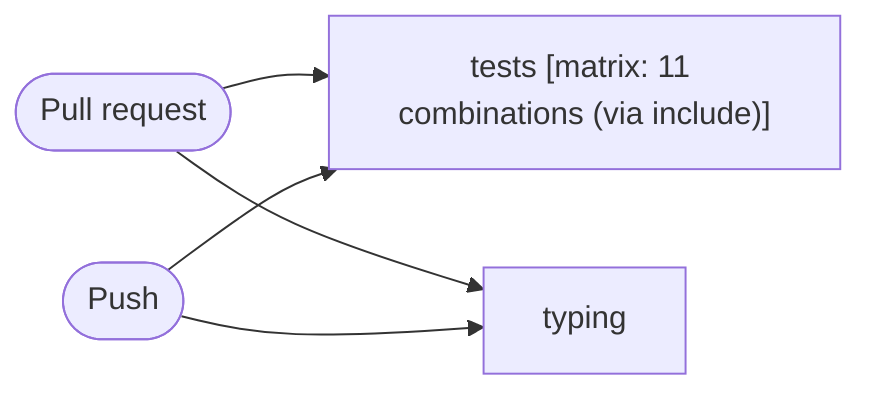

# Tests

```text
Pipeline: Tests
Source: tests/fixtures/flask_tests.yml (GitHub Actions)

TRIGGERS
- Runs on every pull request excluding paths docs/** or README.md
- Runs on every push to main or stable branches; excluding paths docs/** or README.md

JOBS (in order)
1. tests — runs on ${{ matrix.os || 'ubuntu-latest' }}; 4 steps; matrix: 11 combinations (via include)
   - actions/checkout
   - astral-sh/setup-uv
   - actions/setup-python
   - uv run --locked --no-default-groups --group dev tox run
2. typing — runs on ubuntu-latest; 5 steps
   - actions/checkout
   - astral-sh/setup-uv
   - actions/setup-python
   - cache mypy
   - uv run --locked --no-default-groups --group dev tox run -e typing
```

## Pipeline Diagram


