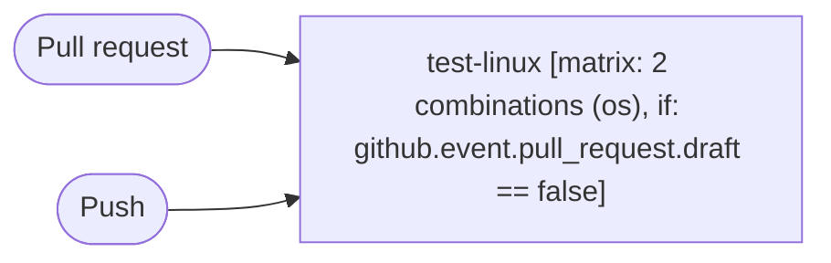

# Test Linux

```text
Pipeline: Test Linux
Source: tests/fixtures/node_test_linux.yml (GitHub Actions)

TRIGGERS
- Runs on every pull request excluding paths .mailmap or README.md or vcbuild.bat or tools/actions/** or tools/clang-format/** or tools/dep_updaters/** or test/internet/** or **.nix or .github/** or !.github/workflows/test-linux.yml
- Runs on every push to main or canary or v[0-9]+.x-staging or v[0-9]+.x branches; excluding paths .mailmap or README.md or vcbuild.bat or tools/actions/** or tools/clang-format/** or tools/dep_updaters/** or test/internet/** or **.nix or .github/** or !.github/workflows/test-linux.yml

JOBS (in order)
1. test-linux — runs on ${{ matrix.os }}; 9 steps; matrix: 2 combinations (os); condition: github.event.pull_request.draft == false
   - actions/checkout
   - Install Clang ${{ env.CLANG_VERSION }}
   - Install Rust ${{ env.RUSTC_VERSION }}
   - Set up Python ${{ env.PYTHON_VERSION }}
   - Set up sccache
   - Build
   - Test
   - Ensure running tests did not cause any change in the tree
   - Re-run test in a folder whose name contains unusual chars
```

## Pipeline Diagram


