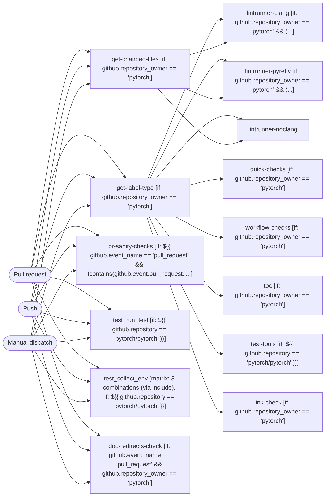

# Lint

```text
Pipeline: Lint
Source: tests/fixtures/pytorch_lint.yml (GitHub Actions)

TRIGGERS
- Runs on every pull request except branch nightly
- Runs on every push to main or release/* or landchecks/* branches; with tag matching ciflow/pull/* or ciflow/trunk/*
- Can be triggered manually

JOBS (in order)
1. get-label-type — delegates to reusable workflow pytorch/pytorch/.github/workflows/_runner-determinator.yml@main; condition: github.repository_owner == 'pytorch'
2. get-changed-files — delegates to reusable workflow ./.github/workflows/_get-changed-files.yml; condition: github.repository_owner == 'pytorch'
3. lintrunner-clang — delegates to reusable workflow ./.github/workflows/_lint.yml; after get-label-type, get-changed-files; condition: github.repository_owner == 'pytorch' && (
  needs.get-changed-files.outputs.changed-files == '*' ||
  contains(needs.get-changed-files.outputs.changed-files, '.h') ||
  contains(needs.get-changed-files.outputs.changed-files, '.cpp') ||
  contains(needs.get-changed-files.outputs.changed-files, '.cc') ||
  contains(needs.get-changed-files.outputs.changed-files, '.cxx') ||
  contains(needs.get-changed-files.outputs.changed-files, '.hpp') ||
  contains(needs.get-changed-files.outputs.changed-files, '.hxx') ||
  contains(needs.get-changed-files.outputs.changed-files, '.cu') ||
  contains(needs.get-changed-files.outputs.changed-files, '.cuh') ||
  contains(needs.get-changed-files.outputs.changed-files, '.mm') ||
  contains(needs.get-changed-files.outputs.changed-files, '.metal')
)

4. lintrunner-pyrefly — delegates to reusable workflow ./.github/workflows/_lint.yml; after get-label-type, get-changed-files; condition: github.repository_owner == 'pytorch' && (
  needs.get-changed-files.outputs.changed-files == '*' ||
  contains(needs.get-changed-files.outputs.changed-files, '.py') ||
  contains(needs.get-changed-files.outputs.changed-files, '.pyi')
)

5. lintrunner-noclang — delegates to reusable workflow ./.github/workflows/_lint.yml; after get-label-type, get-changed-files
6. quick-checks — delegates to reusable workflow ./.github/workflows/_lint.yml; after get-label-type; condition: github.repository_owner == 'pytorch'
7. pr-sanity-checks — runs on linux.24_04.4x; 2 steps; condition: ${{ github.event_name == 'pull_request' && !contains(github.event.pull_request.labels.*.name, 'skip-pr-sanity-checks') && github.repository_owner == 'pytorch' }}
   - Checkout PyTorch
   - PR size check (nonretryable)
8. workflow-checks — delegates to reusable workflow ./.github/workflows/_lint.yml; after get-label-type; condition: github.repository_owner == 'pytorch'
9. toc — delegates to reusable workflow ./.github/workflows/_lint.yml; after get-label-type; condition: github.repository_owner == 'pytorch'
10. test-tools — delegates to reusable workflow ./.github/workflows/_lint.yml; after get-label-type; condition: ${{ github.repository == 'pytorch/pytorch' }}
11. test_run_test — runs on linux.24_04.4x; 4 steps; condition: ${{ github.repository == 'pytorch/pytorch' }}
   - Checkout PyTorch
   - Setup Python 3.10
   - Install dependencies
   - Run run_test.py (nonretryable)
12. test_collect_env — runs on ${{ matrix.runner }}; 6 steps; matrix: 3 combinations (via include); condition: ${{ github.repository == 'pytorch/pytorch' }}
   - Checkout PyTorch
   - Get min python version
   - Setup Old Python version
   - Setup Min Python version
   - Install torch
   - Run collect_env.py (nonretryable)
13. link-check — delegates to reusable workflow ./.github/workflows/_link_check.yml; after get-label-type; condition: github.repository_owner == 'pytorch'
14. doc-redirects-check — runs on linux.24_04.4x; 2 steps; condition: github.event_name == 'pull_request' && github.repository_owner == 'pytorch'
   - Checkout PyTorch
   - Doc redirects check (nonretryable)

LINKED WORKFLOWS
- calls pytorch/pytorch/.github/workflows/_runner-determinator.yml@main
- calls ./.github/workflows/_get-changed-files.yml
- calls ./.github/workflows/_lint.yml
- calls ./.github/workflows/_link_check.yml
```

## Pipeline Diagram


