# Validate Python e2e

```text
Pipeline: Validate Python e2e
Source: tests/fixtures/setup_python_test.yml (GitHub Actions)

AT A GLANCE
This workflow runs on pushes to `main`, pull requests, a scheduled run (cron `30 3 * * *`), and manual dispatch.
It contains 14 jobs, with no job dependencies, so GitHub may run them in parallel.
14 of 14 jobs use a build matrix; 13 of them define 329 configured combinations between them (1 more job's matrix size not reflected in that total).

WHEN IT RUNS
- Runs on every push to main branch; excluding paths **.md
- Runs on every pull request excluding paths **.md
- Runs on a schedule (30 3 * * *)
- Can be triggered manually

EXECUTION SUMMARY
Independent jobs (no dependencies): setup-versions-from-manifest, setup-versions-from-file, setup-versions-from-file-without-parameter, setup-versions-from-standard-pyproject-file, setup-versions-from-poetry-pyproject-file, setup-versions-from-tool-versions-file, setup-versions-from-pipfile-with-python_version, setup-versions-from-pipfile-with-python_full_version, setup-pre-release-version-from-manifest, setup-dev-version, setup-prerelease-version, setup-versions-noenv, check-latest, setup-python-multiple-python-versions

IMPLEMENTATION DETAILS
1. setup-versions-from-manifest — runs on ${{ matrix.os }}; 5 steps; matrix: 35 combinations (os, python)
   - Checkout
   - setup-python ${{ matrix.python }}
   - Check python-path
   - Validate version
   - Run simple code
2. setup-versions-from-file — runs on ${{ matrix.os }}; 6 steps; matrix: 35 combinations (os, python)
   - Checkout
   - build-version-file ${{ matrix.python }}
   - setup-python ${{ matrix.python }}
   - Check python-path
   - Validate version
   - Run simple code
3. setup-versions-from-file-without-parameter — runs on ${{ matrix.os }}; 6 steps; matrix: 35 combinations (os, python)
   - Checkout
   - build-version-file ${{ matrix.python }}
   - setup-python ${{ matrix.python }}
   - Check python-path
   - Validate version
   - Run simple code
4. setup-versions-from-standard-pyproject-file — runs on ${{ matrix.os }}; 6 steps; matrix: 35 combinations (os, python)
   - Checkout
   - build-version-file ${{ matrix.python }}
   - setup-python ${{ matrix.python }}
   - Check python-path
   - Validate version
   - Run simple code
5. setup-versions-from-poetry-pyproject-file — runs on ${{ matrix.os }}; 6 steps; matrix: 35 combinations (os, python)
   - Checkout
   - build-version-file ${{ matrix.python }}
   - setup-python ${{ matrix.python }}
   - Check python-path
   - Validate version
   - Run simple code
6. setup-versions-from-tool-versions-file — runs on ${{ matrix.os }}; 3 steps; matrix: up to 28 combinations (os, python), 1 excluded
   - Checkout
   - build-tool-versions-file ${{ matrix.python }}
   - setup-python using .tool-versions ${{ matrix.python }}
7. setup-versions-from-pipfile-with-python_version — runs on ${{ matrix.os }}; 6 steps; matrix: 28 combinations (os, python)
   - Checkout
   - build-version-file ${{ matrix.python }}
   - setup-python ${{ matrix.python }}
   - Check python-path
   - Validate version
   - Run simple code
8. setup-versions-from-pipfile-with-python_full_version — runs on ${{ matrix.os }}; 6 steps; matrix: 28 combinations (os, python)
   - Checkout
   - build-version-file ${{ matrix.python }}
   - setup-python ${{ matrix.python }}
   - Check python-path
   - Validate version
   - Run simple code
9. setup-pre-release-version-from-manifest — runs on ${{ matrix.os }}; 5 steps; matrix: 7 combinations (os)
   - Checkout
   - setup-python 3.14.0-alpha.6
   - Check python-path
   - Validate version
   - Run simple code
10. setup-dev-version — runs on ${{ matrix.os }}; 5 steps; matrix: 7 combinations (os)
   - Checkout
   - setup-python 3.14-dev
   - Check python-path
   - Validate version
   - Run simple code
11. setup-prerelease-version — runs on ${{ matrix.os }}; 5 steps; matrix: 7 combinations (os)
   - Checkout
   - setup-python 3.14
   - Check python-path
   - Validate version
   - Run simple code
12. setup-versions-noenv — runs on ${{ matrix.os }}; 4 steps; matrix: 35 combinations (os, python)
   - Checkout
   - setup-python ${{ matrix.python }}
   - Python version
   - Run simple code
13. check-latest — runs on ${{ matrix.os }}; 3 steps; matrix: 35 combinations (os, python-version)
   - actions/checkout@v6
   - Setup Python and check latest
   - Validate version
14. setup-python-multiple-python-versions — runs on ${{ matrix.os }}; 3 steps; matrix: 7 combinations (os)
   - actions/checkout@v6
   - Setup Python and check latest
   - Validate version
```

## Pipeline Diagram

```mermaid
flowchart LR
    setup-versions-from-manifest["setup-versions-from-manifest [matrix: 35 combinations (os, python)]"]
    setup-versions-from-file["setup-versions-from-file [matrix: 35 combinations (os, python)]"]
    setup-versions-from-file-without-parameter["setup-versions-from-file-without-parameter [matrix: 35 combinations (os, python)]"]
    setup-versions-from-standard-pyproject-file["setup-versions-from-standard-pyproject-file [matrix: 35 combinations (os, python)]"]
    setup-versions-from-poetry-pyproject-file["setup-versions-from-poetry-pyproject-file [matrix: 35 combinations (os, python)]"]
    setup-versions-from-tool-versions-file["setup-versions-from-tool-versions-file [matrix: up to 28 combinations (os, python), 1 excluded]"]
    setup-versions-from-pipfile-with-python_version["setup-versions-from-pipfile-with-python_version [matrix: 28 combinations (os, python)]"]
    setup-versions-from-pipfile-with-python_full_version["setup-versions-from-pipfile-with-python_full_version [matrix: 28 combinations (os, python)]"]
    setup-pre-release-version-from-manifest["setup-pre-release-version-from-manifest [matrix: 7 combinations (os)]"]
    setup-dev-version["setup-dev-version [matrix: 7 combinations (os)]"]
    setup-prerelease-version["setup-prerelease-version [matrix: 7 combinations (os)]"]
    setup-versions-noenv["setup-versions-noenv [matrix: 35 combinations (os, python)]"]
    check-latest["check-latest [matrix: 35 combinations (os, python-version)]"]
    setup-python-multiple-python-versions["setup-python-multiple-python-versions [matrix: 7 combinations (os)]"]
```


