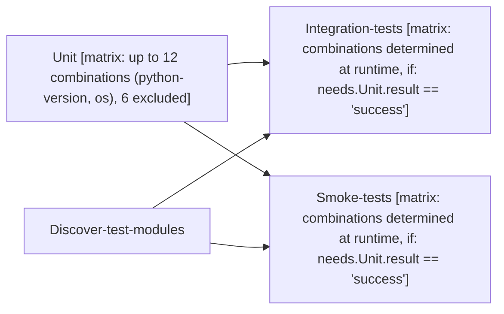

# Tier 4 scoring — celery_python_package

Pre-registered checklist: `evaluation/tier4_checklists/celery_python_package.checklist.yml` (open separately -- not duplicated here).

Score each condition fact-by-fact against the checklist: present / missing / false (hallucination). Presentation order below is randomized per EVALUATION_PLAN.md's Method 9 bias mitigation -- the mapping back to conditions 1/2/3 is in `celery_python_package.answer_key.md`, intentionally kept out of this file.

---

## Condition A

# Celery

<!-- llm-overview:start -->
## Overview

The Celery pipeline is a GitHub Actions workflow defined in `celery_python_package.yml` with `contents: read` permissions. It runs on every push to the `main` branch and on every pull request targeting `main`, provided changes touch Python files (`**.py`), text files (`**.txt`), TOML files (`**.toml`), `tox.ini`, or the workflow files `.github/workflows/python-package.yml`, `.github/workflows/integration-tests.yml`, or `.github/workflows/smoke-tests.yml`. The pipeline can also be triggered manually.

This workflow contains four jobs, with three of them utilizing a build matrix. The `Unit` and `Discover-test-modules` jobs run independently. The `Unit` job runs on a matrix of operating systems, using up to 12 combinations of Python versions and OS, with 6 excluded. Its steps include installing apt packages, checking out the repository, setting up Python, installing tox, running tox for unit tests, and uploading test results to Codecov using the `CODECOV_TOKEN` secret. The `Discover-test-modules` job runs on `blacksmith-4vcpu-ubuntu-2404`, checking out the repository and discovering test module paths.

Following these, the `Integration-tests` and `Smoke-tests` jobs execute after both `Unit` and `Discover-test-modules` have completed, provided the `Unit` job was successful. Both `Integration-tests` and `Smoke-tests` delegate to reusable workflows (`./.github/workflows/integration-tests.yml` and `./.github/workflows/smoke-tests.yml` respectively), passing a `test_path` parameter, with their matrix combinations determined at runtime.
<!-- llm-overview:end -->

```text
Pipeline: Celery
Source: /home/user/what-is-my-pipeline-doing/evaluation/held_out_workflows/celery_python_package.yml (GitHub Actions)
Permissions: contents: read

AT A GLANCE
This workflow runs on pushes to `main`, pull requests, and manual dispatch.
It contains 4 jobs: 2 with no declared dependencies, 2 depending on other jobs.
3 of 4 jobs use a build matrix.

WHEN IT RUNS
- Runs on every push to main branch; touching path **.py or **.txt or .github/workflows/python-package.yml or .github/workflows/integration-tests.yml or .github/workflows/smoke-tests.yml or **.toml or tox.ini
- Runs on every pull request targeting main branch; touching path **.py or **.txt or **.toml or .github/workflows/python-package.yml or .github/workflows/integration-tests.yml or .github/workflows/smoke-tests.yml or tox.ini
- Can be triggered manually

EXECUTION SUMMARY
Independent jobs (no dependencies): Unit, Discover-test-modules
Integration-tests runs after Unit, Discover-test-modules
Smoke-tests runs after Unit, Discover-test-modules

IMPLEMENTATION DETAILS
1. Unit — runs on ${{ matrix.os }}; 7 steps; matrix: up to 12 combinations (python-version, os), 6 excluded
   - Install apt packages
   - actions/checkout@v7 (https://github.com/actions/checkout)
   - Set up Python ${{ matrix.python-version }} (https://github.com/actions/setup-python)
   - Install tox
   - Run tox for "${{ matrix.python-version }}-unit"

   - codecov/codecov-action@v7 (https://github.com/codecov/codecov-action)
   - Upload test results to Codecov (https://github.com/codecov/codecov-action)
2. Discover-test-modules — runs on blacksmith-4vcpu-ubuntu-2404; 2 steps
   - actions/checkout@v7 (https://github.com/actions/checkout)
   - Discover test module paths
3. Integration-tests — delegates to reusable workflow ./.github/workflows/integration-tests.yml; with: test_path: ${{ matrix.test_path }}; matrix: combinations determined at runtime; after Unit, Discover-test-modules; condition: needs.Unit.result == 'success'
4. Smoke-tests — delegates to reusable workflow ./.github/workflows/smoke-tests.yml; with: test_path: ${{ matrix.test_path }}; matrix: combinations determined at runtime; after Unit, Discover-test-modules; condition: needs.Unit.result == 'success'

LINKED WORKFLOWS
- calls ./.github/workflows/integration-tests.yml
- calls ./.github/workflows/smoke-tests.yml

SECRETS REQUIRED
- CODECOV_TOKEN (used in job: Unit, step: codecov/codecov-action@v7)
- CODECOV_TOKEN (used in job: Unit, step: Upload test results to Codecov)
```

## Pipeline Diagram



---

## Condition B

This CI/CD pipeline, named "Celery," is a GitHub Actions workflow designed to ensure the quality and functionality of a Python project, likely the Celery distributed task queue, by running a comprehensive suite of tests across various environments.

Here's a breakdown of what it does:

## Overall Purpose

The pipeline automates the process of:
1.  **Running Unit Tests:** Verifying individual components of the code.
2.  **Discovering Test Modules:** Dynamically identifying integration and smoke test files.
3.  **Running Integration Tests:** Testing how different parts of the system work together.
4.  **Running Smoke Tests:** Performing quick, high-level tests to ensure core functionality is working.
5.  **Reporting Code Coverage:** Tracking how much of the code is covered by tests.

It does this across multiple Python versions and operating systems (though with specific exclusions).

## When it Runs (Triggers - `on`)

The pipeline is triggered in the following scenarios:

*   **`push` to `main` branch:** Whenever code is pushed directly to the `main` branch.
*   **`pull_request` targeting `main` branch:** When a pull request is opened or updated that targets the `main` branch.
*   **`workflow_dispatch`:** Allows developers to manually trigger the workflow from the GitHub Actions UI.

**Important Path Filtering:** The pipeline is optimized to only run if changes are detected in specific file types or locations:
*   Python files (`.py`)
*   Text files (`.txt`)
*   TOML configuration files (`.toml`)
*   The `tox.ini` configuration file (used for testing environments)
*   The workflow definition files themselves (`.github/workflows/python-package.yml`, `integration-tests.yml`, `smoke-tests.yml`).
    This prevents unnecessary runs for changes to documentation, images, or other unrelated files.

## Permissions

*   `contents: read`: Grants the workflow permission to read the repository's code, which is necessary for checking out the project.

## Jobs Breakdown

The pipeline consists of four main jobs, some of which run in parallel or depend on others:

### 1. `Unit` Job

This job focuses on running unit tests and linting.

*   **Runs On:** A matrix of different Python versions and operating systems.
    *   **Python Versions:** `3.10`, `3.11`, `3.12`, `3.13`, `3.14` (including pre-releases), and `pypy3.11`. This ensures broad compatibility.
    *   **Operating Systems:** A custom Ubuntu runner (`blacksmith-4vcpu-ubuntu-2404`) and `windows-latest`.
    *   **Exclusion:** Crucially, **all Windows runs are excluded**. This means unit tests are *only executed on the custom Ubuntu runner*.
*   **Strategy:** `fail-fast: false` means that if one combination of Python version/OS fails, the other matrix jobs will continue to run, providing a complete picture of failures.
*   **Steps:**
    *   **Install apt packages:** (Conditional) If running on the Ubuntu runner, it installs several system libraries (`libcurl`, `libev`, `libssl`, `libgnutls`, `httping`, `expect`, `libmemcached-dev`). These are likely dependencies for C extensions or specific network/database interactions within the Python project.
    *   **Checkout Code:** Fetches the repository's code.
    *   **Set up Python:** Configures the specified Python version, allows pre-releases, and caches `pip` dependencies based on `setup.py` to speed up subsequent runs.
    *   **Install tox:** Installs `tox` (a tool for automating testing in multiple Python environments) and `tox-gh-actions` (for better integration with GitHub Actions).
    *   **Run tox:** Executes `tox` with verbose output. It's configured to run the "unit" test environment for each Python version. It has a `timeout-minutes: 30`, indicating these tests can be substantial.
    *   **Upload test coverage to Codecov:** Sends the generated code coverage report for unit tests to Codecov. The job will fail if this upload fails.
    *   **Upload test results to Codecov:** (Conditional) Uploads general test results (not just coverage) to Codecov, even if previous steps failed, as long as the job wasn't manually cancelled. This ensures test result data is always collected.

### 2. `Discover-test-modules` Job

This job identifies the specific integration and smoke test files that need to be run.

*   **Runs On:** The custom Ubuntu runner (`blacksmith-4vcpu-ubuntu-2404`).
*   **Outputs:** It produces two outputs: `integration` and `smoke`, which are JSON arrays of file paths.
*   **Steps:**
    *   **Checkout Code (Sparse):** Only checks out the `t/integration` and `t/smoke/tests` directories. This is an optimization to speed up the checkout process as only these files are needed.
    *   **Discover test module paths:**
        *   Uses `find` to locate all Python files starting with `test_` within `t/integration` and `t/smoke/tests`.
        *   Formats these paths into JSON arrays using `jq`.
        *   If no integration or smoke test modules are found, the job fails.
        *   Sets the `integration` and `smoke` outputs for other jobs to consume.

### 3. `Integration-tests` Job

This job runs the integration tests.

*   **Dependencies (`needs`):** It requires both the `Unit` job and the `Discover-test-modules` job to complete successfully before it starts.
*   **Condition (`if`):** It only runs if the `Unit` job passed (`needs.Unit.result == 'success'`). This prevents running integration tests if basic unit tests are already failing.
*   **Strategy (Dynamic Matrix):** It uses a dynamic matrix based on the `integration` output from `Discover-test-modules`. This means a separate, parallel job will be created for *each* integration test file discovered.
*   **Reusable Workflow:** It uses a separate, reusable workflow defined at `.github/workflows/integration-tests.yml` to execute each integration test. This promotes modularity and reusability of the integration test logic.
*   **Inputs:** It passes the specific `test_path` (the path to an individual integration test file) to the reusable workflow.

### 4. `Smoke-tests` Job

This job runs the smoke tests.

*   **Dependencies (`needs`):** Similar to integration tests, it requires `Unit` and `Discover-test-modules` to complete successfully.
*   **Condition (`if`):** It only runs if the `Unit` job passed.
*   **Strategy (Dynamic Matrix):** It uses a dynamic matrix based on the `smoke` output from `Discover-test-modules`, creating a separate, parallel job for *each* smoke test file.
*   **Reusable Workflow:** It uses another separate, reusable workflow defined at `.github/workflows/smoke-tests.yml` to execute each smoke test.
*   **Inputs:** It passes the specific `test_path` (the path to an individual smoke test file) to the reusable workflow.

## In Summary

This CI/CD pipeline is a robust and well-structured system for testing a Python project. It prioritizes:
*   **Comprehensive Testing:** Covering unit, integration, and smoke tests across multiple Python versions.
*   **Efficiency:** Using path filtering, sparse checkouts, dependency caching, and parallel execution of tests to speed up the pipeline.
*   **Code Quality:** Integrating `tox` for environment management and `Codecov` for coverage and test result reporting.
*   **Modularity:** Leveraging reusable workflows for integration and smoke tests.
*   **Dependency Management:** Ensuring that more complex tests (integration, smoke) only run if foundational tests (unit) pass.

---

## Condition C

Pipeline: Celery
Source: /home/user/what-is-my-pipeline-doing/evaluation/held_out_workflows/celery_python_package.yml (GitHub Actions)
Permissions: contents: read

AT A GLANCE
This workflow runs on pushes to `main`, pull requests, and manual dispatch.
It contains 4 jobs: 2 with no declared dependencies, 2 depending on other jobs.
3 of 4 jobs use a build matrix.

WHEN IT RUNS
- Runs on every push to main branch; touching path **.py or **.txt or .github/workflows/python-package.yml or .github/workflows/integration-tests.yml or .github/workflows/smoke-tests.yml or **.toml or tox.ini
- Runs on every pull request targeting main branch; touching path **.py or **.txt or **.toml or .github/workflows/python-package.yml or .github/workflows/integration-tests.yml or .github/workflows/smoke-tests.yml or tox.ini
- Can be triggered manually

EXECUTION SUMMARY
Independent jobs (no dependencies): Unit, Discover-test-modules
Integration-tests runs after Unit, Discover-test-modules
Smoke-tests runs after Unit, Discover-test-modules

IMPLEMENTATION DETAILS
1. Unit — runs on ${{ matrix.os }}; 7 steps; matrix: up to 12 combinations (python-version, os), 6 excluded
   - Install apt packages
   - actions/checkout@v7 (https://github.com/actions/checkout)
   - Set up Python ${{ matrix.python-version }} (https://github.com/actions/setup-python)
   - Install tox
   - Run tox for "${{ matrix.python-version }}-unit"

   - codecov/codecov-action@v7 (https://github.com/codecov/codecov-action)
   - Upload test results to Codecov (https://github.com/codecov/codecov-action)
2. Discover-test-modules — runs on blacksmith-4vcpu-ubuntu-2404; 2 steps
   - actions/checkout@v7 (https://github.com/actions/checkout)
   - Discover test module paths
3. Integration-tests — delegates to reusable workflow ./.github/workflows/integration-tests.yml; with: test_path: ${{ matrix.test_path }}; matrix: combinations determined at runtime; after Unit, Discover-test-modules; condition: needs.Unit.result == 'success'
4. Smoke-tests — delegates to reusable workflow ./.github/workflows/smoke-tests.yml; with: test_path: ${{ matrix.test_path }}; matrix: combinations determined at runtime; after Unit, Discover-test-modules; condition: needs.Unit.result == 'success'

LINKED WORKFLOWS
- calls ./.github/workflows/integration-tests.yml
- calls ./.github/workflows/smoke-tests.yml

SECRETS REQUIRED
- CODECOV_TOKEN (used in job: Unit, step: codecov/codecov-action@v7)
- CODECOV_TOKEN (used in job: Unit, step: Upload test results to Codecov)

---
