# Tier 4 scoring — nextjs_build_and_test

Pre-registered checklist: `evaluation/tier4_checklists/nextjs_build_and_test.checklist.yml` (open separately -- not duplicated here).

Score each condition fact-by-fact against the checklist: present / missing / false (hallucination). Presentation order below is randomized per EVALUATION_PLAN.md's Method 9 bias mitigation -- the mapping back to conditions 1/2/3 is in `nextjs_build_and_test.answer_key.md`, intentionally kept out of this file.

---

## Condition A

Pipeline: build-and-test
Source: /home/user/what-is-my-pipeline-doing/evaluation/held_out_workflows/nextjs_build_and_test.yml (GitHub Actions)
Concurrency: group ${{ github.event_name == 'pull_request' && format('{0}-pr-{1}', github.workflow, github.ref_name) || format('{0}-sha-{1}', github.workflow, github.sha) }}; cancels in-progress runs

AT A GLANCE
This workflow runs on pushes to `canary` and pull requests.
It contains 40 jobs: 5 with no declared dependencies, 35 depending on other jobs.
17 of 40 jobs use a build matrix; 11 of them define 47 configured combinations between them (6 more jobs' matrix sizes not reflected in that total).

WHEN IT RUNS
- Runs on every push to canary branch
- Runs on every pull request

EXECUTION SUMMARY
Independent jobs (no dependencies): optimize-ci, changes, pr-ci-metadata, build-next, validate-docs-links
build-native runs after changes
build-native-windows runs after changes
fetch-test-timings runs after changes
lint runs after build-next
check-types-precompiled runs after changes, build-native, build-next
test-cargo-unit runs after changes, build-next
test-bench runs after optimize-ci, changes, build-next
rust-check runs after changes, build-next
rustdoc-check runs after changes, build-next
ast-grep runs after changes, build-next
devlow-bench runs after optimize-ci, changes, build-next, build-native
test-devlow runs after optimize-ci, changes
test-turbopack-dev runs after optimize-ci, changes, build-next, build-native, fetch-test-timings
test-turbopack-production runs after optimize-ci, changes, build-next, build-native, fetch-test-timings
test-rspack-dev runs after optimize-ci, changes, build-next, build-native, fetch-test-timings
test-rspack-production runs after optimize-ci, changes, build-next, build-native, fetch-test-timings
test-next-swc-wasm runs after optimize-ci, changes, build-next
test-next-napi-bindings-wasi runs after optimize-ci, changes, build-next
test-unit runs after changes, build-next, build-native
test-next-config-ts-native-ts-dev runs after changes, build-next, build-native
test-next-config-ts-native-ts-prod runs after changes, build-next, build-native
test-unit-windows runs after changes, build-native-windows, build-next
test-new-tests-dev runs after optimize-ci, changes, build-native, build-next
test-new-tests-start runs after optimize-ci, changes, build-native, build-next
test-dev runs after optimize-ci, changes, build-native, build-next, fetch-test-timings
test-dev-windows runs after optimize-ci, changes, build-native-windows, build-next
test-integration-windows runs after optimize-ci, changes, build-native-windows, build-next
test-prod-windows runs after optimize-ci, changes, build-native-windows, build-next
test-prod runs after optimize-ci, changes, build-native, build-next, fetch-test-timings
test-new-tests-deploy runs after optimize-ci, test-prod, test-new-tests-dev, test-new-tests-start
test-firefox-safari runs after optimize-ci, changes, build-native, build-next
test-cache-components-dev runs after optimize-ci, changes, build-native, build-next, fetch-test-timings
test-cache-components-prod runs after optimize-ci, changes, build-native, build-next, fetch-test-timings
test-new-tests-deploy-cache-components runs after optimize-ci, test-cache-components-prod, test-new-tests-dev, test-new-tests-start
tests-pass runs after optimize-ci, changes, build-native, build-next, fetch-test-timings, lint, validate-docs-links, check-types-precompiled, test-unit, test-next-config-ts-native-ts-dev, test-next-config-ts-native-ts-prod, test-dev, test-prod, test-firefox-safari, test-cache-components-dev, test-cache-components-prod, test-cargo-unit, rust-check, rustdoc-check, test-next-swc-wasm, test-turbopack-dev, test-new-tests-dev, test-new-tests-start, test-new-tests-deploy, test-new-tests-deploy-cache-components, test-turbopack-production, test-unit-windows, test-dev-windows, test-integration-windows, test-prod-windows

IMPLEMENTATION DETAILS
1. optimize-ci — delegates to reusable workflow ./.github/workflows/pr_stack_optimizer.yml
2. changes — runs on ubuntu-latest; 3 steps; permissions: contents: read
   - actions/checkout (https://github.com/actions/checkout)
   - check for docs only change
   - check for release
3. pr-ci-metadata — runs on ubuntu-latest; 2 steps; condition: event name == 'pull_request'; permissions: contents: read
   - Write PR metadata
   - Upload PR metadata (https://github.com/actions/upload-artifact)
4. build-native — delegates to reusable workflow ./.github/workflows/build_reusable.yml; with: skipInstallBuild: yes, stepName: build-native, uploadNativeArtifact: true; after changes; condition: ${{ needs.changes.outputs.docs-only == 'false' }}
5. build-native-windows — delegates to reusable workflow ./.github/workflows/build_reusable.yml; with: skipInstallBuild: yes, stepName: build-native-windows, runs_on_labels: ["windows-latest-8-core-oss"], uploadNativeArtifact: true; after changes; condition: ${{ needs.changes.outputs.docs-only == 'false' }}
6. build-next — delegates to reusable workflow ./.github/workflows/build_reusable.yml; with: needsPlaywright: no, skipNativeBuild: yes, stepName: build-next
7. fetch-test-timings — runs on ubuntu-latest; 9 steps; after changes; condition: ${{ needs.changes.outputs.docs-only == 'false' }}
   - Setup Node.js (https://github.com/actions/setup-node)
   - Setup pnpm
   - Checkout (https://github.com/actions/checkout)
   - Get pnpm store directory
   - Cache pnpm store (https://github.com/actions/cache)
   - Install dependencies
   - Fetch test timings
   - Ensure test timings file exists
   - Upload test timings (https://github.com/actions/upload-artifact)
8. lint — delegates to reusable workflow ./.github/workflows/build_reusable.yml; with: needsPlaywright: no, skipNativeBuild: yes, skipNativeInstall: yes, afterBuild: pnpm lint-no-typescript [+7 more lines], stepName: lint; after build-next
9. validate-docs-links — runs on ubuntu-latest; 4 steps
   - actions/checkout (https://github.com/actions/checkout)
   - actions/setup-node (https://github.com/actions/setup-node)
   - Setup corepack
   - Run link checker
10. check-types-precompiled — delegates to reusable workflow ./.github/workflows/build_reusable.yml; with: needsPlaywright: no, afterBuild: pnpm types-and-precompiled, stepName: types-and-precompiled; after changes, build-native, build-next
11. test-cargo-unit — delegates to reusable workflow ./.github/workflows/build_reusable.yml; with: needsRust: yes, needsNextest: yes, skipNativeBuild: yes, skipInstallBuild: yes, afterBuild: pnpm dlx turbo@${TURBO_VERSION} run test-cargo-unit ${TURBO_ARGS}, stepName: test-cargo-unit, runs_on_labels: ["ubuntu-latest-16-core-oss"]; after changes, build-next; condition: ${{ needs.changes.outputs.docs-only == 'false' }}
12. test-bench — delegates to reusable workflow ./.github/workflows/test-turbopack-rust-bench-test.yml; after optimize-ci, changes, build-next; condition: ${{ needs.optimize-ci.outputs.skip == 'false' && needs.changes.outputs.docs-only == 'false' }}
13. rust-check — delegates to reusable workflow ./.github/workflows/build_reusable.yml; with: needsRust: yes, skipInstallBuild: yes, skipNativeBuild: yes, afterBuild: pnpm dlx turbo@${TURBO_VERSION} run rust-check ${TURBO_ARGS}, stepName: rust-check; after changes, build-next; condition: ${{ needs.changes.outputs.docs-only == 'false' }}
14. rustdoc-check — delegates to reusable workflow ./.github/workflows/build_reusable.yml; with: needsRust: yes, skipInstallBuild: yes, skipNativeBuild: yes, afterBuild: ./scripts/deploy-turbopack-docs.sh, stepName: rustdoc-check; after changes, build-next; condition: ${{ needs.changes.outputs.docs-only == 'false' }}
15. ast-grep — runs on ubuntu-latest; 2 steps; after changes, build-next
   - actions/checkout (https://github.com/actions/checkout)
   - ast-grep lint step (https://github.com/ast-grep/action)
16. devlow-bench — delegates to reusable workflow ./.github/workflows/build_reusable.yml; with: afterBuild: ./node_modules/.bin/devlow-bench ./scripts/devlow-bench.mjs \ [+3 more lines], stepName: devlow-bench-${{ matrix.mode }}-${{ matrix.selector }}; matrix: 6 combinations (mode, selector); after optimize-ci, changes, build-next, build-native; condition: ${{ needs.optimize-ci.outputs.skip == 'false' && needs.changes.outputs.docs-only == 'false' && github.event_name != 'pull_request' }}
17. test-devlow — delegates to reusable workflow ./.github/workflows/build_reusable.yml; with: skipNativeBuild: yes, stepName: test-devlow, afterBuild: pnpm run --filter=devlow-bench test; after optimize-ci, changes; condition: ${{ needs.optimize-ci.outputs.skip == 'false' && needs.changes.outputs.docs-only == 'false' }}
18. test-turbopack-dev — delegates to reusable workflow ./.github/workflows/build_reusable.yml; with: afterBuild: export IS_TURBOPACK_TEST=1 [+12 more lines], testTimingsArtifact: test-timings, stepName: test-turbopack-dev-react-${{ matrix.react }}-${{ matrix.group }}, runs_on_labels: ["ubuntu-latest-16-core-arm-oss"]; matrix: up to 14 combinations (group, react), 1 excluded; after optimize-ci, changes, build-next, build-native, fetch-test-timings; condition: ${{ needs.optimize-ci.outputs.skip == 'false' && needs.changes.outputs.docs-only == 'false' }}
19. test-turbopack-production — delegates to reusable workflow ./.github/workflows/build_reusable.yml; with: nodeVersion: 20.9.0, afterBuild: export IS_TURBOPACK_TEST=1 [+8 more lines], testTimingsArtifact: test-timings, stepName: test-turbopack-production-react-${{ matrix.react }}-${{ matrix.group }}, runs_on_labels: ["ubuntu-latest-16-core-arm-oss"]; matrix: up to 14 combinations (group, react), 1 excluded; after optimize-ci, changes, build-next, build-native, fetch-test-timings; condition: ${{ needs.optimize-ci.outputs.skip == 'false' && needs.changes.outputs.docs-only == 'false' }}
20. test-rspack-dev — delegates to reusable workflow ./.github/workflows/build_reusable.yml; with: nodeVersion: 20.19.x, afterBuild: export NEXT_EXTERNAL_TESTS_FILTERS="$(pwd)/test/rspack-dev-tests-manifest.json" [+18 more lines], testTimingsArtifact: test-timings, stepName: test-rspack-dev-react-${{ matrix.react }}-${{ matrix.group }}; matrix: up to 10 combinations (group, react), 1 excluded; after optimize-ci, changes, build-next, build-native, fetch-test-timings; condition: ${{ needs.optimize-ci.outputs.skip == 'false' && needs.changes.outputs.docs-only == 'false' && needs.changes.outputs.rspack == 'true' }}
21. test-rspack-production — delegates to reusable workflow ./.github/workflows/build_reusable.yml; with: nodeVersion: 20.19.x, afterBuild: export NEXT_EXTERNAL_TESTS_FILTERS="$(pwd)/test/rspack-build-tests-manifest.json" [+14 more lines], testTimingsArtifact: test-timings, stepName: test-rspack-production-react-${{ matrix.react }}-${{ matrix.group }}; matrix: up to 14 combinations (group, react), 1 excluded; after optimize-ci, changes, build-next, build-native, fetch-test-timings; condition: ${{ needs.optimize-ci.outputs.skip == 'false' && needs.changes.outputs.docs-only == 'false' && needs.changes.outputs.rspack == 'true' }}
22. test-next-swc-wasm — delegates to reusable workflow ./.github/workflows/build_reusable.yml; with: skipNativeBuild: yes, skipNativeInstall: yes, afterBuild: rustup target add wasm32-unknown-unknown [+10 more lines], stepName: test-next-swc-wasm; after optimize-ci, changes, build-next; condition: ${{ needs.optimize-ci.outputs.skip == 'false' && needs.changes.outputs.docs-only == 'false' }}
23. test-next-napi-bindings-wasi — delegates to reusable workflow ./.github/workflows/build_reusable.yml; with: skipNativeBuild: yes, skipNativeInstall: yes, afterBuild: rustup target add wasm32-wasip1-threads [+1 more line], stepName: test-next-napi-bindings-wasi; after optimize-ci, changes, build-next; condition: false
24. test-unit — delegates to reusable workflow ./.github/workflows/build_reusable.yml; with: needsPlaywright: no, nodeVersion: ${{ matrix.node }}, afterBuild: node run-tests.js --type unit, stepName: test-unit-${{ matrix.node }}; matrix: 2 combinations (node); after changes, build-next, build-native; condition: ${{ needs.changes.outputs.docs-only == 'false' }}
25. test-next-config-ts-native-ts-dev — delegates to reusable workflow ./.github/workflows/build_reusable.yml; with: nodeVersion: ${{ matrix.node }}, afterBuild: export __NEXT_NODE_NATIVE_TS_LOADER_ENABLED=true [+2 more lines], stepName: test-next-config-ts-native-ts-dev-${{ matrix.node }}; matrix: 2 combinations (node); after changes, build-next, build-native; condition: ${{ needs.changes.outputs.docs-only == 'false' }}
26. test-next-config-ts-native-ts-prod — delegates to reusable workflow ./.github/workflows/build_reusable.yml; with: nodeVersion: ${{ matrix.node }}, afterBuild: export __NEXT_NODE_NATIVE_TS_LOADER_ENABLED=true [+2 more lines], stepName: test-next-config-ts-native-ts-prod-${{ matrix.node }}; matrix: 2 combinations (node); after changes, build-next, build-native; condition: ${{ needs.changes.outputs.docs-only == 'false' }}
27. test-unit-windows — delegates to reusable workflow ./.github/workflows/build_reusable.yml; with: needsPlaywright: no, nodeVersion: ${{ matrix.node }}, afterBuild: node run-tests.js --type unit, stepName: test-unit-windows-${{ matrix.node }}, runs_on_labels: ["windows-latest-8-core-oss"]; matrix: 2 combinations (node); after changes, build-native-windows, build-next; condition: ${{ needs.changes.outputs.docs-only == 'false' }}
28. test-new-tests-dev — delegates to reusable workflow ./.github/workflows/build_reusable.yml; with: afterBuild: export __NEXT_EXPERIMENTAL_STRICT_ROUTE_TYPES=true [+6 more lines], stepName: test-new-tests-dev-${{matrix.group}}, timeout_minutes: 120; matrix: 5 combinations (group); after optimize-ci, changes, build-native, build-next; condition: ${{ needs.optimize-ci.outputs.skip == 'false' && needs.changes.outputs.docs-only == 'false' }}
29. test-new-tests-start — delegates to reusable workflow ./.github/workflows/build_reusable.yml; with: afterBuild: export __NEXT_EXPERIMENTAL_STRICT_ROUTE_TYPES=true [+6 more lines], stepName: test-new-tests-start-${{matrix.group}}, timeout_minutes: 120; matrix: 5 combinations (group); after optimize-ci, changes, build-native, build-next; condition: ${{ needs.optimize-ci.outputs.skip == 'false' && needs.changes.outputs.docs-only == 'false' }}
30. test-dev — delegates to reusable workflow ./.github/workflows/build_reusable.yml; with: afterBuild: export IS_WEBPACK_TEST=1 [+10 more lines], testTimingsArtifact: test-timings, stepName: test-dev-react-${{ matrix.react }}-${{ matrix.group }}, runs_on_labels: ["ubuntu-latest-16-core-arm-oss"]; matrix: up to 20 combinations (group, react), 1 excluded; after optimize-ci, changes, build-native, build-next, fetch-test-timings; condition: ${{ needs.optimize-ci.outputs.skip == 'false' && needs.changes.outputs.docs-only == 'false' }}
31. test-dev-windows — delegates to reusable workflow ./.github/workflows/build_reusable.yml; with: afterBuild: export NEXT_TEST_MODE=dev [+10 more lines], stepName: test-dev-windows, runs_on_labels: ["windows-latest-8-core-oss"]; after optimize-ci, changes, build-native-windows, build-next; condition: ${{ needs.optimize-ci.outputs.skip == 'false' && needs.changes.outputs.docs-only == 'false' }}
32. test-integration-windows — delegates to reusable workflow ./.github/workflows/build_reusable.yml; with: nodeVersion: 20.9.0, afterBuild: export NEXT_TEST_MODE=start [+12 more lines], stepName: test-integration-windows, runs_on_labels: ["windows-latest-8-core-oss"]; after optimize-ci, changes, build-native-windows, build-next; condition: ${{ needs.optimize-ci.outputs.skip == 'false' && needs.changes.outputs.docs-only == 'false' }}
33. test-prod-windows — delegates to reusable workflow ./.github/workflows/build_reusable.yml; with: afterBuild: export NEXT_TEST_MODE=start [+11 more lines], stepName: test-prod-windows, runs_on_labels: ["windows-latest-8-core-oss"]; after optimize-ci, changes, build-native-windows, build-next; condition: ${{ needs.optimize-ci.outputs.skip == 'false' && needs.changes.outputs.docs-only == 'false' }}
34. test-prod — delegates to reusable workflow ./.github/workflows/build_reusable.yml; with: afterBuild: export IS_WEBPACK_TEST=1 [+6 more lines], testTimingsArtifact: test-timings, stepName: test-prod-react-${{ matrix.react }}-${{ matrix.group }}, runs_on_labels: ["ubuntu-latest-16-core-arm-oss"]; matrix: up to 20 combinations (group, react), 1 excluded; after optimize-ci, changes, build-native, build-next, fetch-test-timings; condition: ${{ needs.optimize-ci.outputs.skip == 'false' && needs.changes.outputs.docs-only == 'false' }}
35. test-new-tests-deploy — delegates to reusable workflow ./.github/workflows/build_reusable.yml; with: afterBuild: export NEXT_ENABLE_ADAPTER=1 [+8 more lines], stepName: test-new-tests-deploy-${{matrix.group}}; matrix: 5 combinations (group); after optimize-ci, test-prod, test-new-tests-dev, test-new-tests-start; condition: ${{ needs.optimize-ci.outputs.skip == 'false' }}
36. test-firefox-safari — delegates to reusable workflow ./.github/workflows/build_reusable.yml; with: browser: firefox webkit, afterBuild: # these all run without concurrency because they're heavier [+23 more lines], stepName: test-firefox-safari; after optimize-ci, changes, build-native, build-next; condition: ${{ needs.optimize-ci.outputs.skip == 'false' && needs.changes.outputs.docs-only == 'false' }}
37. test-cache-components-dev — delegates to reusable workflow ./.github/workflows/build_reusable.yml; with: afterBuild: export __NEXT_CACHE_COMPONENTS=true [+12 more lines], testTimingsArtifact: test-timings, stepName: test-cache-components-dev-${{ matrix.group }}; matrix: 6 combinations (group); after optimize-ci, changes, build-native, build-next, fetch-test-timings; condition: ${{ needs.optimize-ci.outputs.skip == 'false' && needs.changes.outputs.docs-only == 'false' }}
38. test-cache-components-prod — delegates to reusable workflow ./.github/workflows/build_reusable.yml; with: afterBuild: export __NEXT_CACHE_COMPONENTS=true [+12 more lines], testTimingsArtifact: test-timings, stepName: test-cache-components-prod-${{ matrix.group }}; matrix: 7 combinations (group); after optimize-ci, changes, build-native, build-next, fetch-test-timings; condition: ${{ needs.optimize-ci.outputs.skip == 'false' && needs.changes.outputs.docs-only == 'false' }}
39. test-new-tests-deploy-cache-components — delegates to reusable workflow ./.github/workflows/build_reusable.yml; with: afterBuild: export __NEXT_CACHE_COMPONENTS=true [+9 more lines], stepName: test-new-tests-deploy-cache-components-${{matrix.group}}; matrix: 5 combinations (group); after optimize-ci, test-cache-components-prod, test-new-tests-dev, test-new-tests-start; condition: ${{ needs.optimize-ci.outputs.skip == 'false' }}
40. tests-pass — runs on ubuntu-latest; 1 step; after optimize-ci, changes, build-native, build-next, fetch-test-timings, lint, validate-docs-links, check-types-precompiled, test-unit, test-next-config-ts-native-ts-dev, test-next-config-ts-native-ts-prod, test-dev, test-prod, test-firefox-safari, test-cache-components-dev, test-cache-components-prod, test-cargo-unit, rust-check, rustdoc-check, test-next-swc-wasm, test-turbopack-dev, test-new-tests-dev, test-new-tests-start, test-new-tests-deploy, test-new-tests-deploy-cache-components, test-turbopack-production, test-unit-windows, test-dev-windows, test-integration-windows, test-prod-windows; condition: always()
   - exit 1

LINKED WORKFLOWS
- calls ./.github/workflows/pr_stack_optimizer.yml
- calls ./.github/workflows/build_reusable.yml
- calls ./.github/workflows/test-turbopack-rust-bench-test.yml

ENVIRONMENT VARIABLES
- NODE_MAINTENANCE_VERSION: 20
- NODE_LTS_VERSION: 22
- PR_NUMBER: ${{ github.event.pull_request.number }} (used in job: pr-ci-metadata, step: Write PR metadata)
- PR_HEAD_SHA: ${{ github.event.pull_request.head.sha }} (used in job: pr-ci-metadata, step: Write PR metadata)
- PR_HEAD_REF: ${{ github.event.pull_request.head.ref }} (used in job: pr-ci-metadata, step: Write PR metadata)
- PR_HEAD_REPO: ${{ github.event.pull_request.head.repo.full_name }} (used in job: pr-ci-metadata, step: Write PR metadata)
- PR_BASE_REF: ${{ github.event.pull_request.base.ref }} (used in job: pr-ci-metadata, step: Write PR metadata)
- PR_IS_FORK: ${{ github.event.pull_request.head.repo.full_name != github.repository }} (used in job: pr-ci-metadata, step: Write PR metadata)
- KV_REST_API_URL: ${{ secrets.KV_REST_API_URL }} (used in job: fetch-test-timings, step: Fetch test timings)
- KV_REST_API_TOKEN: ${{ secrets.KV_REST_API_TOKEN }} (used in job: fetch-test-timings, step: Fetch test timings)
- GITHUB_TOKEN: ${{ secrets.GITHUB_TOKEN }} (used in job: validate-docs-links, step: Run link checker)

SECRETS REQUIRED
- KV_REST_API_URL (used in job: fetch-test-timings, step: Fetch test timings)
- KV_REST_API_TOKEN (used in job: fetch-test-timings, step: Fetch test timings)
- GITHUB_TOKEN (used in job: validate-docs-links, step: Run link checker)

---

## Condition B

This CI/CD pipeline, named `build-and-test`, is designed to comprehensively validate changes to a project (likely a JavaScript/TypeScript framework like Next.js, given the job names and technologies) before they are merged into the `canary` branch or integrated from a pull request. It focuses on ensuring code quality, functionality, performance, and stability across various build tools (Webpack, Turbopack, Rspack) and environments.

Here's a breakdown of what it does:

### 1. Triggers and Concurrency

*   **Triggers (`on`):**
    *   **`push` to `canary` branch:** Whenever code is pushed directly to the `canary` branch, the pipeline runs. This ensures the main integration branch remains stable.
    *   **`pull_request` (`opened`, `synchronize`):** The pipeline runs when a new pull request is opened or when new commits are pushed to an existing pull request. This provides pre-merge validation.
*   **Concurrency:**
    *   **Pull Requests:** Limits concurrent runs to 1 per PR (`group: ${{ github.workflow }}-pr-${{ github.ref_name }}`). If a new commit is pushed to a PR while a previous run is in progress, the older run is cancelled (`cancel-in-progress: true`). This saves resources and ensures only the latest commit is tested.
    *   **Pushes (to `canary`):** Allows concurrent runs for different commits (`group: ${{ github.workflow }}-sha-${{ github.sha }}`). This means if multiple pushes happen quickly, they can run in parallel, as they might be testing different states of the `canary` branch.

### 2. Environment Variables (`env`)

*   `NODE_MAINTENANCE_VERSION: 20`
*   `NODE_LTS_VERSION: 22`
    These define standard Node.js versions to be used across various jobs, ensuring consistency. A note clarifies that these are not automatically inherited by reusable workflows.

### 3. Jobs Overview

The pipeline consists of many jobs, often leveraging a reusable workflow (`.github/workflows/build_reusable.yml`) for common setup tasks (like Node.js installation, pnpm setup, dependency caching, and artifact handling). Many jobs also use `strategy: matrix` to parallelize tests across different configurations (Node versions, test groups, React versions, build modes).

Here's a categorized explanation of the jobs:

#### A. Initial Setup, Optimization & Change Detection

1.  **`optimize-ci`**:
    *   Uses a reusable workflow `pr_stack_optimizer.yml`.
    *   **Purpose:** Likely analyzes the changes in a PR to determine which subsequent jobs can be skipped or optimized (e.g., if only specific parts of the codebase were touched), saving CI time and resources. Its `outputs.skip` is used in many `if` conditions.

2.  **`changes`**:
    *   Checks out the code with a shallow fetch (`fetch-depth: 25`).
    *   **`docs-change`**: Determines if the changes are *only* related to documentation. Its output (`docs-only`) is used to skip many build and test jobs if only docs changed.
    *   **`is-release`**: Checks if the current commit/branch represents a release.
    *   **`rspack` output**: Set to `true` if it's a release or if the PR has a 'Rspack' label. This controls the execution of Rspack-specific tests.
    *   **Purpose:** Intelligently determines the scope and type of changes to enable conditional job execution and optimize the pipeline.

3.  **`pr-ci-metadata`**:
    *   Runs only for Pull Requests.
    *   Collects and uploads PR metadata (number, head SHA, head ref, base ref, fork status) as an artifact.
    *   **Purpose:** Provides contextual information about the PR for other tools or for debugging/analysis.

4.  **`fetch-test-timings`**:
    *   Sets up Node.js and pnpm, installs dependencies.
    *   Runs `node run-tests.js --timings --write-timings`.
    *   Uploads a `test-timings.json` artifact.
    *   **Purpose:** Collects historical test execution times. This data is then used by subsequent parallel test jobs to distribute tests more efficiently, ensuring that each parallel group takes roughly the same amount of time.

#### B. Build Jobs

These jobs build different parts of the project, often in parallel, and are skipped if only documentation changed.

1.  **`build-native`**:
    *   Uses `build_reusable.yml`.
    *   **Purpose:** Builds native (likely Rust-based, e.g., SWC or Turbopack) components for the default Linux environment and uploads them as an artifact.
2.  **`build-native-windows`**:
    *   Similar to `build-native`, but specifically targets Windows runners (`windows-latest-8-core-oss`).
    *   **Purpose:** Builds native components for Windows.
3.  **`build-next`**:
    *   Uses `build_reusable.yml`.
    *   **Purpose:** Builds the main Next.js project (JavaScript/TypeScript code), skipping native component builds.

#### C. Static Analysis and Linting

These jobs ensure code quality, style, and correctness.

1.  **`lint`**:
    *   Depends on `build-next`.
    *   Runs various linting and consistency checks: `pnpm lint-no-typescript`, `pnpm check-examples`, `pnpm validate-externals-doc`, `pnpm generate-browser-variant-aliases` (and checks for changes), `git diff --exit-code`.
    *   **Purpose:** Enforces coding standards and prevents common errors.
2.  **`validate-docs-links`**:
    *   Checks for broken links within the project's documentation.
    *   **Purpose:** Ensures documentation is accurate and navigable.
3.  **`check-types-precompiled`**:
    *   Depends on `build-native` and `build-next`.
    *   Runs `pnpm types-and-precompiled`.
    *   **Purpose:** Verifies TypeScript types and the correctness of precompiled assets.
4.  **`ast-grep`**:
    *   Uses the `ast-grep/action` to perform structural code linting.
    *   **Purpose:** Enforces specific code patterns and prevents anti-patterns using abstract syntax tree analysis.

#### D. Rust/Turbopack Specific Checks

These jobs focus on the Rust-based components of the project (e.g., Turbopack, SWC).

1.  **`test-cargo-unit`**:
    *   Runs Rust unit tests using `nextest` via `turbo`.
    *   Runs on a specific `ubuntu-latest-16-core-oss` runner due to native dependency issues on ARM.
    *   **Purpose:** Ensures the correctness of Rust modules.
2.  **`test-bench`**:
    *   Uses `test-turbopack-rust-bench-test.yml`.
    *   **Purpose:** Runs performance benchmarks for the Rust-based Turbopack components.
3.  **`rust-check`**:
    *   Runs `pnpm dlx turbo run rust-check`.
    *   **Purpose:** Performs various Rust code quality checks (e.g., `clippy`, `fmt`).
4.  **`rustdoc-check`**:
    *   Runs `./scripts/deploy-turbopack-docs.sh`.
    *   **Purpose:** Verifies that Rust documentation builds correctly.

#### E. Benchmarking

1.  **`devlow-bench`**:
    *   Runs only on `push` events (not PRs) and if not skipped by `optimize-ci` or `docs-only`.
    *   Uses a matrix strategy to run benchmarks with and without Turbopack (`--turbopack=true/false`) and across different scenarios (`heavy-npm-deps-dev`, `heavy-npm-deps-build`, `heavy-npm-deps-build-turbo-cache-enabled`).
    *   **Purpose:** Measures and compares the performance of the project (likely Next.js) with different bundlers (Webpack vs. Turbopack) in various development and build scenarios.
2.  **`test-devlow`**:
    *   Tests the `devlow-bench` package itself.
    *   **Purpose:** Ensures the benchmarking tool is functioning correctly.

#### F. Core Test Matrix (Extensive Testing)

This is the largest section, running a wide array of tests in parallel across different configurations. Most of these jobs depend on `optimize-ci`, `changes`, `build-native`, `build-next`, and `fetch-test-timings`, and are skipped if `docs-only` is true or `optimize-ci` suggests skipping. They often use `strategy: matrix` for:
*   **`group`**: Divides tests into `X/Y` groups for parallel execution, using `test-timings.json` to balance load.
*   **`react`**: Tests with default React and `18.3.1`, with an exclusion for PRs unless a specific label (`run-react-18-tests`) is present (likely for budget control).

1.  **`test-turbopack-dev`**: Runs development mode tests using Turbopack.
2.  **`test-turbopack-production`**: Runs production mode tests using Turbopack.
3.  **`test-rspack-dev`**: Runs development mode tests using Rspack. Only runs if `needs.changes.outputs.rspack == 'true'`.
4.  **`test-rspack-production`**: Runs production mode tests using Rspack. Only runs if `needs.changes.outputs.rspack == 'true'`.
5.  **`test-next-swc-wasm`**: Tests `next-swc` with a WASM target.
6.  **`test-next-napi-bindings-wasi`**: (Currently disabled) Intended to test `next-swc` with a WASI target.
7.  **`test-unit`**: Runs unit tests, matrixed across Node.js 20 and 22.
8.  **`test-next-config-ts-native-ts-dev` / `prod`**: Specific tests for the native TypeScript loader in `next.config.ts`, matrixed across Node.js 22 and 24.15.0.
9.  **`test-unit-windows`**: Runs unit tests on Windows, matrixed across Node.js 20 and 22.
10. **`test-dev`**: Runs development mode tests using Webpack.
11. **`test-dev-windows`**: Runs a subset of development mode tests on Windows.
12. **`test-integration-windows`**: Runs a subset of integration tests on Windows.
13. **`test-prod-windows`**: Runs a subset of production mode tests on Windows.
14. **`test-prod`**: Runs production mode tests using Webpack.
15. **`test-firefox-safari`**: Runs a subset of browser-specific (Playwright) tests for Firefox and Safari, often without concurrency due to their heavier nature.
16. **`test-cache-components-dev` / `prod`**: Runs tests with experimental cache components enabled in development and production modes.

#### G. Flake Detection

These jobs are specifically designed to catch "flaky" tests (tests that sometimes pass and sometimes fail without code changes) by running new or changed tests multiple times.

1.  **`test-new-tests-dev`**: Runs new/changed tests in development mode with flake detection.
2.  **`test-new-tests-start`**: Runs new/changed tests in production mode with flake detection.
3.  **`test-new-tests-deploy`**: Runs new/changed tests against deployed versions of the application.
4.  **`test-new-tests-deploy-cache-components`**: Runs new/changed tests against deployed versions with experimental cache components enabled.

#### H. Final Status Check

1.  **`tests-pass` (named "thank you, next")**:
    *   **Dependencies (`needs`):** This job explicitly lists *all* critical build, lint, and test jobs as dependencies.
    *   **Conditional Failure (`if: always()`):** It always runs, even if some dependencies fail.
    *   **Logic:** It fails (`exit 1`) if *any* of its listed dependencies resulted in `failure` or `cancelled`.
    *   **Purpose:** This is the crucial aggregation job. It acts as a single, definitive status check for the entire pipeline. If this job passes, it means all required checks have successfully completed. This job is typically used in branch protection rules to prevent merging PRs if any part of the CI fails.

### In Summary:

This `build-and-test` pipeline is a sophisticated and highly parallelized CI/CD workflow that aims to:

*   **Validate changes comprehensively:** Covering builds, linting, type checking, unit tests, integration tests, and end-to-end tests across different environments (Linux, Windows) and Node.js versions.
*   **Support multiple bundlers:** Explicitly testing with Webpack, Turbopack, and Rspack.
*   **Optimize for speed:** Using change detection, test timing artifacts, and an `optimize-ci` step to skip unnecessary jobs and parallelize efficiently.
*   **Ensure stability:** Including flake detection for new/changed tests.
*   **Provide a clear pass/fail signal:** The `tests-pass` job acts as the final gate for merging.
*   **Manage resources:** Through concurrency control and conditional job execution.

It's a robust system designed for a large, complex project that requires high confidence in its codebase before changes are integrated.

---

## Condition C

# build-and-test

<!-- llm-overview:start -->
## Overview

The `build-and-test` pipeline is a GitHub Actions workflow that runs on every push to the `canary` branch and on all pull requests. It manages concurrency by canceling in-progress runs within a group defined by the workflow and either the pull request's reference name or the commit's SHA. This pipeline consists of 40 jobs, with 17 of them utilizing a build matrix, and 11 of these matrices defining 47 configured combinations. Five jobs (`optimize-ci`, `changes`, `pr-ci-metadata`, `build-next`, and `validate-docs-links`) run independently, while the remaining 35 jobs have declared dependencies.

The pipeline begins with `optimize-ci` and `changes`, which checks for docs-only changes and release status. For pull requests, `pr-ci-metadata` captures and uploads relevant metadata. Core build jobs include `build-next` for Next.js components, and `build-native` and `build-native-windows` for native components, both conditional on changes not being docs-only. Initial quality checks involve `lint`, `validate-docs-links` (which uses a `GITHUB_TOKEN`), `check-types-precompiled`, `rust-check`, `rustdoc-check`, and `ast-grep`. Additionally, `fetch-test-timings` retrieves and uploads test timings, requiring the `KV_REST_API_URL` and `KV_REST_API_TOKEN` secrets.

A comprehensive suite of testing jobs follows, covering unit, benchmark, dev, production, and integration tests across various configurations and environments, including Linux and Windows. Specific tests are run for Cargo, Turbopack, Rspack, SWC WASM, Next.js config, new tests, and cache components. Many of these tests are matrix-based and execute conditionally, depending on outputs from `optimize-ci` and `changes` jobs, or the event type. Notably, the `test-next-napi-bindings-wasi` job is configured not to run.

Finally, the `tests-pass` job executes after all other listed jobs have completed, performing a single step that exits with status code 1.
<!-- llm-overview:end -->

```text
Pipeline: build-and-test
Source: /home/user/what-is-my-pipeline-doing/evaluation/held_out_workflows/nextjs_build_and_test.yml (GitHub Actions)
Concurrency: group ${{ github.event_name == 'pull_request' && format('{0}-pr-{1}', github.workflow, github.ref_name) || format('{0}-sha-{1}', github.workflow, github.sha) }}; cancels in-progress runs

AT A GLANCE
This workflow runs on pushes to `canary` and pull requests.
It contains 40 jobs: 5 with no declared dependencies, 35 depending on other jobs.
17 of 40 jobs use a build matrix; 11 of them define 47 configured combinations between them (6 more jobs' matrix sizes not reflected in that total).

WHEN IT RUNS
- Runs on every push to canary branch
- Runs on every pull request

EXECUTION SUMMARY
Independent jobs (no dependencies): optimize-ci, changes, pr-ci-metadata, build-next, validate-docs-links
build-native runs after changes
build-native-windows runs after changes
fetch-test-timings runs after changes
lint runs after build-next
check-types-precompiled runs after changes, build-native, build-next
test-cargo-unit runs after changes, build-next
test-bench runs after optimize-ci, changes, build-next
rust-check runs after changes, build-next
rustdoc-check runs after changes, build-next
ast-grep runs after changes, build-next
devlow-bench runs after optimize-ci, changes, build-next, build-native
test-devlow runs after optimize-ci, changes
test-turbopack-dev runs after optimize-ci, changes, build-next, build-native, fetch-test-timings
test-turbopack-production runs after optimize-ci, changes, build-next, build-native, fetch-test-timings
test-rspack-dev runs after optimize-ci, changes, build-next, build-native, fetch-test-timings
test-rspack-production runs after optimize-ci, changes, build-next, build-native, fetch-test-timings
test-next-swc-wasm runs after optimize-ci, changes, build-next
test-next-napi-bindings-wasi runs after optimize-ci, changes, build-next
test-unit runs after changes, build-next, build-native
test-next-config-ts-native-ts-dev runs after changes, build-next, build-native
test-next-config-ts-native-ts-prod runs after changes, build-next, build-native
test-unit-windows runs after changes, build-native-windows, build-next
test-new-tests-dev runs after optimize-ci, changes, build-native, build-next
test-new-tests-start runs after optimize-ci, changes, build-native, build-next
test-dev runs after optimize-ci, changes, build-native, build-next, fetch-test-timings
test-dev-windows runs after optimize-ci, changes, build-native-windows, build-next
test-integration-windows runs after optimize-ci, changes, build-native-windows, build-next
test-prod-windows runs after optimize-ci, changes, build-native-windows, build-next
test-prod runs after optimize-ci, changes, build-native, build-next, fetch-test-timings
test-new-tests-deploy runs after optimize-ci, test-prod, test-new-tests-dev, test-new-tests-start
test-firefox-safari runs after optimize-ci, changes, build-native, build-next
test-cache-components-dev runs after optimize-ci, changes, build-native, build-next, fetch-test-timings
test-cache-components-prod runs after optimize-ci, changes, build-native, build-next, fetch-test-timings
test-new-tests-deploy-cache-components runs after optimize-ci, test-cache-components-prod, test-new-tests-dev, test-new-tests-start
tests-pass runs after optimize-ci, changes, build-native, build-next, fetch-test-timings, lint, validate-docs-links, check-types-precompiled, test-unit, test-next-config-ts-native-ts-dev, test-next-config-ts-native-ts-prod, test-dev, test-prod, test-firefox-safari, test-cache-components-dev, test-cache-components-prod, test-cargo-unit, rust-check, rustdoc-check, test-next-swc-wasm, test-turbopack-dev, test-new-tests-dev, test-new-tests-start, test-new-tests-deploy, test-new-tests-deploy-cache-components, test-turbopack-production, test-unit-windows, test-dev-windows, test-integration-windows, test-prod-windows

IMPLEMENTATION DETAILS
1. optimize-ci — delegates to reusable workflow ./.github/workflows/pr_stack_optimizer.yml
2. changes — runs on ubuntu-latest; 3 steps; permissions: contents: read
   - actions/checkout (https://github.com/actions/checkout)
   - check for docs only change
   - check for release
3. pr-ci-metadata — runs on ubuntu-latest; 2 steps; condition: event name == 'pull_request'; permissions: contents: read
   - Write PR metadata
   - Upload PR metadata (https://github.com/actions/upload-artifact)
4. build-native — delegates to reusable workflow ./.github/workflows/build_reusable.yml; with: skipInstallBuild: yes, stepName: build-native, uploadNativeArtifact: true; after changes; condition: ${{ needs.changes.outputs.docs-only == 'false' }}
5. build-native-windows — delegates to reusable workflow ./.github/workflows/build_reusable.yml; with: skipInstallBuild: yes, stepName: build-native-windows, runs_on_labels: ["windows-latest-8-core-oss"], uploadNativeArtifact: true; after changes; condition: ${{ needs.changes.outputs.docs-only == 'false' }}
6. build-next — delegates to reusable workflow ./.github/workflows/build_reusable.yml; with: needsPlaywright: no, skipNativeBuild: yes, stepName: build-next
7. fetch-test-timings — runs on ubuntu-latest; 9 steps; after changes; condition: ${{ needs.changes.outputs.docs-only == 'false' }}
   - Setup Node.js (https://github.com/actions/setup-node)
   - Setup pnpm
   - Checkout (https://github.com/actions/checkout)
   - Get pnpm store directory
   - Cache pnpm store (https://github.com/actions/cache)
   - Install dependencies
   - Fetch test timings
   - Ensure test timings file exists
   - Upload test timings (https://github.com/actions/upload-artifact)
8. lint — delegates to reusable workflow ./.github/workflows/build_reusable.yml; with: needsPlaywright: no, skipNativeBuild: yes, skipNativeInstall: yes, afterBuild: pnpm lint-no-typescript [+7 more lines], stepName: lint; after build-next
9. validate-docs-links — runs on ubuntu-latest; 4 steps
   - actions/checkout (https://github.com/actions/checkout)
   - actions/setup-node (https://github.com/actions/setup-node)
   - Setup corepack
   - Run link checker
10. check-types-precompiled — delegates to reusable workflow ./.github/workflows/build_reusable.yml; with: needsPlaywright: no, afterBuild: pnpm types-and-precompiled, stepName: types-and-precompiled; after changes, build-native, build-next
11. test-cargo-unit — delegates to reusable workflow ./.github/workflows/build_reusable.yml; with: needsRust: yes, needsNextest: yes, skipNativeBuild: yes, skipInstallBuild: yes, afterBuild: pnpm dlx turbo@${TURBO_VERSION} run test-cargo-unit ${TURBO_ARGS}, stepName: test-cargo-unit, runs_on_labels: ["ubuntu-latest-16-core-oss"]; after changes, build-next; condition: ${{ needs.changes.outputs.docs-only == 'false' }}
12. test-bench — delegates to reusable workflow ./.github/workflows/test-turbopack-rust-bench-test.yml; after optimize-ci, changes, build-next; condition: ${{ needs.optimize-ci.outputs.skip == 'false' && needs.changes.outputs.docs-only == 'false' }}
13. rust-check — delegates to reusable workflow ./.github/workflows/build_reusable.yml; with: needsRust: yes, skipInstallBuild: yes, skipNativeBuild: yes, afterBuild: pnpm dlx turbo@${TURBO_VERSION} run rust-check ${TURBO_ARGS}, stepName: rust-check; after changes, build-next; condition: ${{ needs.changes.outputs.docs-only == 'false' }}
14. rustdoc-check — delegates to reusable workflow ./.github/workflows/build_reusable.yml; with: needsRust: yes, skipInstallBuild: yes, skipNativeBuild: yes, afterBuild: ./scripts/deploy-turbopack-docs.sh, stepName: rustdoc-check; after changes, build-next; condition: ${{ needs.changes.outputs.docs-only == 'false' }}
15. ast-grep — runs on ubuntu-latest; 2 steps; after changes, build-next
   - actions/checkout (https://github.com/actions/checkout)
   - ast-grep lint step (https://github.com/ast-grep/action)
16. devlow-bench — delegates to reusable workflow ./.github/workflows/build_reusable.yml; with: afterBuild: ./node_modules/.bin/devlow-bench ./scripts/devlow-bench.mjs \ [+3 more lines], stepName: devlow-bench-${{ matrix.mode }}-${{ matrix.selector }}; matrix: 6 combinations (mode, selector); after optimize-ci, changes, build-next, build-native; condition: ${{ needs.optimize-ci.outputs.skip == 'false' && needs.changes.outputs.docs-only == 'false' && github.event_name != 'pull_request' }}
17. test-devlow — delegates to reusable workflow ./.github/workflows/build_reusable.yml; with: skipNativeBuild: yes, stepName: test-devlow, afterBuild: pnpm run --filter=devlow-bench test; after optimize-ci, changes; condition: ${{ needs.optimize-ci.outputs.skip == 'false' && needs.changes.outputs.docs-only == 'false' }}
18. test-turbopack-dev — delegates to reusable workflow ./.github/workflows/build_reusable.yml; with: afterBuild: export IS_TURBOPACK_TEST=1 [+12 more lines], testTimingsArtifact: test-timings, stepName: test-turbopack-dev-react-${{ matrix.react }}-${{ matrix.group }}, runs_on_labels: ["ubuntu-latest-16-core-arm-oss"]; matrix: up to 14 combinations (group, react), 1 excluded; after optimize-ci, changes, build-next, build-native, fetch-test-timings; condition: ${{ needs.optimize-ci.outputs.skip == 'false' && needs.changes.outputs.docs-only == 'false' }}
19. test-turbopack-production — delegates to reusable workflow ./.github/workflows/build_reusable.yml; with: nodeVersion: 20.9.0, afterBuild: export IS_TURBOPACK_TEST=1 [+8 more lines], testTimingsArtifact: test-timings, stepName: test-turbopack-production-react-${{ matrix.react }}-${{ matrix.group }}, runs_on_labels: ["ubuntu-latest-16-core-arm-oss"]; matrix: up to 14 combinations (group, react), 1 excluded; after optimize-ci, changes, build-next, build-native, fetch-test-timings; condition: ${{ needs.optimize-ci.outputs.skip == 'false' && needs.changes.outputs.docs-only == 'false' }}
20. test-rspack-dev — delegates to reusable workflow ./.github/workflows/build_reusable.yml; with: nodeVersion: 20.19.x, afterBuild: export NEXT_EXTERNAL_TESTS_FILTERS="$(pwd)/test/rspack-dev-tests-manifest.json" [+18 more lines], testTimingsArtifact: test-timings, stepName: test-rspack-dev-react-${{ matrix.react }}-${{ matrix.group }}; matrix: up to 10 combinations (group, react), 1 excluded; after optimize-ci, changes, build-next, build-native, fetch-test-timings; condition: ${{ needs.optimize-ci.outputs.skip == 'false' && needs.changes.outputs.docs-only == 'false' && needs.changes.outputs.rspack == 'true' }}
21. test-rspack-production — delegates to reusable workflow ./.github/workflows/build_reusable.yml; with: nodeVersion: 20.19.x, afterBuild: export NEXT_EXTERNAL_TESTS_FILTERS="$(pwd)/test/rspack-build-tests-manifest.json" [+14 more lines], testTimingsArtifact: test-timings, stepName: test-rspack-production-react-${{ matrix.react }}-${{ matrix.group }}; matrix: up to 14 combinations (group, react), 1 excluded; after optimize-ci, changes, build-next, build-native, fetch-test-timings; condition: ${{ needs.optimize-ci.outputs.skip == 'false' && needs.changes.outputs.docs-only == 'false' && needs.changes.outputs.rspack == 'true' }}
22. test-next-swc-wasm — delegates to reusable workflow ./.github/workflows/build_reusable.yml; with: skipNativeBuild: yes, skipNativeInstall: yes, afterBuild: rustup target add wasm32-unknown-unknown [+10 more lines], stepName: test-next-swc-wasm; after optimize-ci, changes, build-next; condition: ${{ needs.optimize-ci.outputs.skip == 'false' && needs.changes.outputs.docs-only == 'false' }}
23. test-next-napi-bindings-wasi — delegates to reusable workflow ./.github/workflows/build_reusable.yml; with: skipNativeBuild: yes, skipNativeInstall: yes, afterBuild: rustup target add wasm32-wasip1-threads [+1 more line], stepName: test-next-napi-bindings-wasi; after optimize-ci, changes, build-next; condition: false
24. test-unit — delegates to reusable workflow ./.github/workflows/build_reusable.yml; with: needsPlaywright: no, nodeVersion: ${{ matrix.node }}, afterBuild: node run-tests.js --type unit, stepName: test-unit-${{ matrix.node }}; matrix: 2 combinations (node); after changes, build-next, build-native; condition: ${{ needs.changes.outputs.docs-only == 'false' }}
25. test-next-config-ts-native-ts-dev — delegates to reusable workflow ./.github/workflows/build_reusable.yml; with: nodeVersion: ${{ matrix.node }}, afterBuild: export __NEXT_NODE_NATIVE_TS_LOADER_ENABLED=true [+2 more lines], stepName: test-next-config-ts-native-ts-dev-${{ matrix.node }}; matrix: 2 combinations (node); after changes, build-next, build-native; condition: ${{ needs.changes.outputs.docs-only == 'false' }}
26. test-next-config-ts-native-ts-prod — delegates to reusable workflow ./.github/workflows/build_reusable.yml; with: nodeVersion: ${{ matrix.node }}, afterBuild: export __NEXT_NODE_NATIVE_TS_LOADER_ENABLED=true [+2 more lines], stepName: test-next-config-ts-native-ts-prod-${{ matrix.node }}; matrix: 2 combinations (node); after changes, build-next, build-native; condition: ${{ needs.changes.outputs.docs-only == 'false' }}
27. test-unit-windows — delegates to reusable workflow ./.github/workflows/build_reusable.yml; with: needsPlaywright: no, nodeVersion: ${{ matrix.node }}, afterBuild: node run-tests.js --type unit, stepName: test-unit-windows-${{ matrix.node }}, runs_on_labels: ["windows-latest-8-core-oss"]; matrix: 2 combinations (node); after changes, build-native-windows, build-next; condition: ${{ needs.changes.outputs.docs-only == 'false' }}
28. test-new-tests-dev — delegates to reusable workflow ./.github/workflows/build_reusable.yml; with: afterBuild: export __NEXT_EXPERIMENTAL_STRICT_ROUTE_TYPES=true [+6 more lines], stepName: test-new-tests-dev-${{matrix.group}}, timeout_minutes: 120; matrix: 5 combinations (group); after optimize-ci, changes, build-native, build-next; condition: ${{ needs.optimize-ci.outputs.skip == 'false' && needs.changes.outputs.docs-only == 'false' }}
29. test-new-tests-start — delegates to reusable workflow ./.github/workflows/build_reusable.yml; with: afterBuild: export __NEXT_EXPERIMENTAL_STRICT_ROUTE_TYPES=true [+6 more lines], stepName: test-new-tests-start-${{matrix.group}}, timeout_minutes: 120; matrix: 5 combinations (group); after optimize-ci, changes, build-native, build-next; condition: ${{ needs.optimize-ci.outputs.skip == 'false' && needs.changes.outputs.docs-only == 'false' }}
30. test-dev — delegates to reusable workflow ./.github/workflows/build_reusable.yml; with: afterBuild: export IS_WEBPACK_TEST=1 [+10 more lines], testTimingsArtifact: test-timings, stepName: test-dev-react-${{ matrix.react }}-${{ matrix.group }}, runs_on_labels: ["ubuntu-latest-16-core-arm-oss"]; matrix: up to 20 combinations (group, react), 1 excluded; after optimize-ci, changes, build-native, build-next, fetch-test-timings; condition: ${{ needs.optimize-ci.outputs.skip == 'false' && needs.changes.outputs.docs-only == 'false' }}
31. test-dev-windows — delegates to reusable workflow ./.github/workflows/build_reusable.yml; with: afterBuild: export NEXT_TEST_MODE=dev [+10 more lines], stepName: test-dev-windows, runs_on_labels: ["windows-latest-8-core-oss"]; after optimize-ci, changes, build-native-windows, build-next; condition: ${{ needs.optimize-ci.outputs.skip == 'false' && needs.changes.outputs.docs-only == 'false' }}
32. test-integration-windows — delegates to reusable workflow ./.github/workflows/build_reusable.yml; with: nodeVersion: 20.9.0, afterBuild: export NEXT_TEST_MODE=start [+12 more lines], stepName: test-integration-windows, runs_on_labels: ["windows-latest-8-core-oss"]; after optimize-ci, changes, build-native-windows, build-next; condition: ${{ needs.optimize-ci.outputs.skip == 'false' && needs.changes.outputs.docs-only == 'false' }}
33. test-prod-windows — delegates to reusable workflow ./.github/workflows/build_reusable.yml; with: afterBuild: export NEXT_TEST_MODE=start [+11 more lines], stepName: test-prod-windows, runs_on_labels: ["windows-latest-8-core-oss"]; after optimize-ci, changes, build-native-windows, build-next; condition: ${{ needs.optimize-ci.outputs.skip == 'false' && needs.changes.outputs.docs-only == 'false' }}
34. test-prod — delegates to reusable workflow ./.github/workflows/build_reusable.yml; with: afterBuild: export IS_WEBPACK_TEST=1 [+6 more lines], testTimingsArtifact: test-timings, stepName: test-prod-react-${{ matrix.react }}-${{ matrix.group }}, runs_on_labels: ["ubuntu-latest-16-core-arm-oss"]; matrix: up to 20 combinations (group, react), 1 excluded; after optimize-ci, changes, build-native, build-next, fetch-test-timings; condition: ${{ needs.optimize-ci.outputs.skip == 'false' && needs.changes.outputs.docs-only == 'false' }}
35. test-new-tests-deploy — delegates to reusable workflow ./.github/workflows/build_reusable.yml; with: afterBuild: export NEXT_ENABLE_ADAPTER=1 [+8 more lines], stepName: test-new-tests-deploy-${{matrix.group}}; matrix: 5 combinations (group); after optimize-ci, test-prod, test-new-tests-dev, test-new-tests-start; condition: ${{ needs.optimize-ci.outputs.skip == 'false' }}
36. test-firefox-safari — delegates to reusable workflow ./.github/workflows/build_reusable.yml; with: browser: firefox webkit, afterBuild: # these all run without concurrency because they're heavier [+23 more lines], stepName: test-firefox-safari; after optimize-ci, changes, build-native, build-next; condition: ${{ needs.optimize-ci.outputs.skip == 'false' && needs.changes.outputs.docs-only == 'false' }}
37. test-cache-components-dev — delegates to reusable workflow ./.github/workflows/build_reusable.yml; with: afterBuild: export __NEXT_CACHE_COMPONENTS=true [+12 more lines], testTimingsArtifact: test-timings, stepName: test-cache-components-dev-${{ matrix.group }}; matrix: 6 combinations (group); after optimize-ci, changes, build-native, build-next, fetch-test-timings; condition: ${{ needs.optimize-ci.outputs.skip == 'false' && needs.changes.outputs.docs-only == 'false' }}
38. test-cache-components-prod — delegates to reusable workflow ./.github/workflows/build_reusable.yml; with: afterBuild: export __NEXT_CACHE_COMPONENTS=true [+12 more lines], testTimingsArtifact: test-timings, stepName: test-cache-components-prod-${{ matrix.group }}; matrix: 7 combinations (group); after optimize-ci, changes, build-native, build-next, fetch-test-timings; condition: ${{ needs.optimize-ci.outputs.skip == 'false' && needs.changes.outputs.docs-only == 'false' }}
39. test-new-tests-deploy-cache-components — delegates to reusable workflow ./.github/workflows/build_reusable.yml; with: afterBuild: export __NEXT_CACHE_COMPONENTS=true [+9 more lines], stepName: test-new-tests-deploy-cache-components-${{matrix.group}}; matrix: 5 combinations (group); after optimize-ci, test-cache-components-prod, test-new-tests-dev, test-new-tests-start; condition: ${{ needs.optimize-ci.outputs.skip == 'false' }}
40. tests-pass — runs on ubuntu-latest; 1 step; after optimize-ci, changes, build-native, build-next, fetch-test-timings, lint, validate-docs-links, check-types-precompiled, test-unit, test-next-config-ts-native-ts-dev, test-next-config-ts-native-ts-prod, test-dev, test-prod, test-firefox-safari, test-cache-components-dev, test-cache-components-prod, test-cargo-unit, rust-check, rustdoc-check, test-next-swc-wasm, test-turbopack-dev, test-new-tests-dev, test-new-tests-start, test-new-tests-deploy, test-new-tests-deploy-cache-components, test-turbopack-production, test-unit-windows, test-dev-windows, test-integration-windows, test-prod-windows; condition: always()
   - exit 1

LINKED WORKFLOWS
- calls ./.github/workflows/pr_stack_optimizer.yml
- calls ./.github/workflows/build_reusable.yml
- calls ./.github/workflows/test-turbopack-rust-bench-test.yml

ENVIRONMENT VARIABLES
- NODE_MAINTENANCE_VERSION: 20
- NODE_LTS_VERSION: 22
- PR_NUMBER: ${{ github.event.pull_request.number }} (used in job: pr-ci-metadata, step: Write PR metadata)
- PR_HEAD_SHA: ${{ github.event.pull_request.head.sha }} (used in job: pr-ci-metadata, step: Write PR metadata)
- PR_HEAD_REF: ${{ github.event.pull_request.head.ref }} (used in job: pr-ci-metadata, step: Write PR metadata)
- PR_HEAD_REPO: ${{ github.event.pull_request.head.repo.full_name }} (used in job: pr-ci-metadata, step: Write PR metadata)
- PR_BASE_REF: ${{ github.event.pull_request.base.ref }} (used in job: pr-ci-metadata, step: Write PR metadata)
- PR_IS_FORK: ${{ github.event.pull_request.head.repo.full_name != github.repository }} (used in job: pr-ci-metadata, step: Write PR metadata)
- KV_REST_API_URL: ${{ secrets.KV_REST_API_URL }} (used in job: fetch-test-timings, step: Fetch test timings)
- KV_REST_API_TOKEN: ${{ secrets.KV_REST_API_TOKEN }} (used in job: fetch-test-timings, step: Fetch test timings)
- GITHUB_TOKEN: ${{ secrets.GITHUB_TOKEN }} (used in job: validate-docs-links, step: Run link checker)

SECRETS REQUIRED
- KV_REST_API_URL (used in job: fetch-test-timings, step: Fetch test timings)
- KV_REST_API_TOKEN (used in job: fetch-test-timings, step: Fetch test timings)
- GITHUB_TOKEN (used in job: validate-docs-links, step: Run link checker)
```

## Pipeline Diagram

```mermaid
flowchart LR
    optimize-ci["optimize-ci"]
    changes["changes"]
    pr-ci-metadata["pr-ci-metadata [if: event name == 'pull_request']"]
    build-native["build-native [if: ${{ needs.changes.outputs.docs-only == 'false' }}]"]
    build-native-windows["build-native-windows [if: ${{ needs.changes.outputs.docs-only == 'false' }}]"]
    build-next["build-next"]
    fetch-test-timings["fetch-test-timings [if: ${{ needs.changes.outputs.docs-only == 'false' }}]"]
    lint["lint"]
    validate-docs-links["validate-docs-links"]
    check-types-precompiled["check-types-precompiled"]
    test-cargo-unit["test-cargo-unit [if: ${{ needs.changes.outputs.docs-only == 'false' }}]"]
    test-bench["test-bench [if: ${{ needs.optimize-ci.outputs.skip == 'false' && needs.changes.outputs.docs-only...]"]
    rust-check["rust-check [if: ${{ needs.changes.outputs.docs-only == 'false' }}]"]
    rustdoc-check["rustdoc-check [if: ${{ needs.changes.outputs.docs-only == 'false' }}]"]
    ast-grep["ast-grep"]
    devlow-bench["devlow-bench [matrix: 6 combinations (mode, selector), if: ${{ needs.optimize-ci.outputs.skip == 'false' && needs.changes.outputs.docs-only...]"]
    test-devlow["test-devlow [if: ${{ needs.optimize-ci.outputs.skip == 'false' && needs.changes.outputs.docs-only...]"]
    test-turbopack-dev["test-turbopack-dev [matrix: up to 14 combinations (group, react), 1 excluded, if: ${{ needs.optimize-ci.outputs.skip == 'false' && needs.changes.outputs.docs-only...]"]
    test-turbopack-production["test-turbopack-production [matrix: up to 14 combinations (group, react), 1 excluded, if: ${{ needs.optimize-ci.outputs.skip == 'false' && needs.changes.outputs.docs-only...]"]
    test-rspack-dev["test-rspack-dev [matrix: up to 10 combinations (group, react), 1 excluded, if: ${{ needs.optimize-ci.outputs.skip == 'false' && needs.changes.outputs.docs-only...]"]
    test-rspack-production["test-rspack-production [matrix: up to 14 combinations (group, react), 1 excluded, if: ${{ needs.optimize-ci.outputs.skip == 'false' && needs.changes.outputs.docs-only...]"]
    test-next-swc-wasm["test-next-swc-wasm [if: ${{ needs.optimize-ci.outputs.skip == 'false' && needs.changes.outputs.docs-only...]"]
    test-next-napi-bindings-wasi["test-next-napi-bindings-wasi [if: false]"]
    test-unit["test-unit [matrix: 2 combinations (node), if: ${{ needs.changes.outputs.docs-only == 'false' }}]"]
    test-next-config-ts-native-ts-dev["test-next-config-ts-native-ts-dev [matrix: 2 combinations (node), if: ${{ needs.changes.outputs.docs-only == 'false' }}]"]
    test-next-config-ts-native-ts-prod["test-next-config-ts-native-ts-prod [matrix: 2 combinations (node), if: ${{ needs.changes.outputs.docs-only == 'false' }}]"]
    test-unit-windows["test-unit-windows [matrix: 2 combinations (node), if: ${{ needs.changes.outputs.docs-only == 'false' }}]"]
    test-new-tests-dev["test-new-tests-dev [matrix: 5 combinations (group), if: ${{ needs.optimize-ci.outputs.skip == 'false' && needs.changes.outputs.docs-only...]"]
    test-new-tests-start["test-new-tests-start [matrix: 5 combinations (group), if: ${{ needs.optimize-ci.outputs.skip == 'false' && needs.changes.outputs.docs-only...]"]
    test-dev["test-dev [matrix: up to 20 combinations (group, react), 1 excluded, if: ${{ needs.optimize-ci.outputs.skip == 'false' && needs.changes.outputs.docs-only...]"]
    test-dev-windows["test-dev-windows [if: ${{ needs.optimize-ci.outputs.skip == 'false' && needs.changes.outputs.docs-only...]"]
    test-integration-windows["test-integration-windows [if: ${{ needs.optimize-ci.outputs.skip == 'false' && needs.changes.outputs.docs-only...]"]
    test-prod-windows["test-prod-windows [if: ${{ needs.optimize-ci.outputs.skip == 'false' && needs.changes.outputs.docs-only...]"]
    test-prod["test-prod [matrix: up to 20 combinations (group, react), 1 excluded, if: ${{ needs.optimize-ci.outputs.skip == 'false' && needs.changes.outputs.docs-only...]"]
    test-new-tests-deploy["test-new-tests-deploy [matrix: 5 combinations (group), if: ${{ needs.optimize-ci.outputs.skip == 'false' }}]"]
    test-firefox-safari["test-firefox-safari [if: ${{ needs.optimize-ci.outputs.skip == 'false' && needs.changes.outputs.docs-only...]"]
    test-cache-components-dev["test-cache-components-dev [matrix: 6 combinations (group), if: ${{ needs.optimize-ci.outputs.skip == 'false' && needs.changes.outputs.docs-only...]"]
    test-cache-components-prod["test-cache-components-prod [matrix: 7 combinations (group), if: ${{ needs.optimize-ci.outputs.skip == 'false' && needs.changes.outputs.docs-only...]"]
    test-new-tests-deploy-cache-components["test-new-tests-deploy-cache-components [matrix: 5 combinations (group), if: ${{ needs.optimize-ci.outputs.skip == 'false' }}]"]
    tests-pass["tests-pass [if: always()]"]
    changes --> build-native
    changes --> build-native-windows
    changes --> fetch-test-timings
    build-next --> lint
    changes --> check-types-precompiled
    build-native --> check-types-precompiled
    build-next --> check-types-precompiled
    changes --> test-cargo-unit
    build-next --> test-cargo-unit
    optimize-ci --> test-bench
    changes --> test-bench
    build-next --> test-bench
    changes --> rust-check
    build-next --> rust-check
    changes --> rustdoc-check
    build-next --> rustdoc-check
    changes --> ast-grep
    build-next --> ast-grep
    optimize-ci --> devlow-bench
    changes --> devlow-bench
    build-next --> devlow-bench
    build-native --> devlow-bench
    optimize-ci --> test-devlow
    changes --> test-devlow
    optimize-ci --> test-turbopack-dev
    changes --> test-turbopack-dev
    build-next --> test-turbopack-dev
    build-native --> test-turbopack-dev
    fetch-test-timings --> test-turbopack-dev
    optimize-ci --> test-turbopack-production
    changes --> test-turbopack-production
    build-next --> test-turbopack-production
    build-native --> test-turbopack-production
    fetch-test-timings --> test-turbopack-production
    optimize-ci --> test-rspack-dev
    changes --> test-rspack-dev
    build-next --> test-rspack-dev
    build-native --> test-rspack-dev
    fetch-test-timings --> test-rspack-dev
    optimize-ci --> test-rspack-production
    changes --> test-rspack-production
    build-next --> test-rspack-production
    build-native --> test-rspack-production
    fetch-test-timings --> test-rspack-production
    optimize-ci --> test-next-swc-wasm
    changes --> test-next-swc-wasm
    build-next --> test-next-swc-wasm
    optimize-ci --> test-next-napi-bindings-wasi
    changes --> test-next-napi-bindings-wasi
    build-next --> test-next-napi-bindings-wasi
    changes --> test-unit
    build-next --> test-unit
    build-native --> test-unit
    changes --> test-next-config-ts-native-ts-dev
    build-next --> test-next-config-ts-native-ts-dev
    build-native --> test-next-config-ts-native-ts-dev
    changes --> test-next-config-ts-native-ts-prod
    build-next --> test-next-config-ts-native-ts-prod
    build-native --> test-next-config-ts-native-ts-prod
    changes --> test-unit-windows
    build-native-windows --> test-unit-windows
    build-next --> test-unit-windows
    optimize-ci --> test-new-tests-dev
    changes --> test-new-tests-dev
    build-native --> test-new-tests-dev
    build-next --> test-new-tests-dev
    optimize-ci --> test-new-tests-start
    changes --> test-new-tests-start
    build-native --> test-new-tests-start
    build-next --> test-new-tests-start
    optimize-ci --> test-dev
    changes --> test-dev
    build-native --> test-dev
    build-next --> test-dev
    fetch-test-timings --> test-dev
    optimize-ci --> test-dev-windows
    changes --> test-dev-windows
    build-native-windows --> test-dev-windows
    build-next --> test-dev-windows
    optimize-ci --> test-integration-windows
    changes --> test-integration-windows
    build-native-windows --> test-integration-windows
    build-next --> test-integration-windows
    optimize-ci --> test-prod-windows
    changes --> test-prod-windows
    build-native-windows --> test-prod-windows
    build-next --> test-prod-windows
    optimize-ci --> test-prod
    changes --> test-prod
    build-native --> test-prod
    build-next --> test-prod
    fetch-test-timings --> test-prod
    optimize-ci --> test-new-tests-deploy
    test-prod --> test-new-tests-deploy
    test-new-tests-dev --> test-new-tests-deploy
    test-new-tests-start --> test-new-tests-deploy
    optimize-ci --> test-firefox-safari
    changes --> test-firefox-safari
    build-native --> test-firefox-safari
    build-next --> test-firefox-safari
    optimize-ci --> test-cache-components-dev
    changes --> test-cache-components-dev
    build-native --> test-cache-components-dev
    build-next --> test-cache-components-dev
    fetch-test-timings --> test-cache-components-dev
    optimize-ci --> test-cache-components-prod
    changes --> test-cache-components-prod
    build-native --> test-cache-components-prod
    build-next --> test-cache-components-prod
    fetch-test-timings --> test-cache-components-prod
    optimize-ci --> test-new-tests-deploy-cache-components
    test-cache-components-prod --> test-new-tests-deploy-cache-components
    test-new-tests-dev --> test-new-tests-deploy-cache-components
    test-new-tests-start --> test-new-tests-deploy-cache-components
    optimize-ci --> tests-pass
    changes --> tests-pass
    build-native --> tests-pass
    build-next --> tests-pass
    fetch-test-timings --> tests-pass
    lint --> tests-pass
    validate-docs-links --> tests-pass
    check-types-precompiled --> tests-pass
    test-unit --> tests-pass
    test-next-config-ts-native-ts-dev --> tests-pass
    test-next-config-ts-native-ts-prod --> tests-pass
    test-dev --> tests-pass
    test-prod --> tests-pass
    test-firefox-safari --> tests-pass
    test-cache-components-dev --> tests-pass
    test-cache-components-prod --> tests-pass
    test-cargo-unit --> tests-pass
    rust-check --> tests-pass
    rustdoc-check --> tests-pass
    test-next-swc-wasm --> tests-pass
    test-turbopack-dev --> tests-pass
    test-new-tests-dev --> tests-pass
    test-new-tests-start --> tests-pass
    test-new-tests-deploy --> tests-pass
    test-new-tests-deploy-cache-components --> tests-pass
    test-turbopack-production --> tests-pass
    test-unit-windows --> tests-pass
    test-dev-windows --> tests-pass
    test-integration-windows --> tests-pass
    test-prod-windows --> tests-pass
```



---
