# Tier 4 scoring — nextjs_build_and_test

Pre-registered checklist: `evaluation/tier4_checklists/nextjs_build_and_test.checklist.yml` (open separately -- not duplicated here).

Score each condition fact-by-fact against the checklist: present / missing / false (hallucination). Presentation order below is randomized per EVALUATION_PLAN.md's Method 9 bias mitigation -- the mapping back to conditions 1/2/3 is in `nextjs_build_and_test.answer_key.md`, intentionally kept out of this file.

---

## Condition A

This CI/CD pipeline, named `build-and-test`, is designed to thoroughly validate changes in a Next.js project, particularly focusing on its build tools (Webpack, Turbopack, Rspack) and native components (SWC, Rust). It runs a comprehensive suite of checks, builds, and tests across different environments and configurations.

Here's a breakdown of what it does:

## Overall Purpose

The primary goal of this pipeline is to ensure the stability, correctness, performance, and quality of the Next.js codebase. It performs various checks, builds, and tests for both development and production environments, covering different bundlers (Webpack, Turbopack, Rspack), Node.js versions, operating systems (Linux, Windows), and browser environments. It's a critical gatekeeper for changes before they are merged into the `canary` branch.

## Triggers

The pipeline is triggered in two main scenarios:

1.  **`push` to `canary` branch**: Whenever code is pushed directly to or merged into the `canary` branch. This is likely the main development branch where new features land and are continuously integrated.
2.  **`pull_request` (`opened`, `synchronize`)**:
    *   When a new pull request is opened.
    *   When new commits are pushed to an existing pull request (synchronize).
    This ensures that all proposed changes are validated before they can be merged.

## Concurrency Management

The `concurrency` section optimizes resource usage:

*   **Pull Requests**: For PRs, only one workflow run is allowed per PR (`group: ${{ github.workflow }}-pr-${{ github.ref_name }}`). If a new commit is pushed to a PR while a previous run is still in progress, the older run is automatically cancelled (`cancel-in-progress: true`). This saves CI minutes and ensures only the latest changes are being tested.
*   **Pushes**: For pushes (e.g., to `canary`), concurrent runs are allowed, identified by the commit SHA (`group: ${{ github.workflow }}-sha-${{ github.sha }}`). This means multiple pushes can be processed in parallel if they represent different commits.

## Environment Variables

Global environment variables are defined for Node.js versions:
*   `NODE_MAINTENANCE_VERSION: 20`
*   `NODE_LTS_VERSION: 22`
**Important Note**: The comment explicitly states that these `env` variables are *not* automatically passed to reusable workflows (`build_reusable.yml`), which is a common GitHub Actions behavior. Reusable workflows need to define or explicitly pass these variables if they require them.

## Jobs Breakdown

The pipeline consists of numerous jobs, many of which utilize a reusable workflow (`.github/workflows/build_reusable.yml`) for standardized setup, building, and testing.

### 1. Initial Setup & Pre-checks

*   **`optimize-ci`**:
    *   Uses a reusable workflow `pr_stack_optimizer.yml`.
    *   **Purpose**: This job likely analyzes the changes in a PR to determine if certain downstream jobs can be skipped (e.g., if only documentation changed, skip all tests). Its `outputs.skip` is used by many subsequent jobs.
*   **`changes`**:
    *   **Purpose**: Determines the nature of the changes in the current commit/PR.
    *   **Steps**:
        *   Checks out the code.
        *   `docs-change`: Runs a script (`run-for-change.mjs`) to check if *only* documentation files have been modified. Outputs `docs-only`.
        *   `is-release`: Runs a script (`check-is-release.js`) to determine if the current commit is a release commit. Outputs `is-release`.
    *   **Outputs**: `docs-only`, `is-release`, and `rspack` (which is true if it's a release or if the PR has a 'Rspack' label). These outputs are used for conditional job execution.
*   **`pr-ci-metadata`**:
    *   **Condition**: Runs only on `pull_request` events.
    *   **Purpose**: Gathers and uploads metadata about the pull request (number, head SHA, head ref, base ref, fork status) as an artifact (`pr-ci-metadata/pr.json`). This data can be useful for external tools or later analysis.

### 2. Build Jobs

These jobs build the various components of the Next.js project. They are skipped if `docs-only` is true.

*   **`build-native`**:
    *   **Purpose**: Builds native components (likely Rust-based, e.g., SWC, Turbopack) for Linux.
    *   `uploadNativeArtifact: true`: Indicates the built native artifacts are stored for reuse by other jobs.
*   **`build-native-windows`**:
    *   **Purpose**: Builds native components specifically for Windows.
    *   Uses a `windows-latest-8-core-oss` runner.
    *   `uploadNativeArtifact: true`: Stores Windows native artifacts.
*   **`build-next`**:
    *   **Purpose**: Builds the core Next.js JavaScript/TypeScript application.
    *   `skipNativeBuild: 'yes'`: Focuses only on the JS/TS part, assuming native builds are handled by other jobs.

### 3. Test Timings Collection

*   **`fetch-test-timings`**:
    *   **Condition**: Skipped if `docs-only` is true.
    *   **Purpose**: Collects historical execution times for tests. This data is used by subsequent test jobs to intelligently shard (group) tests, ensuring that each parallel test group takes roughly the same amount of time, thus optimizing overall CI duration.
    *   **Steps**: Sets up Node.js/pnpm, installs dependencies, and runs `node run-tests.js --timings --write-timings` to generate `test-timings.json`.
    *   Uploads `test-timings.json` as an artifact.

### 4. Linting & Static Analysis

*   **`lint`**:
    *   **Dependencies**: `build-next`.
    *   **Purpose**: Runs various linting and code quality checks, including TypeScript-related checks, example validation, external documentation validation, and ensures generated browser variant aliases are up-to-date.
*   **`validate-docs-links`**:
    *   **Purpose**: Checks for broken links within the project's documentation.
*   **`check-types-precompiled`**:
    *   **Dependencies**: `changes`, `build-native`, `build-next`.
    *   **Purpose**: Runs type-checking and precompiled checks (`pnpm types-and-precompiled`).
*   **`rust-check`**:
    *   **Condition**: Skipped if `docs-only` is true.
    *   **Purpose**: Runs Rust-specific checks (`turbo run rust-check`), likely for code style, warnings, or basic compilation.
*   **`rustdoc-check`**:
    *   **Condition**: Skipped if `docs-only` is true.
    *   **Purpose**: Checks Rust documentation (`./scripts/deploy-turbopack-docs.sh`).
*   **`ast-grep`**:
    *   **Purpose**: Performs structural code search and linting using `ast-grep` to enforce coding patterns and prevent common mistakes.

### 5. Benchmarking

*   **`test-bench`**:
    *   **Condition**: Skipped if `optimize-ci` skips or `docs-only` is true.
    *   **Purpose**: Runs Rust-based benchmarks for Turbopack components.
*   **`devlow-bench`**:
    *   **Condition**: Skipped if `optimize-ci` skips, `docs-only` is true, or if it's a `pull_request` event (i.e., **only runs on pushes to `canary`**).
    *   **Purpose**: Runs `devlow-bench` benchmarks for various scenarios (`heavy-npm-deps-dev`, `heavy-npm-deps-build`, `heavy-npm-deps-build-turbo-cache-enabled`) with both Turbopack enabled and disabled. This is likely for performance regression tracking on the main branch.
    *   Uses a matrix strategy to run different modes and scenarios in parallel.
*   **`test-devlow`**:
    *   **Condition**: Skipped if `optimize-ci` skips or `docs-only` is true.
    *   **Purpose**: Runs unit tests specifically for the `devlow-bench` package itself.

### 6. Comprehensive Testing

This is the largest section, running various test suites across different configurations. Many of these jobs use a `strategy: matrix` to parallelize tests by `group` (sharding based on `test-timings.json`) and `react` version. React 18 tests are conditionally excluded for PRs unless a specific label (`run-react-18-tests`) is present.

*   **Turbopack Tests (`test-turbopack-dev`, `test-turbopack-production`)**:
    *   **Purpose**: Runs development and production mode tests specifically for Next.js when using Turbopack as the bundler.
    *   Uses `IS_TURBOPACK_TEST=1`, `TURBOPACK_DEV=1` or `TURBOPACK_BUILD=1`.
    *   Runs on `ubuntu-latest-16-core-arm-oss` runners.
*   **Rspack Tests (`test-rspack-dev`, `test-rspack-production`)**:
    *   **Condition**: Runs only if `optimize-ci` doesn't skip, `docs-only` is false, AND `needs.changes.outputs.rspack == 'true'` (i.e., a release or PR with 'Rspack' label).
    *   **Purpose**: Runs development and production mode tests specifically for Next.js when using Rspack as the bundler.
    *   Uses `NEXT_RSPACK=1`, `NEXT_TEST_USE_RSPACK=1`, and specific test manifests.
*   **SWC/WASM/WASI Tests (`test-next-swc-wasm`, `test-next-napi-bindings-wasi`)**:
    *   **`test-next-swc-wasm`**: Builds SWC for WebAssembly (WASM) and runs a subset of tests with `NEXT_TEST_WASM=true`.
    *   **`test-next-napi-bindings-wasi`**: *Currently disabled (`if: false`)*. Was intended to build SWC for WASI (WebAssembly System Interface) target.
*   **Unit Tests (`test-unit`, `test-unit-windows`)**:
    *   **Purpose**: Runs fast, isolated unit tests across Node.js versions 20 and 22, on both Linux and Windows.
*   **Native TS Loader Tests (`test-next-config-ts-native-ts-dev`, `test-next-config-ts-native-ts-prod`)**:
    *   **Purpose**: Tests an experimental native TypeScript loader feature in Next.js, running on Node.js 22 and 24.15.0.
    *   Uses `__NEXT_NODE_NATIVE_TS_LOADER_ENABLED=true` and `NODE_OPTIONS=--experimental-transform-types`.
*   **Webpack (Default) Tests (`test-dev`, `test-prod`, `test-dev-windows`, `test-integration-windows`, `test-prod-windows`)**:
    *   **Purpose**: Runs development and production mode tests for Next.js using its default Webpack bundler.
    *   `test-dev` and `test-prod` are sharded by group and React version on Linux.
    *   `test-dev-windows`, `test-integration-windows`, `test-prod-windows` run a subset of tests on Windows runners.
*   **Browser Compatibility Tests (`test-firefox-safari`)**:
    *   **Purpose**: Runs a selection of critical tests in Firefox and WebKit (Safari) browsers, including mobile emulation for Safari.
*   **Cache Components Tests (`test-cache-components-dev`, `test-cache-components-prod`)**:
    *   **Purpose**: Tests experimental caching features for Next.js components in development and production modes.
    *   Uses `__NEXT_CACHE_COMPONENTS=true`, `__NEXT_EXPERIMENTAL_CACHED_NAVIGATIONS=true`, etc., and specific test manifests.
*   **Flake Detection for New/Changed Tests (`test-new-tests-dev`, `test-new-tests-start`, `test-new-tests-deploy`, `test-new-tests-deploy-cache-components`)**:
    *   **Purpose**: Identifies tests related to recent changes and runs them multiple times (`--flake-detection`) to catch intermittent failures (flakes).
    *   `test-new-tests-deploy` and `test-new-tests-deploy-cache-components` run tests against a *deployed* preview build, ensuring functionality in a real-world hosting environment. These depend on the main `test-prod` and `test-cache-components-prod` jobs, implying they run after successful local production builds.

### 7. Final Status Check

*   **`tests-pass` (named `thank you, next`)**:
    *   **Dependencies**: This job explicitly lists *all* critical build and test jobs as dependencies.
    *   **Condition**: Always runs (`if: always()`), even if some dependencies fail.
    *   **Purpose**: This is the final aggregation job. It checks the result of *every* listed dependency. If any of them failed or were cancelled, this job will fail.
    *   **Significance**: This job acts as the ultimate gatekeeper. Branch protection rules on the `canary` branch likely require this job to pass before any PR can be merged, ensuring that all necessary checks have completed successfully.

## Key Technologies & Concepts

*   **Next.js**: The framework being tested.
*   **Turbopack**: A Rust-based successor to Webpack, heavily tested in this pipeline.
*   **Rspack**: Another Rust-based bundler, also tested conditionally.
*   **SWC**: A Rust-based JavaScript/TypeScript compiler and minifier, used by Next.js and tested for WASM/WASI targets.
*   **`pnpm`**: The package manager used for dependency installation.
*   **`turbo` (Turborepo)**: A monorepo build system, used for running Rust-related tasks.
*   **Reusable Workflows**: (`build_reusable.yml`, `pr_stack_optimizer.yml`, `test-turbopack-rust-bench-test.yml`) promote code reuse and consistency across jobs.
*   **Conditional Execution (`if`)**: Jobs are skipped based on changes (e.g., `docs-only`), optimization results (`optimize-ci.outputs.skip`), or specific labels (`Rspack`).
*   **Matrix Strategy (`strategy: matrix`)**: Used to parallelize tests across different Node.js versions, React versions, and test groups (shards).
*   **Test Sharding (`--timings`, `--require-timings`)**: Uses collected test timings to distribute tests evenly across parallel jobs, minimizing overall execution time.
*   **Flake Detection (`scripts/test-new-tests.mjs --flake-detection`)**: Proactively identifies unreliable tests by running them multiple times.
*   **Artifacts (`actions/upload-artifact`)**: Used to store build outputs (native artifacts) and test data (timings, PR metadata) for later use or inspection.

In summary, this is a highly sophisticated and comprehensive CI/CD pipeline designed for a complex project like Next.js, ensuring high quality, performance, and stability across its various components and configurations.

---

## Condition B

Pipeline: build-and-test
Source: C:/shivam/what-is-my-pipeline-doing/evaluation/held_out_workflows/nextjs_build_and_test.yml (GitHub Actions)
Concurrency: group ${{ github.event_name == 'pull_request' && format('{0}-pr-{1}', github.workflow, github.ref_name) || format('{0}-sha-{1}', github.workflow, github.sha) }}; cancels in-progress runs

AT A GLANCE
This workflow runs on pushes to `canary` and pull requests.
It contains 40 jobs: 5 with no declared dependencies, 35 depending on other jobs.
17 of 40 jobs use a build matrix; 11 of them define 47 configured combinations between them (6 more jobs' matrix sizes not reflected in that total).

WHEN IT RUNS
- Runs on every push to canary branch
- Runs on every pull request

EXECUTION SUMMARY
Independent jobs (no dependencies): optimize-ci, changes, pr-ci-metadata, build-next, validate-docs-links
build-native runs after changes
build-native-windows runs after changes
fetch-test-timings runs after changes
lint runs after build-next
check-types-precompiled runs after changes, build-native, build-next
test-cargo-unit runs after changes, build-next
test-bench runs after optimize-ci, changes, build-next
rust-check runs after changes, build-next
rustdoc-check runs after changes, build-next
ast-grep runs after changes, build-next
devlow-bench runs after optimize-ci, changes, build-next, build-native
test-devlow runs after optimize-ci, changes
test-turbopack-dev runs after optimize-ci, changes, build-next, build-native, fetch-test-timings
test-turbopack-production runs after optimize-ci, changes, build-next, build-native, fetch-test-timings
test-rspack-dev runs after optimize-ci, changes, build-next, build-native, fetch-test-timings
test-rspack-production runs after optimize-ci, changes, build-next, build-native, fetch-test-timings
test-next-swc-wasm runs after optimize-ci, changes, build-next
test-next-napi-bindings-wasi runs after optimize-ci, changes, build-next
test-unit runs after changes, build-next, build-native
test-next-config-ts-native-ts-dev runs after changes, build-next, build-native
test-next-config-ts-native-ts-prod runs after changes, build-next, build-native
test-unit-windows runs after changes, build-native-windows, build-next
test-new-tests-dev runs after optimize-ci, changes, build-native, build-next
test-new-tests-start runs after optimize-ci, changes, build-native, build-next
test-dev runs after optimize-ci, changes, build-native, build-next, fetch-test-timings
test-dev-windows runs after optimize-ci, changes, build-native-windows, build-next
test-integration-windows runs after optimize-ci, changes, build-native-windows, build-next
test-prod-windows runs after optimize-ci, changes, build-native-windows, build-next
test-prod runs after optimize-ci, changes, build-native, build-next, fetch-test-timings
test-new-tests-deploy runs after optimize-ci, test-prod, test-new-tests-dev, test-new-tests-start
test-firefox-safari runs after optimize-ci, changes, build-native, build-next
test-cache-components-dev runs after optimize-ci, changes, build-native, build-next, fetch-test-timings
test-cache-components-prod runs after optimize-ci, changes, build-native, build-next, fetch-test-timings
test-new-tests-deploy-cache-components runs after optimize-ci, test-cache-components-prod, test-new-tests-dev, test-new-tests-start
tests-pass runs after optimize-ci, changes, build-native, build-next, fetch-test-timings, lint, validate-docs-links, check-types-precompiled, test-unit, test-next-config-ts-native-ts-dev, test-next-config-ts-native-ts-prod, test-dev, test-prod, test-firefox-safari, test-cache-components-dev, test-cache-components-prod, test-cargo-unit, rust-check, rustdoc-check, test-next-swc-wasm, test-turbopack-dev, test-new-tests-dev, test-new-tests-start, test-new-tests-deploy, test-new-tests-deploy-cache-components, test-turbopack-production, test-unit-windows, test-dev-windows, test-integration-windows, test-prod-windows

IMPLEMENTATION DETAILS
1. optimize-ci — delegates to reusable workflow ./.github/workflows/pr_stack_optimizer.yml
2. changes — runs on ubuntu-latest; 3 steps; permissions: contents: read
   - actions/checkout
   - check for docs only change
   - check for release
3. pr-ci-metadata — runs on ubuntu-latest; 2 steps; condition: event name == 'pull_request'; permissions: contents: read
   - Write PR metadata
   - Upload PR metadata
4. build-native — delegates to reusable workflow ./.github/workflows/build_reusable.yml; after changes; condition: ${{ needs.changes.outputs.docs-only == 'false' }}
5. build-native-windows — delegates to reusable workflow ./.github/workflows/build_reusable.yml; after changes; condition: ${{ needs.changes.outputs.docs-only == 'false' }}
6. build-next — delegates to reusable workflow ./.github/workflows/build_reusable.yml
7. fetch-test-timings — runs on ubuntu-latest; 9 steps; after changes; condition: ${{ needs.changes.outputs.docs-only == 'false' }}
   - Setup Node.js
   - Setup pnpm
   - Checkout
   - Get pnpm store directory
   - Cache pnpm store
   - Install dependencies
   - Fetch test timings
   - Ensure test timings file exists
   - Upload test timings
8. lint — delegates to reusable workflow ./.github/workflows/build_reusable.yml; after build-next
9. validate-docs-links — runs on ubuntu-latest; 4 steps
   - actions/checkout
   - actions/setup-node
   - Setup corepack
   - Run link checker
10. check-types-precompiled — delegates to reusable workflow ./.github/workflows/build_reusable.yml; after changes, build-native, build-next
11. test-cargo-unit — delegates to reusable workflow ./.github/workflows/build_reusable.yml; after changes, build-next; condition: ${{ needs.changes.outputs.docs-only == 'false' }}
12. test-bench — delegates to reusable workflow ./.github/workflows/test-turbopack-rust-bench-test.yml; after optimize-ci, changes, build-next; condition: ${{ needs.optimize-ci.outputs.skip == 'false' && needs.changes.outputs.docs-only == 'false' }}
13. rust-check — delegates to reusable workflow ./.github/workflows/build_reusable.yml; after changes, build-next; condition: ${{ needs.changes.outputs.docs-only == 'false' }}
14. rustdoc-check — delegates to reusable workflow ./.github/workflows/build_reusable.yml; after changes, build-next; condition: ${{ needs.changes.outputs.docs-only == 'false' }}
15. ast-grep — runs on ubuntu-latest; 2 steps; after changes, build-next
   - actions/checkout
   - ast-grep lint step
16. devlow-bench — delegates to reusable workflow ./.github/workflows/build_reusable.yml; matrix: 6 combinations (mode, selector); after optimize-ci, changes, build-next, build-native; condition: ${{ needs.optimize-ci.outputs.skip == 'false' && needs.changes.outputs.docs-only == 'false' && github.event_name != 'pull_request' }}
17. test-devlow — delegates to reusable workflow ./.github/workflows/build_reusable.yml; after optimize-ci, changes; condition: ${{ needs.optimize-ci.outputs.skip == 'false' && needs.changes.outputs.docs-only == 'false' }}
18. test-turbopack-dev — delegates to reusable workflow ./.github/workflows/build_reusable.yml; matrix: up to 14 combinations (group, react), 1 excluded; after optimize-ci, changes, build-next, build-native, fetch-test-timings; condition: ${{ needs.optimize-ci.outputs.skip == 'false' && needs.changes.outputs.docs-only == 'false' }}
19. test-turbopack-production — delegates to reusable workflow ./.github/workflows/build_reusable.yml; matrix: up to 14 combinations (group, react), 1 excluded; after optimize-ci, changes, build-next, build-native, fetch-test-timings; condition: ${{ needs.optimize-ci.outputs.skip == 'false' && needs.changes.outputs.docs-only == 'false' }}
20. test-rspack-dev — delegates to reusable workflow ./.github/workflows/build_reusable.yml; matrix: up to 10 combinations (group, react), 1 excluded; after optimize-ci, changes, build-next, build-native, fetch-test-timings; condition: ${{ needs.optimize-ci.outputs.skip == 'false' && needs.changes.outputs.docs-only == 'false' && needs.changes.outputs.rspack == 'true' }}
21. test-rspack-production — delegates to reusable workflow ./.github/workflows/build_reusable.yml; matrix: up to 14 combinations (group, react), 1 excluded; after optimize-ci, changes, build-next, build-native, fetch-test-timings; condition: ${{ needs.optimize-ci.outputs.skip == 'false' && needs.changes.outputs.docs-only == 'false' && needs.changes.outputs.rspack == 'true' }}
22. test-next-swc-wasm — delegates to reusable workflow ./.github/workflows/build_reusable.yml; after optimize-ci, changes, build-next; condition: ${{ needs.optimize-ci.outputs.skip == 'false' && needs.changes.outputs.docs-only == 'false' }}
23. test-next-napi-bindings-wasi — delegates to reusable workflow ./.github/workflows/build_reusable.yml; after optimize-ci, changes, build-next; condition: false
24. test-unit — delegates to reusable workflow ./.github/workflows/build_reusable.yml; matrix: 2 combinations (node); after changes, build-next, build-native; condition: ${{ needs.changes.outputs.docs-only == 'false' }}
25. test-next-config-ts-native-ts-dev — delegates to reusable workflow ./.github/workflows/build_reusable.yml; matrix: 2 combinations (node); after changes, build-next, build-native; condition: ${{ needs.changes.outputs.docs-only == 'false' }}
26. test-next-config-ts-native-ts-prod — delegates to reusable workflow ./.github/workflows/build_reusable.yml; matrix: 2 combinations (node); after changes, build-next, build-native; condition: ${{ needs.changes.outputs.docs-only == 'false' }}
27. test-unit-windows — delegates to reusable workflow ./.github/workflows/build_reusable.yml; matrix: 2 combinations (node); after changes, build-native-windows, build-next; condition: ${{ needs.changes.outputs.docs-only == 'false' }}
28. test-new-tests-dev — delegates to reusable workflow ./.github/workflows/build_reusable.yml; matrix: 5 combinations (group); after optimize-ci, changes, build-native, build-next; condition: ${{ needs.optimize-ci.outputs.skip == 'false' && needs.changes.outputs.docs-only == 'false' }}
29. test-new-tests-start — delegates to reusable workflow ./.github/workflows/build_reusable.yml; matrix: 5 combinations (group); after optimize-ci, changes, build-native, build-next; condition: ${{ needs.optimize-ci.outputs.skip == 'false' && needs.changes.outputs.docs-only == 'false' }}
30. test-dev — delegates to reusable workflow ./.github/workflows/build_reusable.yml; matrix: up to 20 combinations (group, react), 1 excluded; after optimize-ci, changes, build-native, build-next, fetch-test-timings; condition: ${{ needs.optimize-ci.outputs.skip == 'false' && needs.changes.outputs.docs-only == 'false' }}
31. test-dev-windows — delegates to reusable workflow ./.github/workflows/build_reusable.yml; after optimize-ci, changes, build-native-windows, build-next; condition: ${{ needs.optimize-ci.outputs.skip == 'false' && needs.changes.outputs.docs-only == 'false' }}
32. test-integration-windows — delegates to reusable workflow ./.github/workflows/build_reusable.yml; after optimize-ci, changes, build-native-windows, build-next; condition: ${{ needs.optimize-ci.outputs.skip == 'false' && needs.changes.outputs.docs-only == 'false' }}
33. test-prod-windows — delegates to reusable workflow ./.github/workflows/build_reusable.yml; after optimize-ci, changes, build-native-windows, build-next; condition: ${{ needs.optimize-ci.outputs.skip == 'false' && needs.changes.outputs.docs-only == 'false' }}
34. test-prod — delegates to reusable workflow ./.github/workflows/build_reusable.yml; matrix: up to 20 combinations (group, react), 1 excluded; after optimize-ci, changes, build-native, build-next, fetch-test-timings; condition: ${{ needs.optimize-ci.outputs.skip == 'false' && needs.changes.outputs.docs-only == 'false' }}
35. test-new-tests-deploy — delegates to reusable workflow ./.github/workflows/build_reusable.yml; matrix: 5 combinations (group); after optimize-ci, test-prod, test-new-tests-dev, test-new-tests-start; condition: ${{ needs.optimize-ci.outputs.skip == 'false' }}
36. test-firefox-safari — delegates to reusable workflow ./.github/workflows/build_reusable.yml; after optimize-ci, changes, build-native, build-next; condition: ${{ needs.optimize-ci.outputs.skip == 'false' && needs.changes.outputs.docs-only == 'false' }}
37. test-cache-components-dev — delegates to reusable workflow ./.github/workflows/build_reusable.yml; matrix: 6 combinations (group); after optimize-ci, changes, build-native, build-next, fetch-test-timings; condition: ${{ needs.optimize-ci.outputs.skip == 'false' && needs.changes.outputs.docs-only == 'false' }}
38. test-cache-components-prod — delegates to reusable workflow ./.github/workflows/build_reusable.yml; matrix: 7 combinations (group); after optimize-ci, changes, build-native, build-next, fetch-test-timings; condition: ${{ needs.optimize-ci.outputs.skip == 'false' && needs.changes.outputs.docs-only == 'false' }}
39. test-new-tests-deploy-cache-components — delegates to reusable workflow ./.github/workflows/build_reusable.yml; matrix: 5 combinations (group); after optimize-ci, test-cache-components-prod, test-new-tests-dev, test-new-tests-start; condition: ${{ needs.optimize-ci.outputs.skip == 'false' }}
40. tests-pass — runs on ubuntu-latest; 1 step; after optimize-ci, changes, build-native, build-next, fetch-test-timings, lint, validate-docs-links, check-types-precompiled, test-unit, test-next-config-ts-native-ts-dev, test-next-config-ts-native-ts-prod, test-dev, test-prod, test-firefox-safari, test-cache-components-dev, test-cache-components-prod, test-cargo-unit, rust-check, rustdoc-check, test-next-swc-wasm, test-turbopack-dev, test-new-tests-dev, test-new-tests-start, test-new-tests-deploy, test-new-tests-deploy-cache-components, test-turbopack-production, test-unit-windows, test-dev-windows, test-integration-windows, test-prod-windows; condition: always()
   - exit 1

LINKED WORKFLOWS
- calls ./.github/workflows/pr_stack_optimizer.yml
- calls ./.github/workflows/build_reusable.yml
- calls ./.github/workflows/test-turbopack-rust-bench-test.yml

SECRETS REQUIRED
- KV_REST_API_URL (used in job: fetch-test-timings, step: Fetch test timings)
- KV_REST_API_TOKEN (used in job: fetch-test-timings, step: Fetch test timings)
- GITHUB_TOKEN (used in job: validate-docs-links, step: Run link checker)

---

## Condition C

# build-and-test

<!-- llm-overview:start -->
## Overview

The `build-and-test` pipeline, defined in `nextjs_build_and_test.yml` (GitHub Actions), runs on every push to the `canary` branch and on every pull request. It manages concurrency by canceling in-progress runs within groups based on the event type and branch or SHA. This pipeline consists of 40 jobs, with 5 running independently and 35 depending on other jobs. Many jobs utilize a build matrix, with 17 jobs using one and 11 of those defining 47 configured combinations.

The independent jobs are `optimize-ci`, `changes`, `pr-ci-metadata`, `build-next`, and `validate-docs-links`. The `optimize-ci` job delegates to a reusable workflow for PR stack optimization. The `changes` job runs on `ubuntu-latest`, checks for docs-only changes and release, and uses `actions/checkout`. The `pr-ci-metadata` job also runs on `ubuntu-latest` for pull requests, writing and uploading PR metadata. `build-next` delegates to a reusable build workflow. `validate-docs-links` runs on `ubuntu-latest` to check links.

Following these initial steps, the pipeline executes a wide array of build and test jobs. `build-native` and `build-native-windows` delegate to a reusable build workflow after `changes`. `fetch-test-timings` runs after `changes` to set up Node.js and pnpm, cache dependencies, and fetch/upload test timings. Linting is performed by `lint` (after `build-next`) and `ast-grep` (after `changes`, `build-next`). Other jobs include `check-types-precompiled`, `test-cargo-unit`, `rust-check`, `rustdoc-check`, `devlow-bench`, `test-devlow`, `test-next-swc-wasm`, `test-unit`, `test-next-config-ts-native-ts-dev`, `test-next-config-ts-native-ts-prod`, `test-unit-windows`, `test-new-tests-dev`, `test-new-tests-start`, `test-dev`, `test-prod`, `test-firefox-safari`, `test-cache-components-dev`, `test-cache-components-prod`, and various performance and integration tests such as `test-bench`, `test-turbopack-dev`, `test-turbopack-production`, `test-rspack-dev`, `test-rspack-production`, `test-dev-windows`, `test-integration-windows`, `test-prod-windows`, `test-new-tests-deploy`, and `test-new-tests-deploy-cache-components`. Many of these jobs delegate to reusable workflows and often run conditionally or across multiple matrix combinations. The `test-next-napi-bindings-wasi` job is configured not to run.

The `tests-pass` job runs last, after a wide array of preceding jobs have completed, and is configured to always exit with an error. The pipeline requires three secrets: `KV_REST_API_URL` and `KV_REST_API_TOKEN` are used by the `fetch-test-timings` job's "Fetch test timings" step, and `GITHUB_TOKEN` is used by the `validate-docs-links` job's "Run link checker" step.
<!-- llm-overview:end -->

```text
Pipeline: build-and-test
Source: C:/shivam/what-is-my-pipeline-doing/evaluation/held_out_workflows/nextjs_build_and_test.yml (GitHub Actions)
Concurrency: group ${{ github.event_name == 'pull_request' && format('{0}-pr-{1}', github.workflow, github.ref_name) || format('{0}-sha-{1}', github.workflow, github.sha) }}; cancels in-progress runs

AT A GLANCE
This workflow runs on pushes to `canary` and pull requests.
It contains 40 jobs: 5 with no declared dependencies, 35 depending on other jobs.
17 of 40 jobs use a build matrix; 11 of them define 47 configured combinations between them (6 more jobs' matrix sizes not reflected in that total).

WHEN IT RUNS
- Runs on every push to canary branch
- Runs on every pull request

EXECUTION SUMMARY
Independent jobs (no dependencies): optimize-ci, changes, pr-ci-metadata, build-next, validate-docs-links
build-native runs after changes
build-native-windows runs after changes
fetch-test-timings runs after changes
lint runs after build-next
check-types-precompiled runs after changes, build-native, build-next
test-cargo-unit runs after changes, build-next
test-bench runs after optimize-ci, changes, build-next
rust-check runs after changes, build-next
rustdoc-check runs after changes, build-next
ast-grep runs after changes, build-next
devlow-bench runs after optimize-ci, changes, build-next, build-native
test-devlow runs after optimize-ci, changes
test-turbopack-dev runs after optimize-ci, changes, build-next, build-native, fetch-test-timings
test-turbopack-production runs after optimize-ci, changes, build-next, build-native, fetch-test-timings
test-rspack-dev runs after optimize-ci, changes, build-next, build-native, fetch-test-timings
test-rspack-production runs after optimize-ci, changes, build-next, build-native, fetch-test-timings
test-next-swc-wasm runs after optimize-ci, changes, build-next
test-next-napi-bindings-wasi runs after optimize-ci, changes, build-next
test-unit runs after changes, build-next, build-native
test-next-config-ts-native-ts-dev runs after changes, build-next, build-native
test-next-config-ts-native-ts-prod runs after changes, build-next, build-native
test-unit-windows runs after changes, build-native-windows, build-next
test-new-tests-dev runs after optimize-ci, changes, build-native, build-next
test-new-tests-start runs after optimize-ci, changes, build-native, build-next
test-dev runs after optimize-ci, changes, build-native, build-next, fetch-test-timings
test-dev-windows runs after optimize-ci, changes, build-native-windows, build-next
test-integration-windows runs after optimize-ci, changes, build-native-windows, build-next
test-prod-windows runs after optimize-ci, changes, build-native-windows, build-next
test-prod runs after optimize-ci, changes, build-native, build-next, fetch-test-timings
test-new-tests-deploy runs after optimize-ci, test-prod, test-new-tests-dev, test-new-tests-start
test-firefox-safari runs after optimize-ci, changes, build-native, build-next
test-cache-components-dev runs after optimize-ci, changes, build-native, build-next, fetch-test-timings
test-cache-components-prod runs after optimize-ci, changes, build-native, build-next, fetch-test-timings
test-new-tests-deploy-cache-components runs after optimize-ci, test-cache-components-prod, test-new-tests-dev, test-new-tests-start
tests-pass runs after optimize-ci, changes, build-native, build-next, fetch-test-timings, lint, validate-docs-links, check-types-precompiled, test-unit, test-next-config-ts-native-ts-dev, test-next-config-ts-native-ts-prod, test-dev, test-prod, test-firefox-safari, test-cache-components-dev, test-cache-components-prod, test-cargo-unit, rust-check, rustdoc-check, test-next-swc-wasm, test-turbopack-dev, test-new-tests-dev, test-new-tests-start, test-new-tests-deploy, test-new-tests-deploy-cache-components, test-turbopack-production, test-unit-windows, test-dev-windows, test-integration-windows, test-prod-windows

IMPLEMENTATION DETAILS
1. optimize-ci — delegates to reusable workflow ./.github/workflows/pr_stack_optimizer.yml
2. changes — runs on ubuntu-latest; 3 steps; permissions: contents: read
   - actions/checkout
   - check for docs only change
   - check for release
3. pr-ci-metadata — runs on ubuntu-latest; 2 steps; condition: event name == 'pull_request'; permissions: contents: read
   - Write PR metadata
   - Upload PR metadata
4. build-native — delegates to reusable workflow ./.github/workflows/build_reusable.yml; after changes; condition: ${{ needs.changes.outputs.docs-only == 'false' }}
5. build-native-windows — delegates to reusable workflow ./.github/workflows/build_reusable.yml; after changes; condition: ${{ needs.changes.outputs.docs-only == 'false' }}
6. build-next — delegates to reusable workflow ./.github/workflows/build_reusable.yml
7. fetch-test-timings — runs on ubuntu-latest; 9 steps; after changes; condition: ${{ needs.changes.outputs.docs-only == 'false' }}
   - Setup Node.js
   - Setup pnpm
   - Checkout
   - Get pnpm store directory
   - Cache pnpm store
   - Install dependencies
   - Fetch test timings
   - Ensure test timings file exists
   - Upload test timings
8. lint — delegates to reusable workflow ./.github/workflows/build_reusable.yml; after build-next
9. validate-docs-links — runs on ubuntu-latest; 4 steps
   - actions/checkout
   - actions/setup-node
   - Setup corepack
   - Run link checker
10. check-types-precompiled — delegates to reusable workflow ./.github/workflows/build_reusable.yml; after changes, build-native, build-next
11. test-cargo-unit — delegates to reusable workflow ./.github/workflows/build_reusable.yml; after changes, build-next; condition: ${{ needs.changes.outputs.docs-only == 'false' }}
12. test-bench — delegates to reusable workflow ./.github/workflows/test-turbopack-rust-bench-test.yml; after optimize-ci, changes, build-next; condition: ${{ needs.optimize-ci.outputs.skip == 'false' && needs.changes.outputs.docs-only == 'false' }}
13. rust-check — delegates to reusable workflow ./.github/workflows/build_reusable.yml; after changes, build-next; condition: ${{ needs.changes.outputs.docs-only == 'false' }}
14. rustdoc-check — delegates to reusable workflow ./.github/workflows/build_reusable.yml; after changes, build-next; condition: ${{ needs.changes.outputs.docs-only == 'false' }}
15. ast-grep — runs on ubuntu-latest; 2 steps; after changes, build-next
   - actions/checkout
   - ast-grep lint step
16. devlow-bench — delegates to reusable workflow ./.github/workflows/build_reusable.yml; matrix: 6 combinations (mode, selector); after optimize-ci, changes, build-next, build-native; condition: ${{ needs.optimize-ci.outputs.skip == 'false' && needs.changes.outputs.docs-only == 'false' && github.event_name != 'pull_request' }}
17. test-devlow — delegates to reusable workflow ./.github/workflows/build_reusable.yml; after optimize-ci, changes; condition: ${{ needs.optimize-ci.outputs.skip == 'false' && needs.changes.outputs.docs-only == 'false' }}
18. test-turbopack-dev — delegates to reusable workflow ./.github/workflows/build_reusable.yml; matrix: up to 14 combinations (group, react), 1 excluded; after optimize-ci, changes, build-next, build-native, fetch-test-timings; condition: ${{ needs.optimize-ci.outputs.skip == 'false' && needs.changes.outputs.docs-only == 'false' }}
19. test-turbopack-production — delegates to reusable workflow ./.github/workflows/build_reusable.yml; matrix: up to 14 combinations (group, react), 1 excluded; after optimize-ci, changes, build-next, build-native, fetch-test-timings; condition: ${{ needs.optimize-ci.outputs.skip == 'false' && needs.changes.outputs.docs-only == 'false' }}
20. test-rspack-dev — delegates to reusable workflow ./.github/workflows/build_reusable.yml; matrix: up to 10 combinations (group, react), 1 excluded; after optimize-ci, changes, build-next, build-native, fetch-test-timings; condition: ${{ needs.optimize-ci.outputs.skip == 'false' && needs.changes.outputs.docs-only == 'false' && needs.changes.outputs.rspack == 'true' }}
21. test-rspack-production — delegates to reusable workflow ./.github/workflows/build_reusable.yml; matrix: up to 14 combinations (group, react), 1 excluded; after optimize-ci, changes, build-next, build-native, fetch-test-timings; condition: ${{ needs.optimize-ci.outputs.skip == 'false' && needs.changes.outputs.docs-only == 'false' && needs.changes.outputs.rspack == 'true' }}
22. test-next-swc-wasm — delegates to reusable workflow ./.github/workflows/build_reusable.yml; after optimize-ci, changes, build-next; condition: ${{ needs.optimize-ci.outputs.skip == 'false' && needs.changes.outputs.docs-only == 'false' }}
23. test-next-napi-bindings-wasi — delegates to reusable workflow ./.github/workflows/build_reusable.yml; after optimize-ci, changes, build-next; condition: false
24. test-unit — delegates to reusable workflow ./.github/workflows/build_reusable.yml; matrix: 2 combinations (node); after changes, build-next, build-native; condition: ${{ needs.changes.outputs.docs-only == 'false' }}
25. test-next-config-ts-native-ts-dev — delegates to reusable workflow ./.github/workflows/build_reusable.yml; matrix: 2 combinations (node); after changes, build-next, build-native; condition: ${{ needs.changes.outputs.docs-only == 'false' }}
26. test-next-config-ts-native-ts-prod — delegates to reusable workflow ./.github/workflows/build_reusable.yml; matrix: 2 combinations (node); after changes, build-next, build-native; condition: ${{ needs.changes.outputs.docs-only == 'false' }}
27. test-unit-windows — delegates to reusable workflow ./.github/workflows/build_reusable.yml; matrix: 2 combinations (node); after changes, build-native-windows, build-next; condition: ${{ needs.changes.outputs.docs-only == 'false' }}
28. test-new-tests-dev — delegates to reusable workflow ./.github/workflows/build_reusable.yml; matrix: 5 combinations (group); after optimize-ci, changes, build-native, build-next; condition: ${{ needs.optimize-ci.outputs.skip == 'false' && needs.changes.outputs.docs-only == 'false' }}
29. test-new-tests-start — delegates to reusable workflow ./.github/workflows/build_reusable.yml; matrix: 5 combinations (group); after optimize-ci, changes, build-native, build-next; condition: ${{ needs.optimize-ci.outputs.skip == 'false' && needs.changes.outputs.docs-only == 'false' }}
30. test-dev — delegates to reusable workflow ./.github/workflows/build_reusable.yml; matrix: up to 20 combinations (group, react), 1 excluded; after optimize-ci, changes, build-native, build-next, fetch-test-timings; condition: ${{ needs.optimize-ci.outputs.skip == 'false' && needs.changes.outputs.docs-only == 'false' }}
31. test-dev-windows — delegates to reusable workflow ./.github/workflows/build_reusable.yml; after optimize-ci, changes, build-native-windows, build-next; condition: ${{ needs.optimize-ci.outputs.skip == 'false' && needs.changes.outputs.docs-only == 'false' }}
32. test-integration-windows — delegates to reusable workflow ./.github/workflows/build_reusable.yml; after optimize-ci, changes, build-native-windows, build-next; condition: ${{ needs.optimize-ci.outputs.skip == 'false' && needs.changes.outputs.docs-only == 'false' }}
33. test-prod-windows — delegates to reusable workflow ./.github/workflows/build_reusable.yml; after optimize-ci, changes, build-native-windows, build-next; condition: ${{ needs.optimize-ci.outputs.skip == 'false' && needs.changes.outputs.docs-only == 'false' }}
34. test-prod — delegates to reusable workflow ./.github/workflows/build_reusable.yml; matrix: up to 20 combinations (group, react), 1 excluded; after optimize-ci, changes, build-native, build-next, fetch-test-timings; condition: ${{ needs.optimize-ci.outputs.skip == 'false' && needs.changes.outputs.docs-only == 'false' }}
35. test-new-tests-deploy — delegates to reusable workflow ./.github/workflows/build_reusable.yml; matrix: 5 combinations (group); after optimize-ci, test-prod, test-new-tests-dev, test-new-tests-start; condition: ${{ needs.optimize-ci.outputs.skip == 'false' }}
36. test-firefox-safari — delegates to reusable workflow ./.github/workflows/build_reusable.yml; after optimize-ci, changes, build-native, build-next; condition: ${{ needs.optimize-ci.outputs.skip == 'false' && needs.changes.outputs.docs-only == 'false' }}
37. test-cache-components-dev — delegates to reusable workflow ./.github/workflows/build_reusable.yml; matrix: 6 combinations (group); after optimize-ci, changes, build-native, build-next, fetch-test-timings; condition: ${{ needs.optimize-ci.outputs.skip == 'false' && needs.changes.outputs.docs-only == 'false' }}
38. test-cache-components-prod — delegates to reusable workflow ./.github/workflows/build_reusable.yml; matrix: 7 combinations (group); after optimize-ci, changes, build-native, build-next, fetch-test-timings; condition: ${{ needs.optimize-ci.outputs.skip == 'false' && needs.changes.outputs.docs-only == 'false' }}
39. test-new-tests-deploy-cache-components — delegates to reusable workflow ./.github/workflows/build_reusable.yml; matrix: 5 combinations (group); after optimize-ci, test-cache-components-prod, test-new-tests-dev, test-new-tests-start; condition: ${{ needs.optimize-ci.outputs.skip == 'false' }}
40. tests-pass — runs on ubuntu-latest; 1 step; after optimize-ci, changes, build-native, build-next, fetch-test-timings, lint, validate-docs-links, check-types-precompiled, test-unit, test-next-config-ts-native-ts-dev, test-next-config-ts-native-ts-prod, test-dev, test-prod, test-firefox-safari, test-cache-components-dev, test-cache-components-prod, test-cargo-unit, rust-check, rustdoc-check, test-next-swc-wasm, test-turbopack-dev, test-new-tests-dev, test-new-tests-start, test-new-tests-deploy, test-new-tests-deploy-cache-components, test-turbopack-production, test-unit-windows, test-dev-windows, test-integration-windows, test-prod-windows; condition: always()
   - exit 1

LINKED WORKFLOWS
- calls ./.github/workflows/pr_stack_optimizer.yml
- calls ./.github/workflows/build_reusable.yml
- calls ./.github/workflows/test-turbopack-rust-bench-test.yml

SECRETS REQUIRED
- KV_REST_API_URL (used in job: fetch-test-timings, step: Fetch test timings)
- KV_REST_API_TOKEN (used in job: fetch-test-timings, step: Fetch test timings)
- GITHUB_TOKEN (used in job: validate-docs-links, step: Run link checker)
```

## Pipeline Diagram

```mermaid
flowchart LR
    optimize-ci["optimize-ci"]
    changes["changes"]
    pr-ci-metadata["pr-ci-metadata [if: event name == 'pull_request']"]
    build-native["build-native [if: ${{ needs.changes.outputs.docs-only == 'false' }}]"]
    build-native-windows["build-native-windows [if: ${{ needs.changes.outputs.docs-only == 'false' }}]"]
    build-next["build-next"]
    fetch-test-timings["fetch-test-timings [if: ${{ needs.changes.outputs.docs-only == 'false' }}]"]
    lint["lint"]
    validate-docs-links["validate-docs-links"]
    check-types-precompiled["check-types-precompiled"]
    test-cargo-unit["test-cargo-unit [if: ${{ needs.changes.outputs.docs-only == 'false' }}]"]
    test-bench["test-bench [if: ${{ needs.optimize-ci.outputs.skip == 'false' && needs.changes.outputs.docs-only...]"]
    rust-check["rust-check [if: ${{ needs.changes.outputs.docs-only == 'false' }}]"]
    rustdoc-check["rustdoc-check [if: ${{ needs.changes.outputs.docs-only == 'false' }}]"]
    ast-grep["ast-grep"]
    devlow-bench["devlow-bench [matrix: 6 combinations (mode, selector), if: ${{ needs.optimize-ci.outputs.skip == 'false' && needs.changes.outputs.docs-only...]"]
    test-devlow["test-devlow [if: ${{ needs.optimize-ci.outputs.skip == 'false' && needs.changes.outputs.docs-only...]"]
    test-turbopack-dev["test-turbopack-dev [matrix: up to 14 combinations (group, react), 1 excluded, if: ${{ needs.optimize-ci.outputs.skip == 'false' && needs.changes.outputs.docs-only...]"]
    test-turbopack-production["test-turbopack-production [matrix: up to 14 combinations (group, react), 1 excluded, if: ${{ needs.optimize-ci.outputs.skip == 'false' && needs.changes.outputs.docs-only...]"]
    test-rspack-dev["test-rspack-dev [matrix: up to 10 combinations (group, react), 1 excluded, if: ${{ needs.optimize-ci.outputs.skip == 'false' && needs.changes.outputs.docs-only...]"]
    test-rspack-production["test-rspack-production [matrix: up to 14 combinations (group, react), 1 excluded, if: ${{ needs.optimize-ci.outputs.skip == 'false' && needs.changes.outputs.docs-only...]"]
    test-next-swc-wasm["test-next-swc-wasm [if: ${{ needs.optimize-ci.outputs.skip == 'false' && needs.changes.outputs.docs-only...]"]
    test-next-napi-bindings-wasi["test-next-napi-bindings-wasi [if: false]"]
    test-unit["test-unit [matrix: 2 combinations (node), if: ${{ needs.changes.outputs.docs-only == 'false' }}]"]
    test-next-config-ts-native-ts-dev["test-next-config-ts-native-ts-dev [matrix: 2 combinations (node), if: ${{ needs.changes.outputs.docs-only == 'false' }}]"]
    test-next-config-ts-native-ts-prod["test-next-config-ts-native-ts-prod [matrix: 2 combinations (node), if: ${{ needs.changes.outputs.docs-only == 'false' }}]"]
    test-unit-windows["test-unit-windows [matrix: 2 combinations (node), if: ${{ needs.changes.outputs.docs-only == 'false' }}]"]
    test-new-tests-dev["test-new-tests-dev [matrix: 5 combinations (group), if: ${{ needs.optimize-ci.outputs.skip == 'false' && needs.changes.outputs.docs-only...]"]
    test-new-tests-start["test-new-tests-start [matrix: 5 combinations (group), if: ${{ needs.optimize-ci.outputs.skip == 'false' && needs.changes.outputs.docs-only...]"]
    test-dev["test-dev [matrix: up to 20 combinations (group, react), 1 excluded, if: ${{ needs.optimize-ci.outputs.skip == 'false' && needs.changes.outputs.docs-only...]"]
    test-dev-windows["test-dev-windows [if: ${{ needs.optimize-ci.outputs.skip == 'false' && needs.changes.outputs.docs-only...]"]
    test-integration-windows["test-integration-windows [if: ${{ needs.optimize-ci.outputs.skip == 'false' && needs.changes.outputs.docs-only...]"]
    test-prod-windows["test-prod-windows [if: ${{ needs.optimize-ci.outputs.skip == 'false' && needs.changes.outputs.docs-only...]"]
    test-prod["test-prod [matrix: up to 20 combinations (group, react), 1 excluded, if: ${{ needs.optimize-ci.outputs.skip == 'false' && needs.changes.outputs.docs-only...]"]
    test-new-tests-deploy["test-new-tests-deploy [matrix: 5 combinations (group), if: ${{ needs.optimize-ci.outputs.skip == 'false' }}]"]
    test-firefox-safari["test-firefox-safari [if: ${{ needs.optimize-ci.outputs.skip == 'false' && needs.changes.outputs.docs-only...]"]
    test-cache-components-dev["test-cache-components-dev [matrix: 6 combinations (group), if: ${{ needs.optimize-ci.outputs.skip == 'false' && needs.changes.outputs.docs-only...]"]
    test-cache-components-prod["test-cache-components-prod [matrix: 7 combinations (group), if: ${{ needs.optimize-ci.outputs.skip == 'false' && needs.changes.outputs.docs-only...]"]
    test-new-tests-deploy-cache-components["test-new-tests-deploy-cache-components [matrix: 5 combinations (group), if: ${{ needs.optimize-ci.outputs.skip == 'false' }}]"]
    tests-pass["tests-pass [if: always()]"]
    changes --> build-native
    changes --> build-native-windows
    changes --> fetch-test-timings
    build-next --> lint
    changes --> check-types-precompiled
    build-native --> check-types-precompiled
    build-next --> check-types-precompiled
    changes --> test-cargo-unit
    build-next --> test-cargo-unit
    optimize-ci --> test-bench
    changes --> test-bench
    build-next --> test-bench
    changes --> rust-check
    build-next --> rust-check
    changes --> rustdoc-check
    build-next --> rustdoc-check
    changes --> ast-grep
    build-next --> ast-grep
    optimize-ci --> devlow-bench
    changes --> devlow-bench
    build-next --> devlow-bench
    build-native --> devlow-bench
    optimize-ci --> test-devlow
    changes --> test-devlow
    optimize-ci --> test-turbopack-dev
    changes --> test-turbopack-dev
    build-next --> test-turbopack-dev
    build-native --> test-turbopack-dev
    fetch-test-timings --> test-turbopack-dev
    optimize-ci --> test-turbopack-production
    changes --> test-turbopack-production
    build-next --> test-turbopack-production
    build-native --> test-turbopack-production
    fetch-test-timings --> test-turbopack-production
    optimize-ci --> test-rspack-dev
    changes --> test-rspack-dev
    build-next --> test-rspack-dev
    build-native --> test-rspack-dev
    fetch-test-timings --> test-rspack-dev
    optimize-ci --> test-rspack-production
    changes --> test-rspack-production
    build-next --> test-rspack-production
    build-native --> test-rspack-production
    fetch-test-timings --> test-rspack-production
    optimize-ci --> test-next-swc-wasm
    changes --> test-next-swc-wasm
    build-next --> test-next-swc-wasm
    optimize-ci --> test-next-napi-bindings-wasi
    changes --> test-next-napi-bindings-wasi
    build-next --> test-next-napi-bindings-wasi
    changes --> test-unit
    build-next --> test-unit
    build-native --> test-unit
    changes --> test-next-config-ts-native-ts-dev
    build-next --> test-next-config-ts-native-ts-dev
    build-native --> test-next-config-ts-native-ts-dev
    changes --> test-next-config-ts-native-ts-prod
    build-next --> test-next-config-ts-native-ts-prod
    build-native --> test-next-config-ts-native-ts-prod
    changes --> test-unit-windows
    build-native-windows --> test-unit-windows
    build-next --> test-unit-windows
    optimize-ci --> test-new-tests-dev
    changes --> test-new-tests-dev
    build-native --> test-new-tests-dev
    build-next --> test-new-tests-dev
    optimize-ci --> test-new-tests-start
    changes --> test-new-tests-start
    build-native --> test-new-tests-start
    build-next --> test-new-tests-start
    optimize-ci --> test-dev
    changes --> test-dev
    build-native --> test-dev
    build-next --> test-dev
    fetch-test-timings --> test-dev
    optimize-ci --> test-dev-windows
    changes --> test-dev-windows
    build-native-windows --> test-dev-windows
    build-next --> test-dev-windows
    optimize-ci --> test-integration-windows
    changes --> test-integration-windows
    build-native-windows --> test-integration-windows
    build-next --> test-integration-windows
    optimize-ci --> test-prod-windows
    changes --> test-prod-windows
    build-native-windows --> test-prod-windows
    build-next --> test-prod-windows
    optimize-ci --> test-prod
    changes --> test-prod
    build-native --> test-prod
    build-next --> test-prod
    fetch-test-timings --> test-prod
    optimize-ci --> test-new-tests-deploy
    test-prod --> test-new-tests-deploy
    test-new-tests-dev --> test-new-tests-deploy
    test-new-tests-start --> test-new-tests-deploy
    optimize-ci --> test-firefox-safari
    changes --> test-firefox-safari
    build-native --> test-firefox-safari
    build-next --> test-firefox-safari
    optimize-ci --> test-cache-components-dev
    changes --> test-cache-components-dev
    build-native --> test-cache-components-dev
    build-next --> test-cache-components-dev
    fetch-test-timings --> test-cache-components-dev
    optimize-ci --> test-cache-components-prod
    changes --> test-cache-components-prod
    build-native --> test-cache-components-prod
    build-next --> test-cache-components-prod
    fetch-test-timings --> test-cache-components-prod
    optimize-ci --> test-new-tests-deploy-cache-components
    test-cache-components-prod --> test-new-tests-deploy-cache-components
    test-new-tests-dev --> test-new-tests-deploy-cache-components
    test-new-tests-start --> test-new-tests-deploy-cache-components
    optimize-ci --> tests-pass
    changes --> tests-pass
    build-native --> tests-pass
    build-next --> tests-pass
    fetch-test-timings --> tests-pass
    lint --> tests-pass
    validate-docs-links --> tests-pass
    check-types-precompiled --> tests-pass
    test-unit --> tests-pass
    test-next-config-ts-native-ts-dev --> tests-pass
    test-next-config-ts-native-ts-prod --> tests-pass
    test-dev --> tests-pass
    test-prod --> tests-pass
    test-firefox-safari --> tests-pass
    test-cache-components-dev --> tests-pass
    test-cache-components-prod --> tests-pass
    test-cargo-unit --> tests-pass
    rust-check --> tests-pass
    rustdoc-check --> tests-pass
    test-next-swc-wasm --> tests-pass
    test-turbopack-dev --> tests-pass
    test-new-tests-dev --> tests-pass
    test-new-tests-start --> tests-pass
    test-new-tests-deploy --> tests-pass
    test-new-tests-deploy-cache-components --> tests-pass
    test-turbopack-production --> tests-pass
    test-unit-windows --> tests-pass
    test-dev-windows --> tests-pass
    test-integration-windows --> tests-pass
    test-prod-windows --> tests-pass
```



---
