# Tier 4 scoring — nextjs_build_and_test

Pre-registered checklist: `evaluation/tier4_checklists/nextjs_build_and_test.checklist.yml` (open separately -- not duplicated here).

Score each condition fact-by-fact against the checklist: present / missing / false (hallucination). Presentation order below is randomized per EVALUATION_PLAN.md's Method 9 bias mitigation -- the mapping back to conditions 1/2/3 is in `nextjs_build_and_test.answer_key.md`, intentionally kept out of this file.

---

## Condition A

# build-and-test

<!-- llm-overview:start -->
## Overview

The `build-and-test` pipeline, defined in `nextjs_build_and_test.yml` for GitHub Actions, runs on every push to the `canary` branch and on all pull requests. It manages concurrency by grouping runs based on the workflow and pull request ref name, or workflow and commit SHA, and cancels any in-progress runs within the same group. This pipeline consists of 40 jobs, with 17 of them utilizing a build matrix, defining 47 configured combinations across 11 jobs.

The pipeline begins with several independent jobs: `optimize-ci`, `changes`, `pr-ci-metadata`, `build-next`, and `validate-docs-links`. The `changes` job checks for docs-only or release changes, while `pr-ci-metadata` writes and uploads pull request metadata. Following these, `build-native` and `build-native-windows` run after `changes` to build native components. `fetch-test-timings` also runs after `changes`, setting up Node.js, pnpm, and caching dependencies to fetch and upload test timings, requiring the `KV_REST_API_URL` and `KV_REST_API_TOKEN` secrets. `build-next` builds Next.js components, after which `lint` runs. `validate-docs-links` checks documentation links using the `GITHUB_TOKEN`. Further jobs like `check-types-precompiled`, `test-cargo-unit`, `rust-check`, `rustdoc-check`, and `ast-grep` execute after the initial `changes` and `build-next` steps, with `check-types-precompiled` also depending on `build-native`.

A wide array of testing jobs then execute, many of which depend on `optimize-ci`, `changes`, `build-next`, `build-native`, and `fetch-test-timings`. These include various development and production tests for Turbopack (`test-turbopack-dev`, `test-turbopack-production`), Rspack (`test-rspack-dev`, `test-rspack-production`), and general Next.js functionality (`test-unit`, `test-dev`, `test-prod`, `test-firefox-safari`, `test-cache-components-dev`, `test-cache-components-prod`). Specific tests cover SWC WASM (`test-next-swc-wasm`), native TypeScript configuration (`test-next-config-ts-native-ts-dev`, `test-next-config-ts-native-ts-prod`), and new test suites (`test-new-tests-dev`, `test-new-tests-start`, `test-new-tests-deploy`, `test-new-tests-deploy-cache-components`). Several of these tests also have Windows-specific variants (`test-unit-windows`, `test-dev-windows`, `test-integration-windows`, `test-prod-windows`). Finally, the `tests-pass` job runs after the successful completion of nearly all other jobs.
<!-- llm-overview:end -->

```text
Pipeline: build-and-test
Source: /home/user/what-is-my-pipeline-doing/evaluation/held_out_workflows/nextjs_build_and_test.yml (GitHub Actions)
Concurrency: group ${{ github.event_name == 'pull_request' && format('{0}-pr-{1}', github.workflow, github.ref_name) || format('{0}-sha-{1}', github.workflow, github.sha) }}; cancels in-progress runs

AT A GLANCE
This workflow runs on pushes to `canary` and pull requests.
It contains 40 jobs: 5 with no declared dependencies, 35 depending on other jobs.
17 of 40 jobs use a build matrix; 11 of them define 47 configured combinations between them (6 more jobs' matrix sizes not reflected in that total).

WHEN IT RUNS
- Runs on every push to canary branch
- Runs on every pull request

EXECUTION SUMMARY
Independent jobs (no dependencies): optimize-ci, changes, pr-ci-metadata, build-next, validate-docs-links
build-native runs after changes
build-native-windows runs after changes
fetch-test-timings runs after changes
lint runs after build-next
check-types-precompiled runs after changes, build-native, build-next
test-cargo-unit runs after changes, build-next
test-bench runs after optimize-ci, changes, build-next
rust-check runs after changes, build-next
rustdoc-check runs after changes, build-next
ast-grep runs after changes, build-next
devlow-bench runs after optimize-ci, changes, build-next, build-native
test-devlow runs after optimize-ci, changes
test-turbopack-dev runs after optimize-ci, changes, build-next, build-native, fetch-test-timings
test-turbopack-production runs after optimize-ci, changes, build-next, build-native, fetch-test-timings
test-rspack-dev runs after optimize-ci, changes, build-next, build-native, fetch-test-timings
test-rspack-production runs after optimize-ci, changes, build-next, build-native, fetch-test-timings
test-next-swc-wasm runs after optimize-ci, changes, build-next
test-next-napi-bindings-wasi runs after optimize-ci, changes, build-next
test-unit runs after changes, build-next, build-native
test-next-config-ts-native-ts-dev runs after changes, build-next, build-native
test-next-config-ts-native-ts-prod runs after changes, build-next, build-native
test-unit-windows runs after changes, build-native-windows, build-next
test-new-tests-dev runs after optimize-ci, changes, build-native, build-next
test-new-tests-start runs after optimize-ci, changes, build-native, build-next
test-dev runs after optimize-ci, changes, build-native, build-next, fetch-test-timings
test-dev-windows runs after optimize-ci, changes, build-native-windows, build-next
test-integration-windows runs after optimize-ci, changes, build-native-windows, build-next
test-prod-windows runs after optimize-ci, changes, build-native-windows, build-next
test-prod runs after optimize-ci, changes, build-native, build-next, fetch-test-timings
test-new-tests-deploy runs after optimize-ci, test-prod, test-new-tests-dev, test-new-tests-start
test-firefox-safari runs after optimize-ci, changes, build-native, build-next
test-cache-components-dev runs after optimize-ci, changes, build-native, build-next, fetch-test-timings
test-cache-components-prod runs after optimize-ci, changes, build-native, build-next, fetch-test-timings
test-new-tests-deploy-cache-components runs after optimize-ci, test-cache-components-prod, test-new-tests-dev, test-new-tests-start
tests-pass runs after optimize-ci, changes, build-native, build-next, fetch-test-timings, lint, validate-docs-links, check-types-precompiled, test-unit, test-next-config-ts-native-ts-dev, test-next-config-ts-native-ts-prod, test-dev, test-prod, test-firefox-safari, test-cache-components-dev, test-cache-components-prod, test-cargo-unit, rust-check, rustdoc-check, test-next-swc-wasm, test-turbopack-dev, test-new-tests-dev, test-new-tests-start, test-new-tests-deploy, test-new-tests-deploy-cache-components, test-turbopack-production, test-unit-windows, test-dev-windows, test-integration-windows, test-prod-windows

IMPLEMENTATION DETAILS
1. optimize-ci — delegates to reusable workflow ./.github/workflows/pr_stack_optimizer.yml
2. changes — runs on ubuntu-latest; 3 steps; permissions: contents: read
   - actions/checkout (https://github.com/actions/checkout)
   - check for docs only change
   - check for release
3. pr-ci-metadata — runs on ubuntu-latest; 2 steps; condition: event name == 'pull_request'; permissions: contents: read
   - Write PR metadata
   - Upload PR metadata (https://github.com/actions/upload-artifact)
4. build-native — delegates to reusable workflow ./.github/workflows/build_reusable.yml; with: skipInstallBuild: yes, stepName: build-native, uploadNativeArtifact: true; after changes; condition: ${{ needs.changes.outputs.docs-only == 'false' }}
5. build-native-windows — delegates to reusable workflow ./.github/workflows/build_reusable.yml; with: skipInstallBuild: yes, stepName: build-native-windows, runs_on_labels: ["windows-latest-8-core-oss"], uploadNativeArtifact: true; after changes; condition: ${{ needs.changes.outputs.docs-only == 'false' }}
6. build-next — delegates to reusable workflow ./.github/workflows/build_reusable.yml; with: needsPlaywright: no, skipNativeBuild: yes, stepName: build-next
7. fetch-test-timings — runs on ubuntu-latest; 9 steps; after changes; condition: ${{ needs.changes.outputs.docs-only == 'false' }}
   - Setup Node.js (https://github.com/actions/setup-node)
   - Setup pnpm
   - Checkout (https://github.com/actions/checkout)
   - Get pnpm store directory
   - Cache pnpm store (https://github.com/actions/cache)
   - Install dependencies
   - Fetch test timings
   - Ensure test timings file exists
   - Upload test timings (https://github.com/actions/upload-artifact)
8. lint — delegates to reusable workflow ./.github/workflows/build_reusable.yml; with: needsPlaywright: no, skipNativeBuild: yes, skipNativeInstall: yes, afterBuild: pnpm lint-no-typescript [+7 more lines], stepName: lint; after build-next
9. validate-docs-links — runs on ubuntu-latest; 4 steps
   - actions/checkout (https://github.com/actions/checkout)
   - actions/setup-node (https://github.com/actions/setup-node)
   - Setup corepack
   - Run link checker
10. check-types-precompiled — delegates to reusable workflow ./.github/workflows/build_reusable.yml; with: needsPlaywright: no, afterBuild: pnpm types-and-precompiled, stepName: types-and-precompiled; after changes, build-native, build-next
11. test-cargo-unit — delegates to reusable workflow ./.github/workflows/build_reusable.yml; with: needsRust: yes, needsNextest: yes, skipNativeBuild: yes, skipInstallBuild: yes, afterBuild: pnpm dlx turbo@${TURBO_VERSION} run test-cargo-unit ${TURBO_ARGS}, stepName: test-cargo-unit, runs_on_labels: ["ubuntu-latest-16-core-oss"]; after changes, build-next; condition: ${{ needs.changes.outputs.docs-only == 'false' }}
12. test-bench — delegates to reusable workflow ./.github/workflows/test-turbopack-rust-bench-test.yml; after optimize-ci, changes, build-next; condition: ${{ needs.optimize-ci.outputs.skip == 'false' && needs.changes.outputs.docs-only == 'false' }}
13. rust-check — delegates to reusable workflow ./.github/workflows/build_reusable.yml; with: needsRust: yes, skipInstallBuild: yes, skipNativeBuild: yes, afterBuild: pnpm dlx turbo@${TURBO_VERSION} run rust-check ${TURBO_ARGS}, stepName: rust-check; after changes, build-next; condition: ${{ needs.changes.outputs.docs-only == 'false' }}
14. rustdoc-check — delegates to reusable workflow ./.github/workflows/build_reusable.yml; with: needsRust: yes, skipInstallBuild: yes, skipNativeBuild: yes, afterBuild: ./scripts/deploy-turbopack-docs.sh, stepName: rustdoc-check; after changes, build-next; condition: ${{ needs.changes.outputs.docs-only == 'false' }}
15. ast-grep — runs on ubuntu-latest; 2 steps; after changes, build-next
   - actions/checkout (https://github.com/actions/checkout)
   - ast-grep lint step (https://github.com/ast-grep/action)
16. devlow-bench — delegates to reusable workflow ./.github/workflows/build_reusable.yml; with: afterBuild: ./node_modules/.bin/devlow-bench ./scripts/devlow-bench.mjs \ [+3 more lines], stepName: devlow-bench-${{ matrix.mode }}-${{ matrix.selector }}; matrix: 6 combinations (mode, selector); after optimize-ci, changes, build-next, build-native; condition: ${{ needs.optimize-ci.outputs.skip == 'false' && needs.changes.outputs.docs-only == 'false' && github.event_name != 'pull_request' }}
17. test-devlow — delegates to reusable workflow ./.github/workflows/build_reusable.yml; with: skipNativeBuild: yes, stepName: test-devlow, afterBuild: pnpm run --filter=devlow-bench test; after optimize-ci, changes; condition: ${{ needs.optimize-ci.outputs.skip == 'false' && needs.changes.outputs.docs-only == 'false' }}
18. test-turbopack-dev — delegates to reusable workflow ./.github/workflows/build_reusable.yml; with: afterBuild: export IS_TURBOPACK_TEST=1 [+12 more lines], testTimingsArtifact: test-timings, stepName: test-turbopack-dev-react-${{ matrix.react }}-${{ matrix.group }}, runs_on_labels: ["ubuntu-latest-16-core-arm-oss"]; matrix: up to 14 combinations (group, react), 1 excluded; after optimize-ci, changes, build-next, build-native, fetch-test-timings; condition: ${{ needs.optimize-ci.outputs.skip == 'false' && needs.changes.outputs.docs-only == 'false' }}
19. test-turbopack-production — delegates to reusable workflow ./.github/workflows/build_reusable.yml; with: nodeVersion: 20.9.0, afterBuild: export IS_TURBOPACK_TEST=1 [+8 more lines], testTimingsArtifact: test-timings, stepName: test-turbopack-production-react-${{ matrix.react }}-${{ matrix.group }}, runs_on_labels: ["ubuntu-latest-16-core-arm-oss"]; matrix: up to 14 combinations (group, react), 1 excluded; after optimize-ci, changes, build-next, build-native, fetch-test-timings; condition: ${{ needs.optimize-ci.outputs.skip == 'false' && needs.changes.outputs.docs-only == 'false' }}
20. test-rspack-dev — delegates to reusable workflow ./.github/workflows/build_reusable.yml; with: nodeVersion: 20.19.x, afterBuild: export NEXT_EXTERNAL_TESTS_FILTERS="$(pwd)/test/rspack-dev-tests-manifest.json" [+18 more lines], testTimingsArtifact: test-timings, stepName: test-rspack-dev-react-${{ matrix.react }}-${{ matrix.group }}; matrix: up to 10 combinations (group, react), 1 excluded; after optimize-ci, changes, build-next, build-native, fetch-test-timings; condition: ${{ needs.optimize-ci.outputs.skip == 'false' && needs.changes.outputs.docs-only == 'false' && needs.changes.outputs.rspack == 'true' }}
21. test-rspack-production — delegates to reusable workflow ./.github/workflows/build_reusable.yml; with: nodeVersion: 20.19.x, afterBuild: export NEXT_EXTERNAL_TESTS_FILTERS="$(pwd)/test/rspack-build-tests-manifest.json" [+14 more lines], testTimingsArtifact: test-timings, stepName: test-rspack-production-react-${{ matrix.react }}-${{ matrix.group }}; matrix: up to 14 combinations (group, react), 1 excluded; after optimize-ci, changes, build-next, build-native, fetch-test-timings; condition: ${{ needs.optimize-ci.outputs.skip == 'false' && needs.changes.outputs.docs-only == 'false' && needs.changes.outputs.rspack == 'true' }}
22. test-next-swc-wasm — delegates to reusable workflow ./.github/workflows/build_reusable.yml; with: skipNativeBuild: yes, skipNativeInstall: yes, afterBuild: rustup target add wasm32-unknown-unknown [+10 more lines], stepName: test-next-swc-wasm; after optimize-ci, changes, build-next; condition: ${{ needs.optimize-ci.outputs.skip == 'false' && needs.changes.outputs.docs-only == 'false' }}
23. test-next-napi-bindings-wasi — delegates to reusable workflow ./.github/workflows/build_reusable.yml; with: skipNativeBuild: yes, skipNativeInstall: yes, afterBuild: rustup target add wasm32-wasip1-threads [+1 more line], stepName: test-next-napi-bindings-wasi; after optimize-ci, changes, build-next; condition: false
24. test-unit — delegates to reusable workflow ./.github/workflows/build_reusable.yml; with: needsPlaywright: no, nodeVersion: ${{ matrix.node }}, afterBuild: node run-tests.js --type unit, stepName: test-unit-${{ matrix.node }}; matrix: 2 combinations (node); after changes, build-next, build-native; condition: ${{ needs.changes.outputs.docs-only == 'false' }}
25. test-next-config-ts-native-ts-dev — delegates to reusable workflow ./.github/workflows/build_reusable.yml; with: nodeVersion: ${{ matrix.node }}, afterBuild: export __NEXT_NODE_NATIVE_TS_LOADER_ENABLED=true [+2 more lines], stepName: test-next-config-ts-native-ts-dev-${{ matrix.node }}; matrix: 2 combinations (node); after changes, build-next, build-native; condition: ${{ needs.changes.outputs.docs-only == 'false' }}
26. test-next-config-ts-native-ts-prod — delegates to reusable workflow ./.github/workflows/build_reusable.yml; with: nodeVersion: ${{ matrix.node }}, afterBuild: export __NEXT_NODE_NATIVE_TS_LOADER_ENABLED=true [+2 more lines], stepName: test-next-config-ts-native-ts-prod-${{ matrix.node }}; matrix: 2 combinations (node); after changes, build-next, build-native; condition: ${{ needs.changes.outputs.docs-only == 'false' }}
27. test-unit-windows — delegates to reusable workflow ./.github/workflows/build_reusable.yml; with: needsPlaywright: no, nodeVersion: ${{ matrix.node }}, afterBuild: node run-tests.js --type unit, stepName: test-unit-windows-${{ matrix.node }}, runs_on_labels: ["windows-latest-8-core-oss"]; matrix: 2 combinations (node); after changes, build-native-windows, build-next; condition: ${{ needs.changes.outputs.docs-only == 'false' }}
28. test-new-tests-dev — delegates to reusable workflow ./.github/workflows/build_reusable.yml; with: afterBuild: export __NEXT_EXPERIMENTAL_STRICT_ROUTE_TYPES=true [+6 more lines], stepName: test-new-tests-dev-${{matrix.group}}, timeout_minutes: 120; matrix: 5 combinations (group); after optimize-ci, changes, build-native, build-next; condition: ${{ needs.optimize-ci.outputs.skip == 'false' && needs.changes.outputs.docs-only == 'false' }}
29. test-new-tests-start — delegates to reusable workflow ./.github/workflows/build_reusable.yml; with: afterBuild: export __NEXT_EXPERIMENTAL_STRICT_ROUTE_TYPES=true [+6 more lines], stepName: test-new-tests-start-${{matrix.group}}, timeout_minutes: 120; matrix: 5 combinations (group); after optimize-ci, changes, build-native, build-next; condition: ${{ needs.optimize-ci.outputs.skip == 'false' && needs.changes.outputs.docs-only == 'false' }}
30. test-dev — delegates to reusable workflow ./.github/workflows/build_reusable.yml; with: afterBuild: export IS_WEBPACK_TEST=1 [+10 more lines], testTimingsArtifact: test-timings, stepName: test-dev-react-${{ matrix.react }}-${{ matrix.group }}, runs_on_labels: ["ubuntu-latest-16-core-arm-oss"]; matrix: up to 20 combinations (group, react), 1 excluded; after optimize-ci, changes, build-native, build-next, fetch-test-timings; condition: ${{ needs.optimize-ci.outputs.skip == 'false' && needs.changes.outputs.docs-only == 'false' }}
31. test-dev-windows — delegates to reusable workflow ./.github/workflows/build_reusable.yml; with: afterBuild: export NEXT_TEST_MODE=dev [+10 more lines], stepName: test-dev-windows, runs_on_labels: ["windows-latest-8-core-oss"]; after optimize-ci, changes, build-native-windows, build-next; condition: ${{ needs.optimize-ci.outputs.skip == 'false' && needs.changes.outputs.docs-only == 'false' }}
32. test-integration-windows — delegates to reusable workflow ./.github/workflows/build_reusable.yml; with: nodeVersion: 20.9.0, afterBuild: export NEXT_TEST_MODE=start [+12 more lines], stepName: test-integration-windows, runs_on_labels: ["windows-latest-8-core-oss"]; after optimize-ci, changes, build-native-windows, build-next; condition: ${{ needs.optimize-ci.outputs.skip == 'false' && needs.changes.outputs.docs-only == 'false' }}
33. test-prod-windows — delegates to reusable workflow ./.github/workflows/build_reusable.yml; with: afterBuild: export NEXT_TEST_MODE=start [+11 more lines], stepName: test-prod-windows, runs_on_labels: ["windows-latest-8-core-oss"]; after optimize-ci, changes, build-native-windows, build-next; condition: ${{ needs.optimize-ci.outputs.skip == 'false' && needs.changes.outputs.docs-only == 'false' }}
34. test-prod — delegates to reusable workflow ./.github/workflows/build_reusable.yml; with: afterBuild: export IS_WEBPACK_TEST=1 [+6 more lines], testTimingsArtifact: test-timings, stepName: test-prod-react-${{ matrix.react }}-${{ matrix.group }}, runs_on_labels: ["ubuntu-latest-16-core-arm-oss"]; matrix: up to 20 combinations (group, react), 1 excluded; after optimize-ci, changes, build-native, build-next, fetch-test-timings; condition: ${{ needs.optimize-ci.outputs.skip == 'false' && needs.changes.outputs.docs-only == 'false' }}
35. test-new-tests-deploy — delegates to reusable workflow ./.github/workflows/build_reusable.yml; with: afterBuild: export NEXT_ENABLE_ADAPTER=1 [+8 more lines], stepName: test-new-tests-deploy-${{matrix.group}}; matrix: 5 combinations (group); after optimize-ci, test-prod, test-new-tests-dev, test-new-tests-start; condition: ${{ needs.optimize-ci.outputs.skip == 'false' }}
36. test-firefox-safari — delegates to reusable workflow ./.github/workflows/build_reusable.yml; with: browser: firefox webkit, afterBuild: # these all run without concurrency because they're heavier [+23 more lines], stepName: test-firefox-safari; after optimize-ci, changes, build-native, build-next; condition: ${{ needs.optimize-ci.outputs.skip == 'false' && needs.changes.outputs.docs-only == 'false' }}
37. test-cache-components-dev — delegates to reusable workflow ./.github/workflows/build_reusable.yml; with: afterBuild: export __NEXT_CACHE_COMPONENTS=true [+12 more lines], testTimingsArtifact: test-timings, stepName: test-cache-components-dev-${{ matrix.group }}; matrix: 6 combinations (group); after optimize-ci, changes, build-native, build-next, fetch-test-timings; condition: ${{ needs.optimize-ci.outputs.skip == 'false' && needs.changes.outputs.docs-only == 'false' }}
38. test-cache-components-prod — delegates to reusable workflow ./.github/workflows/build_reusable.yml; with: afterBuild: export __NEXT_CACHE_COMPONENTS=true [+12 more lines], testTimingsArtifact: test-timings, stepName: test-cache-components-prod-${{ matrix.group }}; matrix: 7 combinations (group); after optimize-ci, changes, build-native, build-next, fetch-test-timings; condition: ${{ needs.optimize-ci.outputs.skip == 'false' && needs.changes.outputs.docs-only == 'false' }}
39. test-new-tests-deploy-cache-components — delegates to reusable workflow ./.github/workflows/build_reusable.yml; with: afterBuild: export __NEXT_CACHE_COMPONENTS=true [+9 more lines], stepName: test-new-tests-deploy-cache-components-${{matrix.group}}; matrix: 5 combinations (group); after optimize-ci, test-cache-components-prod, test-new-tests-dev, test-new-tests-start; condition: ${{ needs.optimize-ci.outputs.skip == 'false' }}
40. tests-pass — runs on ubuntu-latest; 1 step; after optimize-ci, changes, build-native, build-next, fetch-test-timings, lint, validate-docs-links, check-types-precompiled, test-unit, test-next-config-ts-native-ts-dev, test-next-config-ts-native-ts-prod, test-dev, test-prod, test-firefox-safari, test-cache-components-dev, test-cache-components-prod, test-cargo-unit, rust-check, rustdoc-check, test-next-swc-wasm, test-turbopack-dev, test-new-tests-dev, test-new-tests-start, test-new-tests-deploy, test-new-tests-deploy-cache-components, test-turbopack-production, test-unit-windows, test-dev-windows, test-integration-windows, test-prod-windows; condition: always()
   - exit 1

LINKED WORKFLOWS
- calls ./.github/workflows/pr_stack_optimizer.yml
- calls ./.github/workflows/build_reusable.yml
- calls ./.github/workflows/test-turbopack-rust-bench-test.yml

SECRETS REQUIRED
- KV_REST_API_URL (used in job: fetch-test-timings, step: Fetch test timings)
- KV_REST_API_TOKEN (used in job: fetch-test-timings, step: Fetch test timings)
- GITHUB_TOKEN (used in job: validate-docs-links, step: Run link checker)
```

## Pipeline Diagram

```mermaid
flowchart LR
    optimize-ci["optimize-ci"]
    changes["changes"]
    pr-ci-metadata["pr-ci-metadata [if: event name == 'pull_request']"]
    build-native["build-native [if: ${{ needs.changes.outputs.docs-only == 'false' }}]"]
    build-native-windows["build-native-windows [if: ${{ needs.changes.outputs.docs-only == 'false' }}]"]
    build-next["build-next"]
    fetch-test-timings["fetch-test-timings [if: ${{ needs.changes.outputs.docs-only == 'false' }}]"]
    lint["lint"]
    validate-docs-links["validate-docs-links"]
    check-types-precompiled["check-types-precompiled"]
    test-cargo-unit["test-cargo-unit [if: ${{ needs.changes.outputs.docs-only == 'false' }}]"]
    test-bench["test-bench [if: ${{ needs.optimize-ci.outputs.skip == 'false' && needs.changes.outputs.docs-only...]"]
    rust-check["rust-check [if: ${{ needs.changes.outputs.docs-only == 'false' }}]"]
    rustdoc-check["rustdoc-check [if: ${{ needs.changes.outputs.docs-only == 'false' }}]"]
    ast-grep["ast-grep"]
    devlow-bench["devlow-bench [matrix: 6 combinations (mode, selector), if: ${{ needs.optimize-ci.outputs.skip == 'false' && needs.changes.outputs.docs-only...]"]
    test-devlow["test-devlow [if: ${{ needs.optimize-ci.outputs.skip == 'false' && needs.changes.outputs.docs-only...]"]
    test-turbopack-dev["test-turbopack-dev [matrix: up to 14 combinations (group, react), 1 excluded, if: ${{ needs.optimize-ci.outputs.skip == 'false' && needs.changes.outputs.docs-only...]"]
    test-turbopack-production["test-turbopack-production [matrix: up to 14 combinations (group, react), 1 excluded, if: ${{ needs.optimize-ci.outputs.skip == 'false' && needs.changes.outputs.docs-only...]"]
    test-rspack-dev["test-rspack-dev [matrix: up to 10 combinations (group, react), 1 excluded, if: ${{ needs.optimize-ci.outputs.skip == 'false' && needs.changes.outputs.docs-only...]"]
    test-rspack-production["test-rspack-production [matrix: up to 14 combinations (group, react), 1 excluded, if: ${{ needs.optimize-ci.outputs.skip == 'false' && needs.changes.outputs.docs-only...]"]
    test-next-swc-wasm["test-next-swc-wasm [if: ${{ needs.optimize-ci.outputs.skip == 'false' && needs.changes.outputs.docs-only...]"]
    test-next-napi-bindings-wasi["test-next-napi-bindings-wasi [if: false]"]
    test-unit["test-unit [matrix: 2 combinations (node), if: ${{ needs.changes.outputs.docs-only == 'false' }}]"]
    test-next-config-ts-native-ts-dev["test-next-config-ts-native-ts-dev [matrix: 2 combinations (node), if: ${{ needs.changes.outputs.docs-only == 'false' }}]"]
    test-next-config-ts-native-ts-prod["test-next-config-ts-native-ts-prod [matrix: 2 combinations (node), if: ${{ needs.changes.outputs.docs-only == 'false' }}]"]
    test-unit-windows["test-unit-windows [matrix: 2 combinations (node), if: ${{ needs.changes.outputs.docs-only == 'false' }}]"]
    test-new-tests-dev["test-new-tests-dev [matrix: 5 combinations (group), if: ${{ needs.optimize-ci.outputs.skip == 'false' && needs.changes.outputs.docs-only...]"]
    test-new-tests-start["test-new-tests-start [matrix: 5 combinations (group), if: ${{ needs.optimize-ci.outputs.skip == 'false' && needs.changes.outputs.docs-only...]"]
    test-dev["test-dev [matrix: up to 20 combinations (group, react), 1 excluded, if: ${{ needs.optimize-ci.outputs.skip == 'false' && needs.changes.outputs.docs-only...]"]
    test-dev-windows["test-dev-windows [if: ${{ needs.optimize-ci.outputs.skip == 'false' && needs.changes.outputs.docs-only...]"]
    test-integration-windows["test-integration-windows [if: ${{ needs.optimize-ci.outputs.skip == 'false' && needs.changes.outputs.docs-only...]"]
    test-prod-windows["test-prod-windows [if: ${{ needs.optimize-ci.outputs.skip == 'false' && needs.changes.outputs.docs-only...]"]
    test-prod["test-prod [matrix: up to 20 combinations (group, react), 1 excluded, if: ${{ needs.optimize-ci.outputs.skip == 'false' && needs.changes.outputs.docs-only...]"]
    test-new-tests-deploy["test-new-tests-deploy [matrix: 5 combinations (group), if: ${{ needs.optimize-ci.outputs.skip == 'false' }}]"]
    test-firefox-safari["test-firefox-safari [if: ${{ needs.optimize-ci.outputs.skip == 'false' && needs.changes.outputs.docs-only...]"]
    test-cache-components-dev["test-cache-components-dev [matrix: 6 combinations (group), if: ${{ needs.optimize-ci.outputs.skip == 'false' && needs.changes.outputs.docs-only...]"]
    test-cache-components-prod["test-cache-components-prod [matrix: 7 combinations (group), if: ${{ needs.optimize-ci.outputs.skip == 'false' && needs.changes.outputs.docs-only...]"]
    test-new-tests-deploy-cache-components["test-new-tests-deploy-cache-components [matrix: 5 combinations (group), if: ${{ needs.optimize-ci.outputs.skip == 'false' }}]"]
    tests-pass["tests-pass [if: always()]"]
    changes --> build-native
    changes --> build-native-windows
    changes --> fetch-test-timings
    build-next --> lint
    changes --> check-types-precompiled
    build-native --> check-types-precompiled
    build-next --> check-types-precompiled
    changes --> test-cargo-unit
    build-next --> test-cargo-unit
    optimize-ci --> test-bench
    changes --> test-bench
    build-next --> test-bench
    changes --> rust-check
    build-next --> rust-check
    changes --> rustdoc-check
    build-next --> rustdoc-check
    changes --> ast-grep
    build-next --> ast-grep
    optimize-ci --> devlow-bench
    changes --> devlow-bench
    build-next --> devlow-bench
    build-native --> devlow-bench
    optimize-ci --> test-devlow
    changes --> test-devlow
    optimize-ci --> test-turbopack-dev
    changes --> test-turbopack-dev
    build-next --> test-turbopack-dev
    build-native --> test-turbopack-dev
    fetch-test-timings --> test-turbopack-dev
    optimize-ci --> test-turbopack-production
    changes --> test-turbopack-production
    build-next --> test-turbopack-production
    build-native --> test-turbopack-production
    fetch-test-timings --> test-turbopack-production
    optimize-ci --> test-rspack-dev
    changes --> test-rspack-dev
    build-next --> test-rspack-dev
    build-native --> test-rspack-dev
    fetch-test-timings --> test-rspack-dev
    optimize-ci --> test-rspack-production
    changes --> test-rspack-production
    build-next --> test-rspack-production
    build-native --> test-rspack-production
    fetch-test-timings --> test-rspack-production
    optimize-ci --> test-next-swc-wasm
    changes --> test-next-swc-wasm
    build-next --> test-next-swc-wasm
    optimize-ci --> test-next-napi-bindings-wasi
    changes --> test-next-napi-bindings-wasi
    build-next --> test-next-napi-bindings-wasi
    changes --> test-unit
    build-next --> test-unit
    build-native --> test-unit
    changes --> test-next-config-ts-native-ts-dev
    build-next --> test-next-config-ts-native-ts-dev
    build-native --> test-next-config-ts-native-ts-dev
    changes --> test-next-config-ts-native-ts-prod
    build-next --> test-next-config-ts-native-ts-prod
    build-native --> test-next-config-ts-native-ts-prod
    changes --> test-unit-windows
    build-native-windows --> test-unit-windows
    build-next --> test-unit-windows
    optimize-ci --> test-new-tests-dev
    changes --> test-new-tests-dev
    build-native --> test-new-tests-dev
    build-next --> test-new-tests-dev
    optimize-ci --> test-new-tests-start
    changes --> test-new-tests-start
    build-native --> test-new-tests-start
    build-next --> test-new-tests-start
    optimize-ci --> test-dev
    changes --> test-dev
    build-native --> test-dev
    build-next --> test-dev
    fetch-test-timings --> test-dev
    optimize-ci --> test-dev-windows
    changes --> test-dev-windows
    build-native-windows --> test-dev-windows
    build-next --> test-dev-windows
    optimize-ci --> test-integration-windows
    changes --> test-integration-windows
    build-native-windows --> test-integration-windows
    build-next --> test-integration-windows
    optimize-ci --> test-prod-windows
    changes --> test-prod-windows
    build-native-windows --> test-prod-windows
    build-next --> test-prod-windows
    optimize-ci --> test-prod
    changes --> test-prod
    build-native --> test-prod
    build-next --> test-prod
    fetch-test-timings --> test-prod
    optimize-ci --> test-new-tests-deploy
    test-prod --> test-new-tests-deploy
    test-new-tests-dev --> test-new-tests-deploy
    test-new-tests-start --> test-new-tests-deploy
    optimize-ci --> test-firefox-safari
    changes --> test-firefox-safari
    build-native --> test-firefox-safari
    build-next --> test-firefox-safari
    optimize-ci --> test-cache-components-dev
    changes --> test-cache-components-dev
    build-native --> test-cache-components-dev
    build-next --> test-cache-components-dev
    fetch-test-timings --> test-cache-components-dev
    optimize-ci --> test-cache-components-prod
    changes --> test-cache-components-prod
    build-native --> test-cache-components-prod
    build-next --> test-cache-components-prod
    fetch-test-timings --> test-cache-components-prod
    optimize-ci --> test-new-tests-deploy-cache-components
    test-cache-components-prod --> test-new-tests-deploy-cache-components
    test-new-tests-dev --> test-new-tests-deploy-cache-components
    test-new-tests-start --> test-new-tests-deploy-cache-components
    optimize-ci --> tests-pass
    changes --> tests-pass
    build-native --> tests-pass
    build-next --> tests-pass
    fetch-test-timings --> tests-pass
    lint --> tests-pass
    validate-docs-links --> tests-pass
    check-types-precompiled --> tests-pass
    test-unit --> tests-pass
    test-next-config-ts-native-ts-dev --> tests-pass
    test-next-config-ts-native-ts-prod --> tests-pass
    test-dev --> tests-pass
    test-prod --> tests-pass
    test-firefox-safari --> tests-pass
    test-cache-components-dev --> tests-pass
    test-cache-components-prod --> tests-pass
    test-cargo-unit --> tests-pass
    rust-check --> tests-pass
    rustdoc-check --> tests-pass
    test-next-swc-wasm --> tests-pass
    test-turbopack-dev --> tests-pass
    test-new-tests-dev --> tests-pass
    test-new-tests-start --> tests-pass
    test-new-tests-deploy --> tests-pass
    test-new-tests-deploy-cache-components --> tests-pass
    test-turbopack-production --> tests-pass
    test-unit-windows --> tests-pass
    test-dev-windows --> tests-pass
    test-integration-windows --> tests-pass
    test-prod-windows --> tests-pass
```



---

## Condition B

This CI/CD pipeline, named `build-and-test`, is a comprehensive GitHub Actions workflow designed to ensure the quality, stability, and performance of a project (likely a JavaScript framework like Next.js, given the job names and technologies involved) across various configurations and environments.

Here's a breakdown of what it does:

## Overall Purpose

The pipeline's primary goal is to **build the project, run extensive tests (unit, integration, end-to-end), perform linting and static analysis, and execute benchmarks** whenever changes are introduced. It supports different build tools (Webpack, Turbopack, Rspack) and Node.js versions, and aims to detect flaky tests.

## Triggers

The pipeline is triggered in two main scenarios:

1.  **`push` to `canary` branch:** Every time code is pushed to the `canary` branch (often a main development branch), the pipeline runs to validate the latest changes.
2.  **`pull_request` events:**
    *   `opened`: When a new pull request is created.
    *   `synchronize`: When new commits are pushed to an existing pull request branch.
    This ensures that all proposed changes are thoroughly vetted before they can be merged.

## Concurrency Management

*   **Pull Requests:** For PRs, only one workflow run is allowed per PR at a time. If new commits are pushed to a PR while a workflow is already running, the older run is automatically cancelled in favor of the newer one. This saves CI resources and ensures only the latest code is being tested.
*   **Pushes to `canary`:** For pushes to the `canary` branch, concurrent runs are allowed if they correspond to different commit SHAs. This means multiple pushes can be processed in parallel.

## Environment Variables

Global environment variables are defined for Node.js versions:
*   `NODE_MAINTENANCE_VERSION: 20`
*   `NODE_LTS_VERSION: 22`
These are likely used as default or configurable versions in various jobs.

## Jobs Breakdown

The pipeline consists of many jobs, often using a reusable workflow (`.github/workflows/build_reusable.yml`) for common setup tasks (like checking out code, setting up Node.js, installing dependencies, caching).

### 1. Initial Setup & Optimization

*   **`optimize-ci`**:
    *   Uses a reusable workflow (`pr_stack_optimizer.yml`).
    *   **Purpose:** Likely analyzes changes in a PR to determine if certain jobs can be skipped to save CI time and resources (e.g., if only documentation changed). Its `outputs.skip` is used in many subsequent `if` conditions.

*   **`changes`**:
    *   **Purpose:** Determines the nature of the changes in the current commit/PR.
    *   **Steps:**
        *   Checks out the code.
        *   Runs a script (`scripts/run-for-change.mjs`) to determine if the changes are *only* documentation-related (`docs-only`).
        *   Runs a script (`scripts/check-is-release.js`) to check if the current commit is a release.
    *   **Outputs:** `docs-only`, `is-release`, and `rspack` (true if it's a release OR the PR has a `Rspack` label). These outputs are used to conditionally run other jobs.

*   **`pr-ci-metadata`**:
    *   **Purpose:** Collects and uploads metadata about the Pull Request.
    *   **Steps:** Writes PR number, head SHA, head ref, head repo, base ref, and whether it's a fork to a `pr.json` file, then uploads this file as an artifact. This metadata can be useful for external tools or debugging.
    *   **Condition:** Only runs for `pull_request` events.

### 2. Build Jobs

These jobs build different parts of the project, often conditionally based on the `changes` job's output.

*   **`build-native`**:
    *   **Purpose:** Builds native (likely Rust/SWC) components for Linux.
    *   **Condition:** Runs only if `docs-only` is false.
    *   **Details:** Uses `build_reusable.yml` to skip install/build steps and uploads the native artifact.
*   **`build-native-windows`**:
    *   **Purpose:** Builds native components specifically for Windows.
    *   **Condition:** Runs only if `docs-only` is false.
    *   **Details:** Similar to `build-native` but runs on a Windows runner (`windows-latest-8-core-oss`).
*   **`build-next`**:
    *   **Purpose:** Builds the main Next.js project (likely the JavaScript/TypeScript parts).
    *   **Details:** Uses `build_reusable.yml` to skip native build steps.

### 3. Linting & Static Analysis

*   **`lint`**:
    *   **Purpose:** Performs various linting and code quality checks.
    *   **Dependencies:** `build-next`.
    *   **Steps:** Runs `pnpm lint-no-typescript`, `pnpm check-examples`, `pnpm validate-externals-doc`, `pnpm generate-browser-variant-aliases`, and checks for uncommitted changes after generation.
*   **`validate-docs-links`**:
    *   **Purpose:** Checks for broken links within the project's documentation.
    *   **Details:** Uses a custom action (`.github/actions/validate-docs-links`).
*   **`check-types-precompiled`**:
    *   **Purpose:** Ensures TypeScript types are correct and precompiled assets are valid.
    *   **Dependencies:** `changes`, `build-native`, `build-next`.
    *   **Steps:** Runs `pnpm types-and-precompiled`.
*   **`rust-check`**:
    *   **Purpose:** Runs Rust code quality checks (e.g., `clippy`, `fmt`).
    *   **Dependencies:** `changes`, `build-next`.
    *   **Condition:** Runs only if `docs-only` is false.
*   **`rustdoc-check`**:
    *   **Purpose:** Checks Rust documentation for correctness and completeness.
    *   **Dependencies:** `changes`, `build-next`.
    *   **Condition:** Runs only if `docs-only` is false.
*   **`ast-grep`**:
    *   **Purpose:** Enforces structural code patterns and best practices using `ast-grep`.
    *   **Dependencies:** `changes`, `build-next`.

### 4. Test Timings & Benchmarking

*   **`fetch-test-timings`**:
    *   **Purpose:** Fetches historical test timings to optimize test distribution across parallel jobs.
    *   **Condition:** Runs only if `docs-only` is false.
    *   **Steps:** Installs dependencies, runs `node run-tests.js --timings --write-timings`, and uploads `test-timings.json` as an artifact. This artifact is then used by other test jobs.
*   **`test-bench`**:
    *   **Purpose:** Runs Rust benchmarks, likely for Turbopack performance.
    *   **Condition:** Runs only if `optimize-ci` didn't skip it and `docs-only` is false.
*   **`devlow-bench`**:
    *   **Purpose:** Runs performance benchmarks for development workflows, comparing Turbopack vs. non-Turbopack.
    *   **Condition:** Runs only on `push` events (not PRs), if `optimize-ci` didn't skip it and `docs-only` is false.
    *   **Strategy:** Uses a matrix to run benchmarks with different modes (`--turbopack=true/false`) and scenarios.
*   **`test-devlow`**:
    *   **Purpose:** Tests the `devlow-bench` package itself.
    *   **Condition:** Runs only if `optimize-ci` didn't skip it and `docs-only` is false.

### 5. Comprehensive Testing (Parallelized & Matrix-based)

Many test jobs use a `strategy: matrix` to parallelize tests across different Node.js versions, test groups, or React versions. They also often use the `testTimingsArtifact` from `fetch-test-timings` to distribute tests efficiently.

*   **`test-cargo-unit`**:
    *   **Purpose:** Runs Rust unit tests.
    *   **Condition:** Runs only if `docs-only` is false.
    *   **Details:** Uses a specific `ubuntu-latest-16-core-oss` runner.
*   **`test-turbopack-dev` & `test-turbopack-production`**:
    *   **Purpose:** Runs extensive integration/e2e tests for Next.js using **Turbopack** in both development and production modes.
    *   **Condition:** Runs only if `optimize-ci` didn't skip it and `docs-only` is false.
    *   **Strategy:** Matrix for test `group` (7 parts) and `react` version (default or `18.3.1`). React 18 tests are excluded for PRs unless a specific label is present.
    *   **Details:** Sets `IS_TURBOPACK_TEST`, `TURBOPACK_DEV/BUILD`, `NEXT_TEST_MODE`, `NEXT_TEST_REACT_VERSION`, and experimental flags. Runs on `ubuntu-latest-16-core-arm-oss` runners.
*   **`test-rspack-dev` & `test-rspack-production`**:
    *   **Purpose:** Runs extensive integration/e2e tests for Next.js using **Rspack** in both development and production modes.
    *   **Condition:** Runs only if `optimize-ci` didn't skip it, `docs-only` is false, AND the `rspack` output from the `changes` job is true (meaning Rspack changes or label is present).
    *   **Strategy:** Similar matrix to Turbopack tests (5 groups for dev, 7 for prod).
    *   **Details:** Sets `NEXT_RSPACK=1`, `NEXT_TEST_USE_RSPACK=1`, and uses specific test manifests.
*   **`test-next-swc-wasm`**:
    *   **Purpose:** Tests Next.js with SWC's WebAssembly (WASM) compilation target.
    *   **Condition:** Runs only if `optimize-ci` didn't skip it and `docs-only` is false.
*   **`test-next-napi-bindings-wasi`**:
    *   **Purpose:** (Currently disabled with `if: false`) Would test Next.js with SWC's WASI compilation target.
*   **`test-unit` & `test-unit-windows`**:
    *   **Purpose:** Runs JavaScript/TypeScript unit tests on Linux and Windows.
    *   **Condition:** Runs only if `docs-only` is false.
    *   **Strategy:** Matrix for Node.js versions (`20`, `22`).
*   **`test-next-config-ts-native-ts-dev` & `test-next-config-ts-native-ts-prod`**:
    *   **Purpose:** Tests an experimental native TypeScript loader for `next.config.ts` in development and production modes.
    *   **Condition:** Runs only if `docs-only` is false.
    *   **Strategy:** Matrix for specific Node.js versions (`22`, `24.15.0`) due to Playwright compatibility.
*   **`test-dev` & `test-prod`**:
    *   **Purpose:** Runs extensive integration/e2e tests for Next.js using **Webpack** (the default bundler) in both development and production modes.
    *   **Condition:** Runs only if `optimize-ci` didn't skip it and `docs-only` is false.
    *   **Strategy:** Matrix for test `group` (10 parts) and `react` version (default or `18.3.1`). React 18 tests are excluded for PRs unless a specific label is present.
    *   **Details:** Sets `IS_WEBPACK_TEST=1`, `NEXT_TEST_MODE`, `NEXT_TEST_REACT_VERSION`, and experimental flags. Runs on `ubuntu-latest-16-core-arm-oss` runners.
*   **`test-dev-windows`, `test-integration-windows`, `test-prod-windows`**:
    *   **Purpose:** Runs a subset of development, integration, and production tests specifically on Windows runners.
    *   **Condition:** Runs only if `optimize-ci` didn't skip it and `docs-only` is false.
*   **`test-firefox-safari`**:
    *   **Purpose:** Runs a subset of E2E tests specifically against Firefox and Safari (WebKit) browsers, including mobile device emulation.
    *   **Condition:** Runs only if `optimize-ci` didn't skip it and `docs-only` is false.
*   **`test-cache-components-dev` & `test-cache-components-prod`**:
    *   **Purpose:** Tests experimental component caching features in Next.js in both development and production modes.
    *   **Condition:** Runs only if `optimize-ci` didn't skip it and `docs-only` is false.
    *   **Details:** Sets specific experimental flags (`__NEXT_CACHE_COMPONENTS`, `__NEXT_EXPERIMENTAL_CACHED_NAVIGATIONS`, etc.) and uses a dedicated test manifest.

### 6. Flake Detection

*   **`test-new-tests-dev`, `test-new-tests-start`, `test-new-tests-deploy`, `test-new-tests-deploy-cache-components`**:
    *   **Purpose:** Identifies flaky tests among newly added or modified tests by running them repeatedly.
    *   **Condition:** Runs only if `optimize-ci` didn't skip it and `docs-only` is false (for dev/start), or just if `optimize-ci` didn't skip it (for deploy).
    *   **Strategy:** Matrix for test `group` (5 parts).
    *   **Details:** Uses `scripts/test-new-tests.mjs --flake-detection` in different modes (dev, start, deploy) and with/without component caching. These jobs have an increased timeout (`120 minutes`) because tests are intentionally run multiple times. `preview-builds-base-url` suggests deployment to a preview environment.

### 7. Final Aggregation

*   **`tests-pass` (named "thank you, next")**:
    *   **Purpose:** This is a critical aggregation job that acts as a single gate for the entire pipeline. It determines if the overall CI run was successful.
    *   **Dependencies:** Lists *all* other jobs in the pipeline.
    *   **Condition:** Always runs (`if: always()`), even if other jobs fail.
    *   **Logic:** It explicitly fails (`exit 1`) if *any* of its dependent jobs failed or were cancelled.
    *   **Significance:** This job is likely configured as a "required status check" in GitHub, meaning a PR cannot be merged unless this specific job passes, ensuring that all necessary checks have completed successfully.

## In Summary

This `build-and-test` pipeline is a robust and highly parallelized system for maintaining a high-quality codebase. It intelligently optimizes runs, builds different components, performs extensive static analysis, and runs a vast array of tests across various configurations (Node.js versions, React versions, Webpack/Turbopack/Rspack bundlers, Linux/Windows, different browsers) to catch regressions and performance issues early. The flake detection and final aggregation job ensure that only stable and thoroughly validated code makes it into the `canary` branch.

---

## Condition C

Pipeline: build-and-test
Source: /home/user/what-is-my-pipeline-doing/evaluation/held_out_workflows/nextjs_build_and_test.yml (GitHub Actions)
Concurrency: group ${{ github.event_name == 'pull_request' && format('{0}-pr-{1}', github.workflow, github.ref_name) || format('{0}-sha-{1}', github.workflow, github.sha) }}; cancels in-progress runs

AT A GLANCE
This workflow runs on pushes to `canary` and pull requests.
It contains 40 jobs: 5 with no declared dependencies, 35 depending on other jobs.
17 of 40 jobs use a build matrix; 11 of them define 47 configured combinations between them (6 more jobs' matrix sizes not reflected in that total).

WHEN IT RUNS
- Runs on every push to canary branch
- Runs on every pull request

EXECUTION SUMMARY
Independent jobs (no dependencies): optimize-ci, changes, pr-ci-metadata, build-next, validate-docs-links
build-native runs after changes
build-native-windows runs after changes
fetch-test-timings runs after changes
lint runs after build-next
check-types-precompiled runs after changes, build-native, build-next
test-cargo-unit runs after changes, build-next
test-bench runs after optimize-ci, changes, build-next
rust-check runs after changes, build-next
rustdoc-check runs after changes, build-next
ast-grep runs after changes, build-next
devlow-bench runs after optimize-ci, changes, build-next, build-native
test-devlow runs after optimize-ci, changes
test-turbopack-dev runs after optimize-ci, changes, build-next, build-native, fetch-test-timings
test-turbopack-production runs after optimize-ci, changes, build-next, build-native, fetch-test-timings
test-rspack-dev runs after optimize-ci, changes, build-next, build-native, fetch-test-timings
test-rspack-production runs after optimize-ci, changes, build-next, build-native, fetch-test-timings
test-next-swc-wasm runs after optimize-ci, changes, build-next
test-next-napi-bindings-wasi runs after optimize-ci, changes, build-next
test-unit runs after changes, build-next, build-native
test-next-config-ts-native-ts-dev runs after changes, build-next, build-native
test-next-config-ts-native-ts-prod runs after changes, build-next, build-native
test-unit-windows runs after changes, build-native-windows, build-next
test-new-tests-dev runs after optimize-ci, changes, build-native, build-next
test-new-tests-start runs after optimize-ci, changes, build-native, build-next
test-dev runs after optimize-ci, changes, build-native, build-next, fetch-test-timings
test-dev-windows runs after optimize-ci, changes, build-native-windows, build-next
test-integration-windows runs after optimize-ci, changes, build-native-windows, build-next
test-prod-windows runs after optimize-ci, changes, build-native-windows, build-next
test-prod runs after optimize-ci, changes, build-native, build-next, fetch-test-timings
test-new-tests-deploy runs after optimize-ci, test-prod, test-new-tests-dev, test-new-tests-start
test-firefox-safari runs after optimize-ci, changes, build-native, build-next
test-cache-components-dev runs after optimize-ci, changes, build-native, build-next, fetch-test-timings
test-cache-components-prod runs after optimize-ci, changes, build-native, build-next, fetch-test-timings
test-new-tests-deploy-cache-components runs after optimize-ci, test-cache-components-prod, test-new-tests-dev, test-new-tests-start
tests-pass runs after optimize-ci, changes, build-native, build-next, fetch-test-timings, lint, validate-docs-links, check-types-precompiled, test-unit, test-next-config-ts-native-ts-dev, test-next-config-ts-native-ts-prod, test-dev, test-prod, test-firefox-safari, test-cache-components-dev, test-cache-components-prod, test-cargo-unit, rust-check, rustdoc-check, test-next-swc-wasm, test-turbopack-dev, test-new-tests-dev, test-new-tests-start, test-new-tests-deploy, test-new-tests-deploy-cache-components, test-turbopack-production, test-unit-windows, test-dev-windows, test-integration-windows, test-prod-windows

IMPLEMENTATION DETAILS
1. optimize-ci — delegates to reusable workflow ./.github/workflows/pr_stack_optimizer.yml
2. changes — runs on ubuntu-latest; 3 steps; permissions: contents: read
   - actions/checkout (https://github.com/actions/checkout)
   - check for docs only change
   - check for release
3. pr-ci-metadata — runs on ubuntu-latest; 2 steps; condition: event name == 'pull_request'; permissions: contents: read
   - Write PR metadata
   - Upload PR metadata (https://github.com/actions/upload-artifact)
4. build-native — delegates to reusable workflow ./.github/workflows/build_reusable.yml; with: skipInstallBuild: yes, stepName: build-native, uploadNativeArtifact: true; after changes; condition: ${{ needs.changes.outputs.docs-only == 'false' }}
5. build-native-windows — delegates to reusable workflow ./.github/workflows/build_reusable.yml; with: skipInstallBuild: yes, stepName: build-native-windows, runs_on_labels: ["windows-latest-8-core-oss"], uploadNativeArtifact: true; after changes; condition: ${{ needs.changes.outputs.docs-only == 'false' }}
6. build-next — delegates to reusable workflow ./.github/workflows/build_reusable.yml; with: needsPlaywright: no, skipNativeBuild: yes, stepName: build-next
7. fetch-test-timings — runs on ubuntu-latest; 9 steps; after changes; condition: ${{ needs.changes.outputs.docs-only == 'false' }}
   - Setup Node.js (https://github.com/actions/setup-node)
   - Setup pnpm
   - Checkout (https://github.com/actions/checkout)
   - Get pnpm store directory
   - Cache pnpm store (https://github.com/actions/cache)
   - Install dependencies
   - Fetch test timings
   - Ensure test timings file exists
   - Upload test timings (https://github.com/actions/upload-artifact)
8. lint — delegates to reusable workflow ./.github/workflows/build_reusable.yml; with: needsPlaywright: no, skipNativeBuild: yes, skipNativeInstall: yes, afterBuild: pnpm lint-no-typescript [+7 more lines], stepName: lint; after build-next
9. validate-docs-links — runs on ubuntu-latest; 4 steps
   - actions/checkout (https://github.com/actions/checkout)
   - actions/setup-node (https://github.com/actions/setup-node)
   - Setup corepack
   - Run link checker
10. check-types-precompiled — delegates to reusable workflow ./.github/workflows/build_reusable.yml; with: needsPlaywright: no, afterBuild: pnpm types-and-precompiled, stepName: types-and-precompiled; after changes, build-native, build-next
11. test-cargo-unit — delegates to reusable workflow ./.github/workflows/build_reusable.yml; with: needsRust: yes, needsNextest: yes, skipNativeBuild: yes, skipInstallBuild: yes, afterBuild: pnpm dlx turbo@${TURBO_VERSION} run test-cargo-unit ${TURBO_ARGS}, stepName: test-cargo-unit, runs_on_labels: ["ubuntu-latest-16-core-oss"]; after changes, build-next; condition: ${{ needs.changes.outputs.docs-only == 'false' }}
12. test-bench — delegates to reusable workflow ./.github/workflows/test-turbopack-rust-bench-test.yml; after optimize-ci, changes, build-next; condition: ${{ needs.optimize-ci.outputs.skip == 'false' && needs.changes.outputs.docs-only == 'false' }}
13. rust-check — delegates to reusable workflow ./.github/workflows/build_reusable.yml; with: needsRust: yes, skipInstallBuild: yes, skipNativeBuild: yes, afterBuild: pnpm dlx turbo@${TURBO_VERSION} run rust-check ${TURBO_ARGS}, stepName: rust-check; after changes, build-next; condition: ${{ needs.changes.outputs.docs-only == 'false' }}
14. rustdoc-check — delegates to reusable workflow ./.github/workflows/build_reusable.yml; with: needsRust: yes, skipInstallBuild: yes, skipNativeBuild: yes, afterBuild: ./scripts/deploy-turbopack-docs.sh, stepName: rustdoc-check; after changes, build-next; condition: ${{ needs.changes.outputs.docs-only == 'false' }}
15. ast-grep — runs on ubuntu-latest; 2 steps; after changes, build-next
   - actions/checkout (https://github.com/actions/checkout)
   - ast-grep lint step (https://github.com/ast-grep/action)
16. devlow-bench — delegates to reusable workflow ./.github/workflows/build_reusable.yml; with: afterBuild: ./node_modules/.bin/devlow-bench ./scripts/devlow-bench.mjs \ [+3 more lines], stepName: devlow-bench-${{ matrix.mode }}-${{ matrix.selector }}; matrix: 6 combinations (mode, selector); after optimize-ci, changes, build-next, build-native; condition: ${{ needs.optimize-ci.outputs.skip == 'false' && needs.changes.outputs.docs-only == 'false' && github.event_name != 'pull_request' }}
17. test-devlow — delegates to reusable workflow ./.github/workflows/build_reusable.yml; with: skipNativeBuild: yes, stepName: test-devlow, afterBuild: pnpm run --filter=devlow-bench test; after optimize-ci, changes; condition: ${{ needs.optimize-ci.outputs.skip == 'false' && needs.changes.outputs.docs-only == 'false' }}
18. test-turbopack-dev — delegates to reusable workflow ./.github/workflows/build_reusable.yml; with: afterBuild: export IS_TURBOPACK_TEST=1 [+12 more lines], testTimingsArtifact: test-timings, stepName: test-turbopack-dev-react-${{ matrix.react }}-${{ matrix.group }}, runs_on_labels: ["ubuntu-latest-16-core-arm-oss"]; matrix: up to 14 combinations (group, react), 1 excluded; after optimize-ci, changes, build-next, build-native, fetch-test-timings; condition: ${{ needs.optimize-ci.outputs.skip == 'false' && needs.changes.outputs.docs-only == 'false' }}
19. test-turbopack-production — delegates to reusable workflow ./.github/workflows/build_reusable.yml; with: nodeVersion: 20.9.0, afterBuild: export IS_TURBOPACK_TEST=1 [+8 more lines], testTimingsArtifact: test-timings, stepName: test-turbopack-production-react-${{ matrix.react }}-${{ matrix.group }}, runs_on_labels: ["ubuntu-latest-16-core-arm-oss"]; matrix: up to 14 combinations (group, react), 1 excluded; after optimize-ci, changes, build-next, build-native, fetch-test-timings; condition: ${{ needs.optimize-ci.outputs.skip == 'false' && needs.changes.outputs.docs-only == 'false' }}
20. test-rspack-dev — delegates to reusable workflow ./.github/workflows/build_reusable.yml; with: nodeVersion: 20.19.x, afterBuild: export NEXT_EXTERNAL_TESTS_FILTERS="$(pwd)/test/rspack-dev-tests-manifest.json" [+18 more lines], testTimingsArtifact: test-timings, stepName: test-rspack-dev-react-${{ matrix.react }}-${{ matrix.group }}; matrix: up to 10 combinations (group, react), 1 excluded; after optimize-ci, changes, build-next, build-native, fetch-test-timings; condition: ${{ needs.optimize-ci.outputs.skip == 'false' && needs.changes.outputs.docs-only == 'false' && needs.changes.outputs.rspack == 'true' }}
21. test-rspack-production — delegates to reusable workflow ./.github/workflows/build_reusable.yml; with: nodeVersion: 20.19.x, afterBuild: export NEXT_EXTERNAL_TESTS_FILTERS="$(pwd)/test/rspack-build-tests-manifest.json" [+14 more lines], testTimingsArtifact: test-timings, stepName: test-rspack-production-react-${{ matrix.react }}-${{ matrix.group }}; matrix: up to 14 combinations (group, react), 1 excluded; after optimize-ci, changes, build-next, build-native, fetch-test-timings; condition: ${{ needs.optimize-ci.outputs.skip == 'false' && needs.changes.outputs.docs-only == 'false' && needs.changes.outputs.rspack == 'true' }}
22. test-next-swc-wasm — delegates to reusable workflow ./.github/workflows/build_reusable.yml; with: skipNativeBuild: yes, skipNativeInstall: yes, afterBuild: rustup target add wasm32-unknown-unknown [+10 more lines], stepName: test-next-swc-wasm; after optimize-ci, changes, build-next; condition: ${{ needs.optimize-ci.outputs.skip == 'false' && needs.changes.outputs.docs-only == 'false' }}
23. test-next-napi-bindings-wasi — delegates to reusable workflow ./.github/workflows/build_reusable.yml; with: skipNativeBuild: yes, skipNativeInstall: yes, afterBuild: rustup target add wasm32-wasip1-threads [+1 more line], stepName: test-next-napi-bindings-wasi; after optimize-ci, changes, build-next; condition: false
24. test-unit — delegates to reusable workflow ./.github/workflows/build_reusable.yml; with: needsPlaywright: no, nodeVersion: ${{ matrix.node }}, afterBuild: node run-tests.js --type unit, stepName: test-unit-${{ matrix.node }}; matrix: 2 combinations (node); after changes, build-next, build-native; condition: ${{ needs.changes.outputs.docs-only == 'false' }}
25. test-next-config-ts-native-ts-dev — delegates to reusable workflow ./.github/workflows/build_reusable.yml; with: nodeVersion: ${{ matrix.node }}, afterBuild: export __NEXT_NODE_NATIVE_TS_LOADER_ENABLED=true [+2 more lines], stepName: test-next-config-ts-native-ts-dev-${{ matrix.node }}; matrix: 2 combinations (node); after changes, build-next, build-native; condition: ${{ needs.changes.outputs.docs-only == 'false' }}
26. test-next-config-ts-native-ts-prod — delegates to reusable workflow ./.github/workflows/build_reusable.yml; with: nodeVersion: ${{ matrix.node }}, afterBuild: export __NEXT_NODE_NATIVE_TS_LOADER_ENABLED=true [+2 more lines], stepName: test-next-config-ts-native-ts-prod-${{ matrix.node }}; matrix: 2 combinations (node); after changes, build-next, build-native; condition: ${{ needs.changes.outputs.docs-only == 'false' }}
27. test-unit-windows — delegates to reusable workflow ./.github/workflows/build_reusable.yml; with: needsPlaywright: no, nodeVersion: ${{ matrix.node }}, afterBuild: node run-tests.js --type unit, stepName: test-unit-windows-${{ matrix.node }}, runs_on_labels: ["windows-latest-8-core-oss"]; matrix: 2 combinations (node); after changes, build-native-windows, build-next; condition: ${{ needs.changes.outputs.docs-only == 'false' }}
28. test-new-tests-dev — delegates to reusable workflow ./.github/workflows/build_reusable.yml; with: afterBuild: export __NEXT_EXPERIMENTAL_STRICT_ROUTE_TYPES=true [+6 more lines], stepName: test-new-tests-dev-${{matrix.group}}, timeout_minutes: 120; matrix: 5 combinations (group); after optimize-ci, changes, build-native, build-next; condition: ${{ needs.optimize-ci.outputs.skip == 'false' && needs.changes.outputs.docs-only == 'false' }}
29. test-new-tests-start — delegates to reusable workflow ./.github/workflows/build_reusable.yml; with: afterBuild: export __NEXT_EXPERIMENTAL_STRICT_ROUTE_TYPES=true [+6 more lines], stepName: test-new-tests-start-${{matrix.group}}, timeout_minutes: 120; matrix: 5 combinations (group); after optimize-ci, changes, build-native, build-next; condition: ${{ needs.optimize-ci.outputs.skip == 'false' && needs.changes.outputs.docs-only == 'false' }}
30. test-dev — delegates to reusable workflow ./.github/workflows/build_reusable.yml; with: afterBuild: export IS_WEBPACK_TEST=1 [+10 more lines], testTimingsArtifact: test-timings, stepName: test-dev-react-${{ matrix.react }}-${{ matrix.group }}, runs_on_labels: ["ubuntu-latest-16-core-arm-oss"]; matrix: up to 20 combinations (group, react), 1 excluded; after optimize-ci, changes, build-native, build-next, fetch-test-timings; condition: ${{ needs.optimize-ci.outputs.skip == 'false' && needs.changes.outputs.docs-only == 'false' }}
31. test-dev-windows — delegates to reusable workflow ./.github/workflows/build_reusable.yml; with: afterBuild: export NEXT_TEST_MODE=dev [+10 more lines], stepName: test-dev-windows, runs_on_labels: ["windows-latest-8-core-oss"]; after optimize-ci, changes, build-native-windows, build-next; condition: ${{ needs.optimize-ci.outputs.skip == 'false' && needs.changes.outputs.docs-only == 'false' }}
32. test-integration-windows — delegates to reusable workflow ./.github/workflows/build_reusable.yml; with: nodeVersion: 20.9.0, afterBuild: export NEXT_TEST_MODE=start [+12 more lines], stepName: test-integration-windows, runs_on_labels: ["windows-latest-8-core-oss"]; after optimize-ci, changes, build-native-windows, build-next; condition: ${{ needs.optimize-ci.outputs.skip == 'false' && needs.changes.outputs.docs-only == 'false' }}
33. test-prod-windows — delegates to reusable workflow ./.github/workflows/build_reusable.yml; with: afterBuild: export NEXT_TEST_MODE=start [+11 more lines], stepName: test-prod-windows, runs_on_labels: ["windows-latest-8-core-oss"]; after optimize-ci, changes, build-native-windows, build-next; condition: ${{ needs.optimize-ci.outputs.skip == 'false' && needs.changes.outputs.docs-only == 'false' }}
34. test-prod — delegates to reusable workflow ./.github/workflows/build_reusable.yml; with: afterBuild: export IS_WEBPACK_TEST=1 [+6 more lines], testTimingsArtifact: test-timings, stepName: test-prod-react-${{ matrix.react }}-${{ matrix.group }}, runs_on_labels: ["ubuntu-latest-16-core-arm-oss"]; matrix: up to 20 combinations (group, react), 1 excluded; after optimize-ci, changes, build-native, build-next, fetch-test-timings; condition: ${{ needs.optimize-ci.outputs.skip == 'false' && needs.changes.outputs.docs-only == 'false' }}
35. test-new-tests-deploy — delegates to reusable workflow ./.github/workflows/build_reusable.yml; with: afterBuild: export NEXT_ENABLE_ADAPTER=1 [+8 more lines], stepName: test-new-tests-deploy-${{matrix.group}}; matrix: 5 combinations (group); after optimize-ci, test-prod, test-new-tests-dev, test-new-tests-start; condition: ${{ needs.optimize-ci.outputs.skip == 'false' }}
36. test-firefox-safari — delegates to reusable workflow ./.github/workflows/build_reusable.yml; with: browser: firefox webkit, afterBuild: # these all run without concurrency because they're heavier [+23 more lines], stepName: test-firefox-safari; after optimize-ci, changes, build-native, build-next; condition: ${{ needs.optimize-ci.outputs.skip == 'false' && needs.changes.outputs.docs-only == 'false' }}
37. test-cache-components-dev — delegates to reusable workflow ./.github/workflows/build_reusable.yml; with: afterBuild: export __NEXT_CACHE_COMPONENTS=true [+12 more lines], testTimingsArtifact: test-timings, stepName: test-cache-components-dev-${{ matrix.group }}; matrix: 6 combinations (group); after optimize-ci, changes, build-native, build-next, fetch-test-timings; condition: ${{ needs.optimize-ci.outputs.skip == 'false' && needs.changes.outputs.docs-only == 'false' }}
38. test-cache-components-prod — delegates to reusable workflow ./.github/workflows/build_reusable.yml; with: afterBuild: export __NEXT_CACHE_COMPONENTS=true [+12 more lines], testTimingsArtifact: test-timings, stepName: test-cache-components-prod-${{ matrix.group }}; matrix: 7 combinations (group); after optimize-ci, changes, build-native, build-next, fetch-test-timings; condition: ${{ needs.optimize-ci.outputs.skip == 'false' && needs.changes.outputs.docs-only == 'false' }}
39. test-new-tests-deploy-cache-components — delegates to reusable workflow ./.github/workflows/build_reusable.yml; with: afterBuild: export __NEXT_CACHE_COMPONENTS=true [+9 more lines], stepName: test-new-tests-deploy-cache-components-${{matrix.group}}; matrix: 5 combinations (group); after optimize-ci, test-cache-components-prod, test-new-tests-dev, test-new-tests-start; condition: ${{ needs.optimize-ci.outputs.skip == 'false' }}
40. tests-pass — runs on ubuntu-latest; 1 step; after optimize-ci, changes, build-native, build-next, fetch-test-timings, lint, validate-docs-links, check-types-precompiled, test-unit, test-next-config-ts-native-ts-dev, test-next-config-ts-native-ts-prod, test-dev, test-prod, test-firefox-safari, test-cache-components-dev, test-cache-components-prod, test-cargo-unit, rust-check, rustdoc-check, test-next-swc-wasm, test-turbopack-dev, test-new-tests-dev, test-new-tests-start, test-new-tests-deploy, test-new-tests-deploy-cache-components, test-turbopack-production, test-unit-windows, test-dev-windows, test-integration-windows, test-prod-windows; condition: always()
   - exit 1

LINKED WORKFLOWS
- calls ./.github/workflows/pr_stack_optimizer.yml
- calls ./.github/workflows/build_reusable.yml
- calls ./.github/workflows/test-turbopack-rust-bench-test.yml

SECRETS REQUIRED
- KV_REST_API_URL (used in job: fetch-test-timings, step: Fetch test timings)
- KV_REST_API_TOKEN (used in job: fetch-test-timings, step: Fetch test timings)
- GITHUB_TOKEN (used in job: validate-docs-links, step: Run link checker)

---
