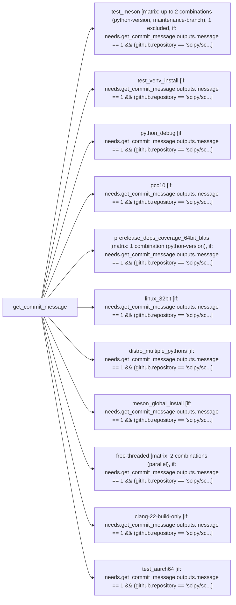

# Tier 4 scoring — scipy_linux

Pre-registered checklist: `evaluation/tier4_checklists/scipy_linux.checklist.yml` (open separately -- not duplicated here).

Score each condition fact-by-fact against the checklist: present / missing / false (hallucination). Presentation order below is randomized per EVALUATION_PLAN.md's Method 9 bias mitigation -- the mapping back to conditions 1/2/3 is in `scipy_linux.answer_key.md`, intentionally kept out of this file.

---

## Condition A

This CI/CD pipeline, named "Linux tests," is a comprehensive suite designed to ensure the quality, compatibility, and robustness of the SciPy library across various Linux environments, Python versions, and build configurations.

Here's a breakdown of what it does:

**Overall Purpose:**
The pipeline aims to thoroughly test SciPy's build process, installation, and functionality on Linux, covering a wide range of scenarios including different Python versions (stable, development, debug), compilers (GCC, Clang), BLAS/LAPACK libraries (OpenBLAS, ATLAS), installation methods (pip, venv, sdist/wheel), and architectures (32-bit, ARM64). It also performs static analysis and generates code coverage reports.

**Triggers (`on`):**
The pipeline runs automatically on:
*   **`push` events:** When code is pushed to the `main` branch or any branch matching `maintenance/**` (e.g., `maintenance/1.x`).
*   **`pull_request` events:** When a pull request targets the `main` branch or any branch matching `maintenance/**`.

**Permissions (`permissions`):**
It grants `read` access to the repository contents, which is necessary for actions like `actions/checkout` to fetch the code.

**Environment Variables (`env`):**
*   `CCACHE_DIR`: Configures `ccache` (a compiler cache) to store its cache in the GitHub workspace, speeding up subsequent builds.
*   `CCACHE_MAXSIZE`: Sets the maximum size of the `ccache` directory to 250MB.
*   `CCACHE_COMPILERCHECK: "content"`: Specifies that `ccache` should check the content of the compiler executable, not just its modification time. This is explicitly noted as "Needed because Pixi doesn't set mtime for compilers," indicating a specific interaction with the `pixi` package manager used in some jobs.

**Concurrency (`concurrency`):**
It ensures that only one run of this workflow for a given branch or pull request is active at a time. If a new commit is pushed while a previous run is still in progress for the same branch/PR, the older run will be cancelled. This saves resources and prevents redundant checks.

---

**Jobs Breakdown:**

The pipeline consists of several independent jobs, many of which depend on `get_commit_message` and include a conditional `if` statement to only run if a specific output from `get_commit_message` is `1` (likely indicating "run CI") and the repository is `scipy/scipy` (or empty for local testing with `act`).

1.  **`get_commit_message`**
    *   **Purpose:** This is a utility job that uses a reusable workflow (`./.github/workflows/commit_message.yml`) to likely parse the commit message.
    *   **Output:** It produces an `output.message` which is used by subsequent jobs to conditionally run. This is often used to implement "skip CI" messages or similar logic.

2.  **`test_meson`**
    *   **Name:** `pyrefly (py3.12) & dev deps (py3.15), fast, spin`
    *   **Purpose:** Performs a standard build and test of SciPy using the `spin` build tool, testing against Python 3.12 (stable) and Python 3.15-dev (development version) with various dependencies. It also runs static analysis tools like `pyrefly`.
    *   **Configuration:**
        *   Runs on `ubuntu-22.04`.
        *   Uses a **matrix strategy** to test:
            *   Python `3.12` and `3.15-dev`.
            *   Checks if the branch is a `maintenance/` branch.
        *   **Excludes** `3.15-dev` on `maintenance` branches, meaning development Python versions are only tested on `main` or feature branches.
    *   **Key Steps:**
        *   Checks out code, sets up Python.
        *   Installs Ubuntu dependencies (OpenBLAS, LAPACK, GMP, etc., and `ccache`).
        *   Installs Python packages using `pip install --group` for `3.12`.
        *   For `3.15-dev`, installs `numpy`, `pythran`, and `meson` directly from their GitHub repositories to test against their latest development versions.
        *   Sets up `ccache` for faster compilation.
        *   Builds SciPy using `spin build --release`.
        *   Performs various **static checks**: `check --installed-files`, `check --symbol-hiding`, `check --usage-of-install-tags`, `check --xp-markers`, `ninja -C build -t missingdeps` (checks build-internal dependencies).
        *   Runs `pyrefly check` (a type checker/linter) for Python 3.12.
        *   Runs SciPy's test suite (`spin test`) with 3 parallel jobs, duration reporting, and a timeout.

3.  **`test_venv_install`**
    *   **Name:** `Install into venv, cluster only, pyAny/npAny, pip+cluster.test()`
    *   **Purpose:** Verifies that SciPy can be successfully installed into a Python virtual environment (`venv`) using `pip` and that basic functionality (specifically `scipy.cluster.test()`) works. It also includes a regression test for installing a venv *inside* the source tree.
    *   **Configuration:** Runs on `ubuntu-24.04`.
    *   **Key Steps:**
        *   Installs minimal Ubuntu dependencies.
        *   Creates a `venv`, installs SciPy using `pip install . -Csetup-args=--werror` (treating build warnings as errors).
        *   Performs basic imports and runs `scipy.cluster.test()`.
        *   Creates another `venv` *inside the source tree* (a regression test for `gh-16312`), installs build dependencies (including `meson-python` from git), and installs SciPy with `--no-build-isolation`.
        *   Runs basic tests again.

4.  **`python_debug`**
    *   **Name:** `Python-debug & ATLAS & sdist+wheel, fast, py3.12/npMin, pip+pytest`
    *   **Purpose:** Tests SciPy with a Python debug build, using the ATLAS BLAS/LAPACK implementation, and verifies installation via the `sdist` (source distribution) and `wheel` (binary distribution) process.
    *   **Configuration:** Runs on `ubuntu-24.04` (which provides `python3.12-dbg`).
    *   **Key Steps:**
        *   Installs `python3-dbg` and `libatlas-base-dev`.
        *   Builds SciPy using `python3-dbg -m build` with debug optimizations and specifying ATLAS for BLAS/LAPACK.
        *   Installs the generated wheel file.
        *   Runs a subset of SciPy tests using `pytest` with the debug Python interpreter.

5.  **`gcc10`**
    *   **Name:** `Oldest GCC & pydata/sparse, full, py3.12/npMin, pip+pytest`
    *   **Purpose:** Checks compatibility with an older GCC compiler (GCC 10), ensuring SciPy builds and tests correctly with it, and specifically tests with `pydata/sparse`.
    *   **Configuration:** Runs on `ubuntu-22.04`.
    *   **Key Steps:**
        *   Installs `gcc-10` and `g++-10`.
        *   Builds SciPy using `pip install .` but explicitly setting `CC="ccache gcc-10"` and `CXX="ccache g++-10"` to force the use of GCC 10. Uses ATLAS for BLAS/LAPACK.
        *   Installs test dependencies, including downgrading NumPy to its oldest supported version (`2.0.0`).
        *   Runs the full SciPy test suite using `pytest`.

6.  **`prerelease_deps_coverage_64bit_blas`**
    *   **Name:** `Prerelease deps & coverage report, full, py3.12/npMin & py3.13/npPre, spin, SCIPY_ARRAY_API=1`
    *   **Purpose:** Tests SciPy against prerelease versions of its dependencies (especially NumPy), generates a code coverage report, and tests with `SCIPY_ARRAY_API=1` (for array API compatibility).
    *   **Configuration:** Runs on `ubuntu-latest` with Python `3.12`.
    *   **Key Steps:**
        *   Installs `lcov` (for coverage) and `ccache`.
        *   Installs Python build dependencies, `coverage` (prerelease), `openblas.txt` requirements, and *prerelease NumPy* from the `scientific-python-nightly-wheels` index.
        *   Builds SciPy using `spin build --gcov --with-scipy-openblas=32 --release` (enabling coverage instrumentation and specifying 32-bit OpenBLAS).
        *   **Downgrades NumPy to `2.0.0`** *after building* to ensure tests run against the oldest supported NumPy, while the build itself used a prerelease version.
        *   Runs the full SciPy test suite with coverage reporting (`--cov --cov-report term-missing`) and `SCIPY_ARRAY_API=1` enabled.

7.  **`linux_32bit`**
    *   **Name:** `32-bit, fast, py3.12/npMin, spin`
    *   **Purpose:** Verifies that SciPy can be built and tested successfully in a 32-bit Linux environment.
    *   **Configuration:** Runs on `ubuntu-latest`.
    *   **Key Steps:**
        *   Uses Docker to pull and run a `quay.io/pypa/manylinux_2_28_i686` (32-bit) container.
        *   Inside the container:
            *   Sets up a Python 3.12 virtual environment.
            *   Installs build and test dependencies (with `mpmath` instead of `gmpy2` due to 32-bit limitations).
            *   Installs `numpy==2.0.0`.
            *   Builds SciPy using `spin build --with-scipy-openblas=32`.
            *   Runs SciPy's test suite.

8.  **`distro_multiple_pythons`**
    *   **Name:** `non-default Python interpreter, fast, py3.12/npMin, pip+pytest`
    *   **Purpose:** Tests building SciPy with a specific, non-default Python interpreter (e.g., `python3.12` when `python3` might point to a different version), ensuring that build dependencies are correctly managed for that specific interpreter.
    *   **Configuration:** Runs on `ubuntu-24.04`.
    *   **Key Steps:**
        *   Adds the `deadsnakes/ppa` repository to install `python3.12-dev`.
        *   Explicitly uses `python3.12 -m pip install` for all build and test dependencies.
        *   Builds a wheel using `python3.12 -m build` and installs it with `python3.12 -m pip install`.
        *   Runs a subset of tests using `python3.12 -m pytest`.

9.  **`meson_global_install`**
    *   **Name:** `build with global meson`
    *   **Purpose:** Tests a specific, less common scenario where the `meson` build system is installed globally (system-wide) rather than within the Python virtual environment, while other Python build dependencies are in the environment.
    *   **Configuration:** Runs on `ubuntu-latest` with Python `3.14`.
    *   **Key Steps:**
        *   Installs `meson` globally using `pip install meson --break-system-packages`.
        *   Sets up a Python environment and installs build/test dependencies.
        *   **Uninstalls `meson` from the Python environment** to ensure the global `meson` is used.
        *   Verifies `which meson` points to the global installation.
        *   Builds a wheel using `python -m build` and installs it.
        *   Runs a subset of tests.

10. **`free-threaded`**
    *   **Name:** `free-threaded (pytest-run-parallel)`
    *   **Purpose:** Tests SciPy with Python's experimental "free-threading" build, which aims to remove the Global Interpreter Lock (GIL). It runs tests both fully and with `pytest-run-parallel`.
    *   **Configuration:**
        *   Runs on `ubuntu-latest`.
        *   Uses a **matrix strategy** to run tests in two modes: `parallel: "0"` (full tests) and `parallel: "1"` (fast tests with `pytest-run-parallel`). `fail-fast: false` ensures both modes run even if one fails.
        *   Uses `prefix-dev/setup-pixi` to set up the environment, indicating `pixi` is used for managing dependencies and running commands.
    *   **Key Steps:**
        *   Uses `pixi run test-freethreading` for full tests.
        *   Uses `pixi run test-parallel-freethreading` for fast, parallel tests.

11. **`clang-22-build-only`**
    *   **Name:** `Clang-22 aarch build-only (-Werror)`
    *   **Purpose:** Checks for compiler warnings when building SciPy with the latest Clang compiler (Clang 22) on an ARM (aarch64) architecture, treating all warnings as errors (`-Werror`) to enforce strict code quality. It only performs the build, not the full test suite.
    *   **Configuration:** Runs on `ubuntu-24.04-arm`.
    *   **Key Steps:**
        *   Uses `prefix-dev/setup-pixi`.
        *   Runs `pixi run build-clang-22`, which is expected to build SciPy with Clang 22 and `-Werror`.

12. **`test_aarch64`**
    *   **Name:** `aarch64, fast, fail slow, py3.12/npAny, spin`
    *   **Purpose:** Runs a fast test suite on an ARM (aarch64) architecture, specifically configured to identify slow tests.
    *   **Configuration:** Runs on `ubuntu-24.04-arm`.
    *   **Key Steps:**
        *   Uses `prefix-dev/setup-pixi`.
        *   Runs `pixi run test-fail-slow`, which will execute the tests and report on any that exceed performance thresholds.

---

In summary, this "Linux tests" CI/CD pipeline is a highly detailed and robust testing framework for SciPy, designed to catch regressions, ensure broad compatibility, maintain code quality, and monitor performance across a diverse set of build and runtime environments.

---

## Condition B

# Linux tests

<!-- llm-overview:start -->
## Overview

The "Linux tests" pipeline is a GitHub Actions workflow defined in `scipy_linux.yml` that operates with `contents: read` permissions. It manages concurrency by grouping runs based on the workflow, head ref, or run ID, and cancels any in-progress runs within the same group. This workflow is triggered on every push to the `main` or `maintenance/**` branches, and also on every pull request targeting these branches. It consists of 12 jobs, with 3 of them utilizing a build matrix that defines 3 configured combinations, plus one additional job whose matrix size is not included in that total.

The workflow begins with an independent job named `get_commit_message`, which delegates its execution to the reusable workflow located at `./.github/workflows/commit_message.yml`. All other eleven jobs depend on `get_commit_message` and will only run if `needs.get_commit_message.outputs.message == 1` and the repository is `scipy/scipy` or an empty string. These dependent jobs include `test_meson`, `test_venv_install`, `python_debug`, `gcc10`, `prerelease_deps_coverage_64bit_blas`, `linux_32bit`, `distro_multiple_pythons`, `meson_global_install`, `free-threaded`, `clang-22-build-only`, and `test_aarch64`.

Specifically, `test_meson` runs on `ubuntu-22.04` with 15 steps and a matrix of up to 2 combinations. `test_venv_install` and `python_debug` both run on `ubuntu-24.04` with 7 and 4 steps respectively. `gcc10` runs on `ubuntu-22.04` with 9 steps. `prerelease_deps_coverage_64bit_blas` runs on `ubuntu-latest` with 9 steps and a 1-combination matrix. `linux_32bit` runs on `ubuntu-latest` with 2 steps. `distro_multiple_pythons` runs on `ubuntu-24.04` with 8 steps. `meson_global_install` runs on `ubuntu-latest` with 10 steps. `free-threaded` runs on `ubuntu-latest` with 6 steps and a 2-combination matrix. Finally, `clang-22-build-only` and `test_aarch64` both run on `ubuntu-24.04-arm` with 3 steps each.
<!-- llm-overview:end -->

```text
Pipeline: Linux tests
Source: /home/user/what-is-my-pipeline-doing/evaluation/held_out_workflows/scipy_linux.yml (GitHub Actions)
Permissions: contents: read
Concurrency: group ${{ github.workflow }}-${{ github.head_ref || github.run_id }}; cancels in-progress runs

AT A GLANCE
This workflow runs on pushes to `main`, `maintenance/**` and pull requests.
It contains 12 jobs: 1 with no declared dependencies, 11 depending on other jobs.
3 of 12 jobs use a build matrix; 2 of them define 3 configured combinations between them (1 more job's matrix size not reflected in that total).

WHEN IT RUNS
- Runs on every push to main or maintenance/** branches
- Runs on every pull request targeting main or maintenance/** branches

EXECUTION SUMMARY
Independent jobs (no dependencies): get_commit_message
test_meson runs after get_commit_message
test_venv_install runs after get_commit_message
python_debug runs after get_commit_message
gcc10 runs after get_commit_message
prerelease_deps_coverage_64bit_blas runs after get_commit_message
linux_32bit runs after get_commit_message
distro_multiple_pythons runs after get_commit_message
meson_global_install runs after get_commit_message
free-threaded runs after get_commit_message
clang-22-build-only runs after get_commit_message
test_aarch64 runs after get_commit_message

IMPLEMENTATION DETAILS
1. get_commit_message — delegates to reusable workflow ./.github/workflows/commit_message.yml
2. test_meson — runs on ubuntu-22.04; 15 steps; matrix: up to 2 combinations (python-version, maintenance-branch), 1 excluded; after get_commit_message; condition: needs.get_commit_message.outputs.message == 1 && (github.repository == 'scipy/scipy' || github.repository == '')

   - actions/checkout (https://github.com/actions/checkout)
   - Setup Python (https://github.com/actions/setup-python)
   - Install Ubuntu dependencies
   - Install Python packages
   - Install Python packages from repositories
   - Set up ccache
   - Setup build and install scipy
   - Ccache performance
   - Check installed files
   - Check symbol hiding
   - ... and 5 more steps
3. test_venv_install — runs on ubuntu-24.04; 7 steps; after get_commit_message; condition: needs.get_commit_message.outputs.message == 1 && (github.repository == 'scipy/scipy' || github.repository == '')

   - actions/checkout (https://github.com/actions/checkout)
   - Install Ubuntu dependencies
   - Set up ccache
   - Create venv, install SciPy
   - Basic imports and tests
   - Create venv inside source tree
   - Ccache performance
4. python_debug — runs on ubuntu-24.04; 4 steps; after get_commit_message; condition: needs.get_commit_message.outputs.message == 1 && (github.repository == 'scipy/scipy' || github.repository == '')

   - actions/checkout (https://github.com/actions/checkout)
   - Configuring Test Environment
   - Build SciPy
   - Testing SciPy
5. gcc10 — runs on ubuntu-22.04; 9 steps; after get_commit_message; condition: needs.get_commit_message.outputs.message == 1 && (github.repository == 'scipy/scipy' || github.repository == '')

   - actions/checkout (https://github.com/actions/checkout)
   - Setup Python (https://github.com/actions/setup-python)
   - Setup system dependencies
   - Setup Python build deps
   - Set up ccache
   - Build wheel and install
   - Ccache performance
   - Install test dependencies
   - Run tests
6. prerelease_deps_coverage_64bit_blas — runs on ubuntu-latest; 9 steps; matrix: 1 combination (python-version); after get_commit_message; condition: needs.get_commit_message.outputs.message == 1 && (github.repository == 'scipy/scipy' || github.repository == '')

   - actions/checkout (https://github.com/actions/checkout)
   - Setup Python (https://github.com/actions/setup-python)
   - Install Ubuntu dependencies
   - Install Python packages
   - Set up ccache
   - Build and install SciPy
   - Ccache performance
   - Downgrade NumPy to lowest supported
   - Test SciPy
7. linux_32bit — runs on ubuntu-latest; 2 steps; after get_commit_message; condition: needs.get_commit_message.outputs.message == 1 && (github.repository == 'scipy/scipy' || github.repository == '')

   - actions/checkout (https://github.com/actions/checkout)
   - build + test in i686 container
8. distro_multiple_pythons — runs on ubuntu-24.04; 8 steps; after get_commit_message; condition: needs.get_commit_message.outputs.message == 1 && (github.repository == 'scipy/scipy' || github.repository == '')

   - actions/checkout (https://github.com/actions/checkout)
   - Setup system dependencies
   - Set up ccache
   - Setup Python build deps
   - Build wheel and install
   - Ccache performance
   - Install test dependencies
   - Run tests
9. meson_global_install — runs on ubuntu-latest; 10 steps; after get_commit_message; condition: needs.get_commit_message.outputs.message == 1 && (github.repository == 'scipy/scipy' || github.repository == '')

   - actions/checkout (https://github.com/actions/checkout)
   - Install system dependencies
   - Set up ccache
   - Install global meson
   - Setup Python (https://github.com/actions/setup-python)
   - Setup Python build/test deps
   - Check we're using global Meson
   - Build wheel and install
   - Ccache performance
   - Run tests
10. free-threaded — runs on ubuntu-latest; 6 steps; matrix: 2 combinations (parallel); after get_commit_message; condition: needs.get_commit_message.outputs.message == 1 && (github.repository == 'scipy/scipy' || github.repository == '')

   - actions/checkout (https://github.com/actions/checkout)
   - prefix-dev/setup-pixi (https://github.com/prefix-dev/setup-pixi)
   - Set up ccache
   - Run tests (full)
   - Run tests (fast, with pytest-run-parallel)
   - Ccache performance
11. clang-22-build-only — runs on ubuntu-24.04-arm; 3 steps; after get_commit_message; condition: needs.get_commit_message.outputs.message == 1 && (github.repository == 'scipy/scipy' || github.repository == '')

   - actions/checkout (https://github.com/actions/checkout)
   - prefix-dev/setup-pixi (https://github.com/prefix-dev/setup-pixi)
   - Build wheel, check for compiler warnings
12. test_aarch64 — runs on ubuntu-24.04-arm; 3 steps; after get_commit_message; condition: needs.get_commit_message.outputs.message == 1 && (github.repository == 'scipy/scipy' || github.repository == '')

   - actions/checkout (https://github.com/actions/checkout)
   - prefix-dev/setup-pixi (https://github.com/prefix-dev/setup-pixi)
   - Test SciPy

LINKED WORKFLOWS
- calls ./.github/workflows/commit_message.yml
```

## Pipeline Diagram



---

## Condition C

Pipeline: Linux tests
Source: /home/user/what-is-my-pipeline-doing/evaluation/held_out_workflows/scipy_linux.yml (GitHub Actions)
Permissions: contents: read
Concurrency: group ${{ github.workflow }}-${{ github.head_ref || github.run_id }}; cancels in-progress runs

AT A GLANCE
This workflow runs on pushes to `main`, `maintenance/**` and pull requests.
It contains 12 jobs: 1 with no declared dependencies, 11 depending on other jobs.
3 of 12 jobs use a build matrix; 2 of them define 3 configured combinations between them (1 more job's matrix size not reflected in that total).

WHEN IT RUNS
- Runs on every push to main or maintenance/** branches
- Runs on every pull request targeting main or maintenance/** branches

EXECUTION SUMMARY
Independent jobs (no dependencies): get_commit_message
test_meson runs after get_commit_message
test_venv_install runs after get_commit_message
python_debug runs after get_commit_message
gcc10 runs after get_commit_message
prerelease_deps_coverage_64bit_blas runs after get_commit_message
linux_32bit runs after get_commit_message
distro_multiple_pythons runs after get_commit_message
meson_global_install runs after get_commit_message
free-threaded runs after get_commit_message
clang-22-build-only runs after get_commit_message
test_aarch64 runs after get_commit_message

IMPLEMENTATION DETAILS
1. get_commit_message — delegates to reusable workflow ./.github/workflows/commit_message.yml
2. test_meson — runs on ubuntu-22.04; 15 steps; matrix: up to 2 combinations (python-version, maintenance-branch), 1 excluded; after get_commit_message; condition: needs.get_commit_message.outputs.message == 1 && (github.repository == 'scipy/scipy' || github.repository == '')

   - actions/checkout (https://github.com/actions/checkout)
   - Setup Python (https://github.com/actions/setup-python)
   - Install Ubuntu dependencies
   - Install Python packages
   - Install Python packages from repositories
   - Set up ccache
   - Setup build and install scipy
   - Ccache performance
   - Check installed files
   - Check symbol hiding
   - ... and 5 more steps
3. test_venv_install — runs on ubuntu-24.04; 7 steps; after get_commit_message; condition: needs.get_commit_message.outputs.message == 1 && (github.repository == 'scipy/scipy' || github.repository == '')

   - actions/checkout (https://github.com/actions/checkout)
   - Install Ubuntu dependencies
   - Set up ccache
   - Create venv, install SciPy
   - Basic imports and tests
   - Create venv inside source tree
   - Ccache performance
4. python_debug — runs on ubuntu-24.04; 4 steps; after get_commit_message; condition: needs.get_commit_message.outputs.message == 1 && (github.repository == 'scipy/scipy' || github.repository == '')

   - actions/checkout (https://github.com/actions/checkout)
   - Configuring Test Environment
   - Build SciPy
   - Testing SciPy
5. gcc10 — runs on ubuntu-22.04; 9 steps; after get_commit_message; condition: needs.get_commit_message.outputs.message == 1 && (github.repository == 'scipy/scipy' || github.repository == '')

   - actions/checkout (https://github.com/actions/checkout)
   - Setup Python (https://github.com/actions/setup-python)
   - Setup system dependencies
   - Setup Python build deps
   - Set up ccache
   - Build wheel and install
   - Ccache performance
   - Install test dependencies
   - Run tests
6. prerelease_deps_coverage_64bit_blas — runs on ubuntu-latest; 9 steps; matrix: 1 combination (python-version); after get_commit_message; condition: needs.get_commit_message.outputs.message == 1 && (github.repository == 'scipy/scipy' || github.repository == '')

   - actions/checkout (https://github.com/actions/checkout)
   - Setup Python (https://github.com/actions/setup-python)
   - Install Ubuntu dependencies
   - Install Python packages
   - Set up ccache
   - Build and install SciPy
   - Ccache performance
   - Downgrade NumPy to lowest supported
   - Test SciPy
7. linux_32bit — runs on ubuntu-latest; 2 steps; after get_commit_message; condition: needs.get_commit_message.outputs.message == 1 && (github.repository == 'scipy/scipy' || github.repository == '')

   - actions/checkout (https://github.com/actions/checkout)
   - build + test in i686 container
8. distro_multiple_pythons — runs on ubuntu-24.04; 8 steps; after get_commit_message; condition: needs.get_commit_message.outputs.message == 1 && (github.repository == 'scipy/scipy' || github.repository == '')

   - actions/checkout (https://github.com/actions/checkout)
   - Setup system dependencies
   - Set up ccache
   - Setup Python build deps
   - Build wheel and install
   - Ccache performance
   - Install test dependencies
   - Run tests
9. meson_global_install — runs on ubuntu-latest; 10 steps; after get_commit_message; condition: needs.get_commit_message.outputs.message == 1 && (github.repository == 'scipy/scipy' || github.repository == '')

   - actions/checkout (https://github.com/actions/checkout)
   - Install system dependencies
   - Set up ccache
   - Install global meson
   - Setup Python (https://github.com/actions/setup-python)
   - Setup Python build/test deps
   - Check we're using global Meson
   - Build wheel and install
   - Ccache performance
   - Run tests
10. free-threaded — runs on ubuntu-latest; 6 steps; matrix: 2 combinations (parallel); after get_commit_message; condition: needs.get_commit_message.outputs.message == 1 && (github.repository == 'scipy/scipy' || github.repository == '')

   - actions/checkout (https://github.com/actions/checkout)
   - prefix-dev/setup-pixi (https://github.com/prefix-dev/setup-pixi)
   - Set up ccache
   - Run tests (full)
   - Run tests (fast, with pytest-run-parallel)
   - Ccache performance
11. clang-22-build-only — runs on ubuntu-24.04-arm; 3 steps; after get_commit_message; condition: needs.get_commit_message.outputs.message == 1 && (github.repository == 'scipy/scipy' || github.repository == '')

   - actions/checkout (https://github.com/actions/checkout)
   - prefix-dev/setup-pixi (https://github.com/prefix-dev/setup-pixi)
   - Build wheel, check for compiler warnings
12. test_aarch64 — runs on ubuntu-24.04-arm; 3 steps; after get_commit_message; condition: needs.get_commit_message.outputs.message == 1 && (github.repository == 'scipy/scipy' || github.repository == '')

   - actions/checkout (https://github.com/actions/checkout)
   - prefix-dev/setup-pixi (https://github.com/prefix-dev/setup-pixi)
   - Test SciPy

LINKED WORKFLOWS
- calls ./.github/workflows/commit_message.yml

---
