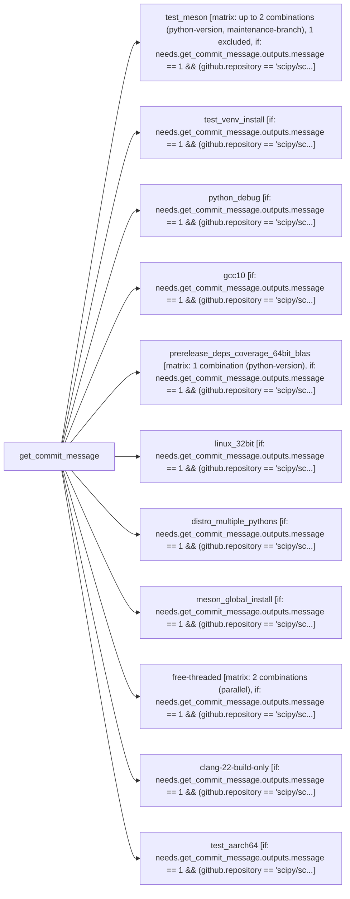

# Tier 4 scoring — scipy_linux

Pre-registered checklist: `evaluation/tier4_checklists/scipy_linux.checklist.yml` (open separately -- not duplicated here).

Score each condition fact-by-fact against the checklist: present / missing / false (hallucination). Presentation order below is randomized per EVALUATION_PLAN.md's Method 9 bias mitigation -- the mapping back to conditions 1/2/3 is in `scipy_linux.answer_key.md`, intentionally kept out of this file.

---

## Condition A

# Linux tests

<!-- llm-overview:start -->
## Overview

The "Linux tests" pipeline is a GitHub Actions workflow defined in `scipy_linux.yml`. It operates with `contents: read` permissions and uses a concurrency group that cancels any in-progress runs for the same workflow and head reference or run ID. This pipeline runs automatically on every push to the `main` or `maintenance/**` branches, and on every pull request targeting these branches.

The pipeline consists of 12 jobs. The `get_commit_message` job runs independently and delegates to the reusable workflow `./.github/workflows/commit_message.yml`. All other 11 jobs depend on `get_commit_message` and execute only if its output message is `1` and the repository is `scipy/scipy` or empty. Three of these jobs utilize a build matrix, with two of them defining a total of three configured combinations.

The dependent jobs include `test_meson` (ubuntu-22.04), which sets up Python, installs dependencies, builds and installs SciPy, and checks installed files and symbol hiding. `test_venv_install` (ubuntu-24.04) creates virtual environments for SciPy installation and basic tests. `python_debug` (ubuntu-24.04) configures the test environment, builds, and tests SciPy. `gcc10` (ubuntu-22.04) sets up Python and system dependencies, builds a wheel, installs it, and runs tests. `prerelease_deps_coverage_64bit_blas` (ubuntu-latest) builds and installs SciPy, tests it, and includes a step to downgrade NumPy. `linux_32bit` (ubuntu-latest) builds and tests within an `i686` container. `distro_multiple_pythons` (ubuntu-24.04) sets up dependencies, builds a wheel, installs it, and runs tests. `meson_global_install` (ubuntu-latest) installs global Meson, sets up Python, builds a wheel, installs it, and runs tests. `free-threaded` (ubuntu-latest) runs full and fast tests. `clang-22-build-only` (ubuntu-24.04-arm) builds a wheel and checks for compiler warnings. Finally, `test_aarch64` (ubuntu-24.04-arm) tests SciPy. The pipeline also defines environment variables `CCACHE_DIR`, `CCACHE_MAXSIZE`, and `CCACHE_COMPILERCHECK`.
<!-- llm-overview:end -->

```text
Pipeline: Linux tests
Source: /home/user/what-is-my-pipeline-doing/evaluation/held_out_workflows/scipy_linux.yml (GitHub Actions)
Permissions: contents: read
Concurrency: group ${{ github.workflow }}-${{ github.head_ref || github.run_id }}; cancels in-progress runs

AT A GLANCE
This workflow runs on pushes to `main`, `maintenance/**` and pull requests.
It contains 12 jobs: 1 with no declared dependencies, 11 depending on other jobs.
3 of 12 jobs use a build matrix; 2 of them define 3 configured combinations between them (1 more job's matrix size not reflected in that total).

WHEN IT RUNS
- Runs on every push to main or maintenance/** branches
- Runs on every pull request targeting main or maintenance/** branches

EXECUTION SUMMARY
Independent jobs (no dependencies): get_commit_message
test_meson runs after get_commit_message
test_venv_install runs after get_commit_message
python_debug runs after get_commit_message
gcc10 runs after get_commit_message
prerelease_deps_coverage_64bit_blas runs after get_commit_message
linux_32bit runs after get_commit_message
distro_multiple_pythons runs after get_commit_message
meson_global_install runs after get_commit_message
free-threaded runs after get_commit_message
clang-22-build-only runs after get_commit_message
test_aarch64 runs after get_commit_message

IMPLEMENTATION DETAILS
1. get_commit_message — delegates to reusable workflow ./.github/workflows/commit_message.yml
2. test_meson — runs on ubuntu-22.04; 15 steps; matrix: up to 2 combinations (python-version, maintenance-branch), 1 excluded; after get_commit_message; condition: needs.get_commit_message.outputs.message == 1 && (github.repository == 'scipy/scipy' || github.repository == '')

   - actions/checkout (https://github.com/actions/checkout)
   - Setup Python (https://github.com/actions/setup-python)
   - Install Ubuntu dependencies
   - Install Python packages
   - Install Python packages from repositories
   - Set up ccache
   - Setup build and install scipy
   - Ccache performance
   - Check installed files
   - Check symbol hiding
   - ... and 5 more steps
3. test_venv_install — runs on ubuntu-24.04; 7 steps; after get_commit_message; condition: needs.get_commit_message.outputs.message == 1 && (github.repository == 'scipy/scipy' || github.repository == '')

   - actions/checkout (https://github.com/actions/checkout)
   - Install Ubuntu dependencies
   - Set up ccache
   - Create venv, install SciPy
   - Basic imports and tests
   - Create venv inside source tree
   - Ccache performance
4. python_debug — runs on ubuntu-24.04; 4 steps; after get_commit_message; condition: needs.get_commit_message.outputs.message == 1 && (github.repository == 'scipy/scipy' || github.repository == '')

   - actions/checkout (https://github.com/actions/checkout)
   - Configuring Test Environment
   - Build SciPy
   - Testing SciPy
5. gcc10 — runs on ubuntu-22.04; 9 steps; after get_commit_message; condition: needs.get_commit_message.outputs.message == 1 && (github.repository == 'scipy/scipy' || github.repository == '')

   - actions/checkout (https://github.com/actions/checkout)
   - Setup Python (https://github.com/actions/setup-python)
   - Setup system dependencies
   - Setup Python build deps
   - Set up ccache
   - Build wheel and install
   - Ccache performance
   - Install test dependencies
   - Run tests
6. prerelease_deps_coverage_64bit_blas — runs on ubuntu-latest; 9 steps; matrix: 1 combination (python-version); after get_commit_message; condition: needs.get_commit_message.outputs.message == 1 && (github.repository == 'scipy/scipy' || github.repository == '')

   - actions/checkout (https://github.com/actions/checkout)
   - Setup Python (https://github.com/actions/setup-python)
   - Install Ubuntu dependencies
   - Install Python packages
   - Set up ccache
   - Build and install SciPy
   - Ccache performance
   - Downgrade NumPy to lowest supported
   - Test SciPy
7. linux_32bit — runs on ubuntu-latest; 2 steps; after get_commit_message; condition: needs.get_commit_message.outputs.message == 1 && (github.repository == 'scipy/scipy' || github.repository == '')

   - actions/checkout (https://github.com/actions/checkout)
   - build + test in i686 container
8. distro_multiple_pythons — runs on ubuntu-24.04; 8 steps; after get_commit_message; condition: needs.get_commit_message.outputs.message == 1 && (github.repository == 'scipy/scipy' || github.repository == '')

   - actions/checkout (https://github.com/actions/checkout)
   - Setup system dependencies
   - Set up ccache
   - Setup Python build deps
   - Build wheel and install
   - Ccache performance
   - Install test dependencies
   - Run tests
9. meson_global_install — runs on ubuntu-latest; 10 steps; after get_commit_message; condition: needs.get_commit_message.outputs.message == 1 && (github.repository == 'scipy/scipy' || github.repository == '')

   - actions/checkout (https://github.com/actions/checkout)
   - Install system dependencies
   - Set up ccache
   - Install global meson
   - Setup Python (https://github.com/actions/setup-python)
   - Setup Python build/test deps
   - Check we're using global Meson
   - Build wheel and install
   - Ccache performance
   - Run tests
10. free-threaded — runs on ubuntu-latest; 6 steps; matrix: 2 combinations (parallel); after get_commit_message; condition: needs.get_commit_message.outputs.message == 1 && (github.repository == 'scipy/scipy' || github.repository == '')

   - actions/checkout (https://github.com/actions/checkout)
   - prefix-dev/setup-pixi (https://github.com/prefix-dev/setup-pixi)
   - Set up ccache
   - Run tests (full)
   - Run tests (fast, with pytest-run-parallel)
   - Ccache performance
11. clang-22-build-only — runs on ubuntu-24.04-arm; 3 steps; after get_commit_message; condition: needs.get_commit_message.outputs.message == 1 && (github.repository == 'scipy/scipy' || github.repository == '')

   - actions/checkout (https://github.com/actions/checkout)
   - prefix-dev/setup-pixi (https://github.com/prefix-dev/setup-pixi)
   - Build wheel, check for compiler warnings
12. test_aarch64 — runs on ubuntu-24.04-arm; 3 steps; after get_commit_message; condition: needs.get_commit_message.outputs.message == 1 && (github.repository == 'scipy/scipy' || github.repository == '')

   - actions/checkout (https://github.com/actions/checkout)
   - prefix-dev/setup-pixi (https://github.com/prefix-dev/setup-pixi)
   - Test SciPy

LINKED WORKFLOWS
- calls ./.github/workflows/commit_message.yml

ENVIRONMENT VARIABLES
- CCACHE_DIR: ${{ github.workspace }}/.ccache
- CCACHE_MAXSIZE: 250M
- CCACHE_COMPILERCHECK: content
```

## Pipeline Diagram



---

## Condition B

This CI/CD pipeline, named "Linux tests," is a comprehensive set of automated checks for the SciPy project, designed to ensure the library builds, installs, and functions correctly across various Linux environments, Python versions, compiler configurations, and dependency setups.

Here's a breakdown of what it does:

**Overall Purpose:**
The pipeline aims to validate the stability, compatibility, and quality of the SciPy library on Linux systems by running a diverse array of build, installation, and test scenarios. It covers different Python versions (stable, development, debug, free-threaded), compiler versions (oldest supported GCC, latest Clang), architectures (32-bit, 64-bit ARM), and dependency configurations (oldest NumPy, prerelease NumPy, specific BLAS libraries).

**Trigger Conditions (`on`):**
The pipeline runs automatically on:
*   **`push` events:** When code is pushed to the `main` branch or any branch under `maintenance/**` (e.g., `maintenance/1.x`).
*   **`pull_request` events:** When a pull request targets the `main` branch or any `maintenance/**` branch.

**Permissions (`permissions`):**
It grants `read` access to the repository contents, which is necessary for actions like `actions/checkout` to fetch the code.

**Environment Variables (`env`):**
*   `CCACHE_DIR`, `CCACHE_MAXSIZE`, `CCACHE_COMPILERCHECK`: These configure `ccache`, a compiler cache that speeds up recompilation by storing previous compilation results. This is used to reduce build times in subsequent runs or jobs. `CCACHE_COMPILERCHECK: "content"` is specifically noted as needed because Pixi (a package manager used in some jobs) might not set `mtime` for compilers, which `ccache` usually relies on.

**Concurrency (`concurrency`):**
*   `group: ${{ github.workflow }}-${{ github.head_ref || github.run_id }}`: This ensures that only one workflow run for a given branch or pull request is active at a time.
*   `cancel-in-progress: true`: If a new commit is pushed to the same branch while a workflow is already running, the older, in-progress run will be canceled to save resources and ensure only the latest changes are tested.

**Jobs Breakdown:**

1.  **`get_commit_message`**
    *   **Purpose:** This is a utility job that uses a reusable workflow (`./.github/workflows/commit_message.yml`) to extract information from the commit message.
    *   **Impact:** The output of this job (`needs.get_commit_message.outputs.message == 1`) is used by almost all subsequent jobs to conditionally run them. This is a common pattern to allow developers to skip CI runs or trigger specific jobs based on keywords in their commit messages (e.g., `[skip ci]`).

2.  **`test_meson`**
    *   **Name:** `pyrefly (py3.12) & dev deps (py3.15), fast, spin`
    *   **Purpose:** This is a primary, comprehensive test job. It builds and tests SciPy with different Python versions, including a development version, and performs various static analysis and post-build checks.
    *   **Runs on:** `ubuntu-22.04`
    *   **Matrix Strategy:**
        *   Runs twice: once with Python `3.12` and once with `3.15-dev` (a development version of Python 3.15).
        *   **Exclusion:** The `3.15-dev` Python version is *not* tested on `maintenance` branches, as these branches are for stable fixes, not bleeding-edge Python compatibility.
    *   **Key Steps:**
        *   Checks out the code.
        *   Sets up the specified Python version (allowing prereleases for `3.15-dev`).
        *   Installs various Ubuntu system dependencies (BLAS, LAPACK, GMP, etc., and `ccache`).
        *   Installs Python packages using `pip install --group` (a feature for installing predefined dependency groups from `pyproject.toml`).
        *   For `3.15-dev`, it installs `numpy`, `pythran`, and `meson` directly from their GitHub repositories to test against their latest development versions.
        *   Sets up `ccache` for faster builds.
        *   Builds SciPy using `spin build --release` (Spin is a SciPy-specific build tool).
        *   Reports `ccache` performance.
        *   Performs several quality checks: `check --installed-files`, `check --symbol-hiding`, `check --usage-of-install-tags`, `check --xp-markers`, and `ninja -C build -t missingdeps` (for build-internal dependencies). These ensure the built package is well-formed and adheres to internal standards.
        *   For Python `3.12`, it runs `pyrefly check` for type checking.
        *   Runs the SciPy test suite using `spin test -j3` (3 parallel jobs), reporting slow tests (`--durations 10`) and with a timeout.

3.  **`test_venv_install`**
    *   **Name:** `Install into venv, cluster only, pyAny/npAny, pip+cluster.test()`
    *   **Purpose:** Verifies that SciPy can be correctly installed into a Python virtual environment using `pip`, and runs a minimal set of tests. It also includes a regression test for a specific installation scenario.
    *   **Runs on:** `ubuntu-24.04`
    *   **Key Steps:**
        *   Installs minimal Ubuntu dependencies.
        *   Sets up `ccache`.
        *   Creates a virtual environment (`venv`), installs core test dependencies, and then installs SciPy using `pip install . -vv -Csetup-args=--werror` (treating build warnings as errors) with build isolation.
        *   Performs basic imports and runs `scipy.cluster.test()` within the venv.
        *   **Regression Test:** Creates another venv *inside the source tree* and installs SciPy *without build isolation*, then runs basic tests. This specifically targets a known issue (`gh-16312`).

4.  **`python_debug`**
    *   **Name:** `Python-debug & ATLAS & sdist+wheel, fast, py3.12/npMin, pip+pytest`
    *   **Purpose:** Tests SciPy's compatibility with a Python debug build, using the ATLAS BLAS library, and verifies the installation process via source distribution (sdist) and wheel.
    *   **Runs on:** `ubuntu-24.04` (because it provides `python3.12-dbg`).
    *   **Key Steps:**
        *   Installs `python3-dbg` and `libatlas-base-dev`.
        *   Builds SciPy using `python3-dbg -m build` to create an sdist, then installs the resulting wheel. It explicitly configures the build to use `blas-atlas` and `lapack-atlas`.
        *   Runs `pytest` with the debug Python, excluding slow tests.

5.  **`gcc10`**
    *   **Name:** `Oldest GCC & pydata/sparse, full, py3.12/npMin, pip+pytest`
    *   **Purpose:** Ensures SciPy builds and tests correctly with an older GCC compiler (GCC 10) and the oldest supported NumPy version, verifying backward compatibility with compiler toolchains and dependencies.
    *   **Runs on:** `ubuntu-22.04`
    *   **Key Steps:**
        *   Sets up Python 3.12.
        *   Installs `g++-10`, `gcc-10`, and other system dependencies.
        *   Sets up `ccache`.
        *   Builds and installs SciPy using `pip install .` while explicitly setting `CC` and `CXX` environment variables to `ccache gcc-10` and `ccache g++-10` to force the use of the older compiler.
        *   Installs test dependencies and *downgrades NumPy to `2.0.0`* (the oldest supported version).
        *   Runs the full `pytest` suite.

6.  **`prerelease_deps_coverage_64bit_blas`**
    *   **Name:** `Prerelease deps & coverage report, full, py3.12/npMin & py3.13/npPre, spin, SCIPY_ARRAY_API=1`
    *   **Purpose:** Tests SciPy against prerelease versions of its dependencies (especially NumPy), generates a code coverage report, and runs tests with specific BLAS configurations and Array API enabled.
    *   **Runs on:** `ubuntu-latest`
    *   **Matrix Strategy:** Currently only runs for Python `3.12`.
    *   **Key Steps:**
        *   Installs Ubuntu dependencies, including `lcov` for coverage.
        *   Installs Python build tools, `coverage` (prerelease), OpenBLAS requirements, and *prerelease NumPy* (`--pre --upgrade ... numpy`).
        *   Builds SciPy with `spin build --gcov --with-scipy-openblas=32 --release`. `--gcov` enables code coverage instrumentation. `--with-scipy-openblas=32` specifies a 32-bit integer BLAS interface.
        *   **Crucially, after building, it downgrades NumPy to `2.0.0`** (lowest supported) before running tests. This means the build is against prerelease NumPy, but the tests are against stable, oldest-supported NumPy.
        *   Runs the full SciPy test suite with coverage reporting (`--coverage --cov --cov-report term-missing`) and with `SCIPY_ARRAY_API=1` enabled for Array API compatibility testing.

7.  **`linux_32bit`**
    *   **Name:** `32-bit, fast, fail slow, py3.12/npAny, spin`
    *   **Purpose:** Verifies that SciPy can be built and tested successfully on a 32-bit Linux architecture.
    *   **Runs on:** `ubuntu-latest`
    *   **Key Steps:**
        *   Uses Docker to pull a `quay.io/pypa/manylinux_2_28_i686` image (a 32-bit Linux environment).
        *   Mounts the SciPy source code into the container.
        *   Inside the container: sets up a Python 3.12 venv, installs build/test dependencies (including `numpy==2.0.0`), builds SciPy with `spin build --with-scipy-openblas=32`, and runs `spin test`.

8.  **`distro_multiple_pythons`**
    *   **Name:** `non-default Python interpreter, fast, py3.12/npMin, pip+pytest`
    *   **Purpose:** Tests building SciPy with a Python interpreter that is *not* the system default (e.g., installed via a PPA), mimicking a common user setup.
    *   **Runs on:** `ubuntu-24.04`
    *   **Key Steps:**
        *   Adds the `deadsnakes/ppa` repository to install `python3.12-dev` (a non-default Python version).
        *   Sets up `ccache`.
        *   Installs Python build dependencies using `python3.12 -m pip install ...` to ensure the specific Python 3.12 interpreter is used.
        *   Builds a wheel and installs SciPy using `python3.12 -m build` and `python3.12 -m pip install dist/*.whl`.
        *   Runs a small subset of tests (`scipy.cluster`, `scipy.linalg`) to confirm the build and basic functionality.

9.  **`meson_global_install`**
    *   **Name:** `build with global meson`
    *   **Purpose:** Checks that SciPy can be built even when the `meson` build system is installed globally (or in a separate environment) and not directly within the Python environment used for building SciPy. This addresses specific edge cases in build setups.
    *   **Runs on:** `ubuntu-latest`
    *   **Key Steps:**
        *   Installs `meson` globally using `python -m pip install meson --break-system-packages`.
        *   Sets up Python 3.14.
        *   Installs other Python build/test dependencies, then *uninstalls `meson`* from this Python environment.
        *   Verifies that the globally installed `meson` is being used (`which meson`).
        *   Builds a wheel and installs SciPy using `python -m build -wnx`.
        *   Runs a small subset of tests (`scipy.linalg`).

10. **`free-threaded`**
    *   **Name:** `free-threaded (pytest-run-parallel)`
    *   **Purpose:** Tests SciPy's compatibility and performance with experimental free-threaded Python builds (e.g., CPython's "nogil" builds).
    *   **Runs on:** `ubuntu-latest`
    *   **Matrix Strategy:** Runs twice:
        *   `parallel: "0"`: Runs full tests.
        *   `parallel: "1"`: Runs fast tests using `pytest-run-parallel`.
    *   **Key Steps:**
        *   Uses `prefix-dev/setup-pixi` to set up the environment, implying that the free-threaded Python is managed by `pixi` (a package manager).
        *   Runs predefined `pixi run` commands (`test-freethreading`, `test-parallel-freethreading`) to execute the tests in the free-threaded environment.

11. **`clang-22-build-only`**
    *   **Name:** `Clang-22 aarch build-only (-Werror)`
    *   **Purpose:** Checks for compiler warnings (treating them as errors via `-Werror`) when building SciPy with a recent Clang compiler on an ARM architecture. This is crucial for maintaining high code quality.
    *   **Runs on:** `ubuntu-24.04-arm` (an ARM-based runner).
    *   **Key Steps:**
        *   Uses `prefix-dev/setup-pixi`.
        *   Runs `pixi run build-clang-22`, which is configured to build SciPy with Clang 22 and fail if any compiler warnings are encountered.

12. **`test_aarch64`**
    *   **Name:** `aarch64, fast, fail slow, py3.12/npAny, spin`
    *   **Purpose:** Provides basic functional testing for SciPy on a 64-bit ARM architecture, specifically focusing on fast tests and identifying any performance regressions (slow tests).
    *   **Runs on:** `ubuntu-24.04-arm`
    *   **Key Steps:**
        *   Uses `prefix-dev/setup-pixi`.
        *   Runs `pixi run test-fail-slow`, which executes the fast test suite and is configured to report or fail if tests exceed expected durations.

In summary, this pipeline is a robust and multi-faceted testing suite for SciPy, covering a wide range of scenarios to catch potential issues early in the development cycle and ensure the library's broad compatibility and high quality.

---

## Condition C

Pipeline: Linux tests
Source: /home/user/what-is-my-pipeline-doing/evaluation/held_out_workflows/scipy_linux.yml (GitHub Actions)
Permissions: contents: read
Concurrency: group ${{ github.workflow }}-${{ github.head_ref || github.run_id }}; cancels in-progress runs

AT A GLANCE
This workflow runs on pushes to `main`, `maintenance/**` and pull requests.
It contains 12 jobs: 1 with no declared dependencies, 11 depending on other jobs.
3 of 12 jobs use a build matrix; 2 of them define 3 configured combinations between them (1 more job's matrix size not reflected in that total).

WHEN IT RUNS
- Runs on every push to main or maintenance/** branches
- Runs on every pull request targeting main or maintenance/** branches

EXECUTION SUMMARY
Independent jobs (no dependencies): get_commit_message
test_meson runs after get_commit_message
test_venv_install runs after get_commit_message
python_debug runs after get_commit_message
gcc10 runs after get_commit_message
prerelease_deps_coverage_64bit_blas runs after get_commit_message
linux_32bit runs after get_commit_message
distro_multiple_pythons runs after get_commit_message
meson_global_install runs after get_commit_message
free-threaded runs after get_commit_message
clang-22-build-only runs after get_commit_message
test_aarch64 runs after get_commit_message

IMPLEMENTATION DETAILS
1. get_commit_message — delegates to reusable workflow ./.github/workflows/commit_message.yml
2. test_meson — runs on ubuntu-22.04; 15 steps; matrix: up to 2 combinations (python-version, maintenance-branch), 1 excluded; after get_commit_message; condition: needs.get_commit_message.outputs.message == 1 && (github.repository == 'scipy/scipy' || github.repository == '')

   - actions/checkout (https://github.com/actions/checkout)
   - Setup Python (https://github.com/actions/setup-python)
   - Install Ubuntu dependencies
   - Install Python packages
   - Install Python packages from repositories
   - Set up ccache
   - Setup build and install scipy
   - Ccache performance
   - Check installed files
   - Check symbol hiding
   - ... and 5 more steps
3. test_venv_install — runs on ubuntu-24.04; 7 steps; after get_commit_message; condition: needs.get_commit_message.outputs.message == 1 && (github.repository == 'scipy/scipy' || github.repository == '')

   - actions/checkout (https://github.com/actions/checkout)
   - Install Ubuntu dependencies
   - Set up ccache
   - Create venv, install SciPy
   - Basic imports and tests
   - Create venv inside source tree
   - Ccache performance
4. python_debug — runs on ubuntu-24.04; 4 steps; after get_commit_message; condition: needs.get_commit_message.outputs.message == 1 && (github.repository == 'scipy/scipy' || github.repository == '')

   - actions/checkout (https://github.com/actions/checkout)
   - Configuring Test Environment
   - Build SciPy
   - Testing SciPy
5. gcc10 — runs on ubuntu-22.04; 9 steps; after get_commit_message; condition: needs.get_commit_message.outputs.message == 1 && (github.repository == 'scipy/scipy' || github.repository == '')

   - actions/checkout (https://github.com/actions/checkout)
   - Setup Python (https://github.com/actions/setup-python)
   - Setup system dependencies
   - Setup Python build deps
   - Set up ccache
   - Build wheel and install
   - Ccache performance
   - Install test dependencies
   - Run tests
6. prerelease_deps_coverage_64bit_blas — runs on ubuntu-latest; 9 steps; matrix: 1 combination (python-version); after get_commit_message; condition: needs.get_commit_message.outputs.message == 1 && (github.repository == 'scipy/scipy' || github.repository == '')

   - actions/checkout (https://github.com/actions/checkout)
   - Setup Python (https://github.com/actions/setup-python)
   - Install Ubuntu dependencies
   - Install Python packages
   - Set up ccache
   - Build and install SciPy
   - Ccache performance
   - Downgrade NumPy to lowest supported
   - Test SciPy
7. linux_32bit — runs on ubuntu-latest; 2 steps; after get_commit_message; condition: needs.get_commit_message.outputs.message == 1 && (github.repository == 'scipy/scipy' || github.repository == '')

   - actions/checkout (https://github.com/actions/checkout)
   - build + test in i686 container
8. distro_multiple_pythons — runs on ubuntu-24.04; 8 steps; after get_commit_message; condition: needs.get_commit_message.outputs.message == 1 && (github.repository == 'scipy/scipy' || github.repository == '')

   - actions/checkout (https://github.com/actions/checkout)
   - Setup system dependencies
   - Set up ccache
   - Setup Python build deps
   - Build wheel and install
   - Ccache performance
   - Install test dependencies
   - Run tests
9. meson_global_install — runs on ubuntu-latest; 10 steps; after get_commit_message; condition: needs.get_commit_message.outputs.message == 1 && (github.repository == 'scipy/scipy' || github.repository == '')

   - actions/checkout (https://github.com/actions/checkout)
   - Install system dependencies
   - Set up ccache
   - Install global meson
   - Setup Python (https://github.com/actions/setup-python)
   - Setup Python build/test deps
   - Check we're using global Meson
   - Build wheel and install
   - Ccache performance
   - Run tests
10. free-threaded — runs on ubuntu-latest; 6 steps; matrix: 2 combinations (parallel); after get_commit_message; condition: needs.get_commit_message.outputs.message == 1 && (github.repository == 'scipy/scipy' || github.repository == '')

   - actions/checkout (https://github.com/actions/checkout)
   - prefix-dev/setup-pixi (https://github.com/prefix-dev/setup-pixi)
   - Set up ccache
   - Run tests (full)
   - Run tests (fast, with pytest-run-parallel)
   - Ccache performance
11. clang-22-build-only — runs on ubuntu-24.04-arm; 3 steps; after get_commit_message; condition: needs.get_commit_message.outputs.message == 1 && (github.repository == 'scipy/scipy' || github.repository == '')

   - actions/checkout (https://github.com/actions/checkout)
   - prefix-dev/setup-pixi (https://github.com/prefix-dev/setup-pixi)
   - Build wheel, check for compiler warnings
12. test_aarch64 — runs on ubuntu-24.04-arm; 3 steps; after get_commit_message; condition: needs.get_commit_message.outputs.message == 1 && (github.repository == 'scipy/scipy' || github.repository == '')

   - actions/checkout (https://github.com/actions/checkout)
   - prefix-dev/setup-pixi (https://github.com/prefix-dev/setup-pixi)
   - Test SciPy

LINKED WORKFLOWS
- calls ./.github/workflows/commit_message.yml

ENVIRONMENT VARIABLES
- CCACHE_DIR: ${{ github.workspace }}/.ccache
- CCACHE_MAXSIZE: 250M
- CCACHE_COMPILERCHECK: content

---
