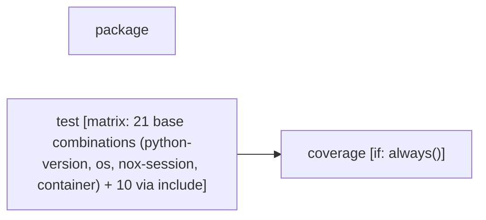

# Tier 4 scoring — urllib3_ci

Pre-registered checklist: `evaluation/tier4_checklists/urllib3_ci.checklist.yml` (open separately -- not duplicated here).

Score each condition fact-by-fact against the checklist: present / missing / false (hallucination). Presentation order below is randomized per EVALUATION_PLAN.md's Method 9 bias mitigation -- the mapping back to conditions 1/2/3 is in `urllib3_ci.answer_key.md`, intentionally kept out of this file.

---

## Condition A

Pipeline: CI
Source: /home/user/what-is-my-pipeline-doing/evaluation/held_out_workflows/urllib3_ci.yml (GitHub Actions)
Permissions: contents: read

AT A GLANCE
This workflow runs on pushes, pull requests, and manual dispatch.
It contains 3 jobs: 2 with no declared dependencies, 1 depending on other jobs.
1 of 3 jobs use a build matrix.

WHEN IT RUNS
- Runs on every push
- Runs on every pull request
- Can be triggered manually

EXECUTION SUMMARY
Independent jobs (no dependencies): package, test
coverage runs after test

IMPLEMENTATION DETAILS
1. package — runs on ubuntu-latest; 3 steps
   - Checkout repository (https://github.com/actions/checkout)
   - Setup Python (https://github.com/actions/setup-python)
   - Check packages
2. test — runs on ${{ matrix.os }}; 10 steps; matrix: 21 base combinations (python-version, os, nox-session, container) + 10 via include
   - Checkout repository (https://github.com/actions/checkout)
   - Setup Python ${{ matrix.python-version }} (https://github.com/actions/setup-python)
   - Install uv (https://github.com/astral-sh/setup-uv)
   - Install Chrome (https://github.com/browser-actions/setup-chrome)
   - Force override system chrome
   - Install Firefox (https://github.com/browser-actions/setup-firefox)
   - Install node.js (https://github.com/actions/setup-node)
   - Cache pyodide downloads in nox cache (https://github.com/actions/cache)
   - Run tests
   - Upload coverage data (https://github.com/actions/upload-artifact)
3. coverage — runs on ubuntu-24.04; 7 steps; after test; condition: always()
   - Checkout repository (https://github.com/actions/checkout)
   - Setup Python (https://github.com/actions/setup-python)
   - Install uv (https://github.com/astral-sh/setup-uv)
   - Install coverage
   - Download coverage data (https://github.com/actions/download-artifact)
   - Combine & check coverage
   - Upload report if check failed (https://github.com/actions/upload-artifact)

ENVIRONMENT VARIABLES
- FORCE_COLOR: 1
- CHROME_PATH: ${{ steps.setup-chrome.outputs.chrome-path }} (used in job: test, step: Force override system chrome)
- NOX_SESSION: ${{ matrix.nox-session != '' && matrix.nox-session || format('test-{0}', matrix.python-version) }} (used in job: test, step: Run tests)

---

## Condition B

# CI

<!-- llm-overview:start -->
## Overview

This CI pipeline is defined as a GitHub Actions workflow and operates with `contents: read` permissions. It is configured to run automatically on every push to the repository and on every pull request. Additionally, it can be triggered manually. The pipeline comprises three jobs: `package`, `test`, and `coverage`. Two of these jobs, `package` and `test`, run independently, while the `coverage` job is configured to run after `test` completes. The `test` job utilizes a build matrix for its execution. The environment variable `FORCE_COLOR` is set to `1` for the pipeline.

The `package` job executes on `ubuntu-latest` and involves three steps: checking out the repository, setting up Python, and checking packages. The `test` job runs on `${{ matrix.os }}` and uses a build matrix that includes 21 base combinations of Python version, OS, nox session, and container, along with 10 additional combinations via an include directive. Its steps include checking out the repository, setting up Python, installing `uv`, Chrome, Firefox, and Node.js, forcing an override of system Chrome, caching Pyodide downloads, running tests, and uploading coverage data. This job specifically uses the `CHROME_PATH` and `NOX_SESSION` environment variables.

The `coverage` job runs on `ubuntu-24.04` after the `test` job, and it is configured to always execute regardless of the `test` job's outcome. This job's steps involve checking out the repository, setting up Python, installing `uv` and coverage tools, downloading coverage data, combining and checking the coverage, and uploading a report if the coverage check fails.
<!-- llm-overview:end -->

```text
Pipeline: CI
Source: /home/user/what-is-my-pipeline-doing/evaluation/held_out_workflows/urllib3_ci.yml (GitHub Actions)
Permissions: contents: read

AT A GLANCE
This workflow runs on pushes, pull requests, and manual dispatch.
It contains 3 jobs: 2 with no declared dependencies, 1 depending on other jobs.
1 of 3 jobs use a build matrix.

WHEN IT RUNS
- Runs on every push
- Runs on every pull request
- Can be triggered manually

EXECUTION SUMMARY
Independent jobs (no dependencies): package, test
coverage runs after test

IMPLEMENTATION DETAILS
1. package — runs on ubuntu-latest; 3 steps
   - Checkout repository (https://github.com/actions/checkout)
   - Setup Python (https://github.com/actions/setup-python)
   - Check packages
2. test — runs on ${{ matrix.os }}; 10 steps; matrix: 21 base combinations (python-version, os, nox-session, container) + 10 via include
   - Checkout repository (https://github.com/actions/checkout)
   - Setup Python ${{ matrix.python-version }} (https://github.com/actions/setup-python)
   - Install uv (https://github.com/astral-sh/setup-uv)
   - Install Chrome (https://github.com/browser-actions/setup-chrome)
   - Force override system chrome
   - Install Firefox (https://github.com/browser-actions/setup-firefox)
   - Install node.js (https://github.com/actions/setup-node)
   - Cache pyodide downloads in nox cache (https://github.com/actions/cache)
   - Run tests
   - Upload coverage data (https://github.com/actions/upload-artifact)
3. coverage — runs on ubuntu-24.04; 7 steps; after test; condition: always()
   - Checkout repository (https://github.com/actions/checkout)
   - Setup Python (https://github.com/actions/setup-python)
   - Install uv (https://github.com/astral-sh/setup-uv)
   - Install coverage
   - Download coverage data (https://github.com/actions/download-artifact)
   - Combine & check coverage
   - Upload report if check failed (https://github.com/actions/upload-artifact)

ENVIRONMENT VARIABLES
- FORCE_COLOR: 1
- CHROME_PATH: ${{ steps.setup-chrome.outputs.chrome-path }} (used in job: test, step: Force override system chrome)
- NOX_SESSION: ${{ matrix.nox-session != '' && matrix.nox-session || format('test-{0}', matrix.python-version) }} (used in job: test, step: Run tests)
```

## Pipeline Diagram



---

## Condition C

This CI/CD pipeline, named "CI", is a comprehensive GitHub Actions workflow designed to ensure the quality, compatibility, and correctness of a Python project. It runs on various triggers and performs three main jobs: `package` (build and lint checks), `test` (extensive cross-platform and cross-version testing), and `coverage` (code coverage analysis and enforcement).

Here's a detailed breakdown of what each part does:

---

### **Overall Configuration**

*   **`name: CI`**: The name of the workflow, visible in the GitHub Actions tab.
*   **`on: [push, pull_request, workflow_dispatch]`**:
    *   **`push`**: The pipeline runs automatically whenever code is pushed to the repository (e.g., to `main` or any branch).
    *   **`pull_request`**: The pipeline runs automatically whenever a pull request is opened, synchronized, or re-opened. This is crucial for pre-merge checks.
    *   **`workflow_dispatch`**: Allows manual triggering of the workflow from the GitHub Actions UI, which is useful for debugging or specific runs.
*   **`permissions: contents: "read"`**: Grants the workflow read access to the repository's contents, which is necessary for checking out the code.
*   **`defaults: run: shell: bash`**: Sets `bash` as the default shell for all `run` steps, ensuring consistent script execution across different operating systems.
*   **`env: FORCE_COLOR: 1`**: Forces colored output in the terminal, which can make logs easier to read.

---

### **Jobs**

The pipeline consists of three sequential jobs: `package`, `test`, and `coverage`.

#### **1. `package` Job**

This job focuses on building the Python package and performing basic sanity checks on its structure and documentation.

*   **`runs-on: ubuntu-latest`**: Executes on a fresh Ubuntu Linux runner.
*   **`timeout-minutes: 10`**: The job will be cancelled if it runs for longer than 10 minutes.

**Steps:**

*   **`Checkout repository`**: Downloads the project's code from the GitHub repository.
*   **`Setup Python`**: Sets up the latest Python 3.x environment and caches `pip` dependencies to speed up subsequent runs.
*   **`Check packages`**: This is the core of the job:
    *   `python -m pip install -U pip setuptools wheel build twine rstcheck`: Installs essential tools for building, packaging, and checking Python distributions and documentation.
        *   `build`: For building source distributions (`sdist`) and wheels (`.whl`).
        *   `twine`: For checking package metadata and integrity.
        *   `rstcheck`: For checking reStructuredText syntax.
    *   `python -m build`: Builds the Python package into the `dist/` directory (creating `sdist` and `wheel` files).
    *   `rstcheck --ignore-messages "(Duplicate implicit target name:.*)" CHANGES.rst`: Checks the `CHANGES.rst` file (likely a changelog or release notes) for reStructuredText syntax errors, ignoring specific duplicate target name warnings. This ensures documentation quality.
    *   `python -m twine check dist/*`: Verifies the metadata and integrity of the built package files in the `dist/` directory. This step catches common packaging errors before potential publication.

**Purpose:** To ensure the Python package can be successfully built, its documentation (changelog) is valid, and its distribution files are correctly formed according to PyPI standards.

#### **2. `test` Job**

This is the most extensive job, running a matrix of tests across various Python versions, operating systems, and specialized environments.

*   **`strategy: matrix`**: Defines a matrix of configurations to run tests against.
    *   **`fail-fast: false`**: Crucially, this means that if one test configuration fails, the other configurations in the matrix will *continue* to run. This provides a more complete picture of failures across the entire test suite.
    *   **`matrix` definitions**:
        *   `python-version`: A wide range of Python versions are tested, including specific patch versions (`3.12.2`), pre-releases (`3.14t`, `3.15`), and PyPy (`pypy-3.11`). This ensures broad compatibility.
        *   `os`: Tests are run on `macos-15`, `windows-latest`, and `ubuntu-24.04` for cross-platform compatibility.
        *   `nox-session`: Defaults to empty, but specific `nox` sessions are defined in `include`.
        *   `container`: Defaults to empty, but a specific Docker container is used for one test case.
        *   **`include`**: This section adds specific, non-standard test configurations:
            *   **Integration tests**: `test_integration` for Python 3.12 on Ubuntu.
            *   **Specific patch version test**: `test-3.12` for Python 3.12.2 (likely targeting a specific bug fix or feature).
            *   **PyPy tests**: `test-pypy3.11` for PyPy 3.11 on Ubuntu.
            *   **Minimum `pyOpenSSL` test**: Uses a `python:3.13-bullseye` Docker container to test with an older OpenSSL 1.1.1 environment, ensuring compatibility with minimum supported dependencies.
            *   **`brotlipy` tests**: `test_brotlipy` for Python 3.x on Ubuntu.
            *   **Emscripten/Pyodide tests**: Several *experimental* tests (`emscripten(node)`, `emscripten(firefox)`, `emscripten(chrome)`) run Python code compiled to WebAssembly (Pyodide) in different JavaScript environments. This indicates the project might be designed to run in web browsers or Node.js.
            *   **Experimental Python 3.15**: An experimental run for Python 3.15.
*   **`runs-on: ${{ matrix.os }}`**: The runner OS is dynamically selected from the matrix.
*   **`container: ${{ matrix.container }}`**: A Docker container is used if specified in the matrix (e.g., for the `bullseye` test).
*   **`name: ...`**: Provides a descriptive name for each individual job run in the matrix, making it easy to identify which configuration is being tested.
*   **`continue-on-error: ${{ matrix.experimental }}`**: **Important!** If a matrix configuration is marked as `experimental: true`, its failure will *not* cause the entire pipeline to fail. This allows testing cutting-edge or less stable configurations without blocking the main development flow.
*   **`timeout-minutes: 10`**: Each individual test run in the matrix has a 10-minute timeout.

**Steps:**

*   **`Checkout repository`**: Downloads the code. `fetch-depth: 0` is used to fetch the full Git history, which might be needed to determine the project's version from Git tags.
*   **`Setup Python ${{ matrix.python-version }}`**: Sets up the specific Python version for the current matrix run. It's skipped if a Docker container is used, as Python is assumed to be pre-installed there. `allow-prereleases: true` and `check-latest: true` are used for testing pre-release Python versions.
*   **`Install uv`**: Installs `uv`, a fast Python package installer and resolver, which is used for dependency management and running commands.
*   **`Install Chrome`, `Force override system chrome`, `Install Firefox`, `Install node.js`**: These steps conditionally install web browsers (Chrome, Firefox) and Node.js specifically for the `emscripten` (WebAssembly) tests, allowing the Python code to be tested in these environments.
*   **`Cache pyodide downloads in nox cache`**: Caches Pyodide-related downloads for the `emscripten` tests, speeding up subsequent runs by avoiding repeated downloads.
*   **`Run tests`**:
    *   `uvx nox -s "$NOX_SESSION"`: Uses `uvx` (uv's equivalent of `npx`) to run `nox`. `nox` is a tool for running tests in isolated virtual environments.
    *   `NOX_SESSION`: This environment variable dynamically selects the `nox` session to run. If a specific `nox-session` is defined in the matrix, it's used; otherwise, it defaults to `test-{python-version}` (e.g., `test-3.10`). This means `nox` handles the actual test execution and environment setup for each Python version and specific test scenario.
*   **`Upload coverage data`**: After tests run, any generated `.coverage.*` files (which contain code coverage information) are uploaded as artifacts. These will be downloaded and combined by the `coverage` job.

**Purpose:** To thoroughly test the project's code against a wide array of Python versions, operating systems, and specialized environments (including PyPy, older dependencies, and WebAssembly), ensuring maximum compatibility and catching regressions early. Experimental tests are allowed to run without blocking the pipeline.

#### **3. `coverage` Job**

This job collects all coverage data from the `test` job, combines it, and enforces a strict code coverage policy.

*   **`if: always()`**: **Important!** This job will run regardless of whether the `test` job succeeded or failed. This ensures that coverage reports are always generated, even if some tests failed, which can be crucial for debugging.
*   **`runs-on: "ubuntu-24.04"`**: Executes on an Ubuntu Linux runner.
*   **`needs: test`**: This job depends on the `test` job. It will start only after all matrix runs of the `test` job have completed (or been skipped/cancelled).

**Steps:**

*   **`Checkout repository`**: Downloads the project's code.
*   **`Setup Python`**: Sets up the latest Python 3.x environment.
*   **`Install uv`**: Installs `uv`.
*   **`Install coverage`**: `uv sync --dev --frozen` installs development dependencies, including the `coverage.py` tool, from a lock file. This ensures that the exact versions of tools used for coverage analysis are consistent.
*   **`Download coverage data`**: Downloads all `coverage-data-*` artifacts that were uploaded by the `test` job. `merge-multiple: true` combines them into a single set of coverage files.
*   **`Combine & check coverage`**: This is the core of the job:
    *   `uv run -m build`: Rebuilds the package. This might be necessary to ensure the source files are available in the correct location for coverage reporting.
    *   `uv run -m coverage combine`: Combines all the individual `.coverage.*` files downloaded from the `test` job into a single `.coverage` data file.
    *   `uv run -m coverage html --skip-covered --skip-empty`: Generates a detailed HTML coverage report in the `htmlcov` directory, skipping files that are fully covered or empty.
    *   `uv run -m coverage report --ignore-errors --show-missing --fail-under=100`: Generates a text-based coverage report in the console. **Crucially, `--fail-under=100` means this step will fail the job if the overall code coverage is not 100%**. This enforces a very strict code coverage policy.
*   **`Upload report if check failed`**: If the previous step (`Combine & check coverage`) fails (meaning coverage is less than 100%), this step uploads the generated `htmlcov` directory as an artifact. This allows developers to easily inspect the detailed HTML report to see which lines are not covered.

**Purpose:** To aggregate all code coverage data, generate comprehensive reports, and strictly enforce 100% code coverage. If coverage falls below 100%, the pipeline fails, and a detailed report is provided for debugging.

---

### **In Summary:**

This CI/CD pipeline is designed for a Python project that prioritizes:

1.  **Robust Packaging**: Ensures the project can be built and distributed correctly.
2.  **Extensive Compatibility**: Tests across a wide range of Python versions (including PyPy and pre-releases) and operating systems (Linux, Windows, macOS).
3.  **Specialized Environment Testing**: Includes tests for specific dependency versions (e.g., older OpenSSL) and advanced use cases like running Python in WebAssembly environments (browsers, Node.js).
4.  **High Code Quality**: Enforces a very strict 100% code coverage policy, ensuring that virtually every line of code is covered by tests.
5.  **Early Feedback**: Runs on every push and pull request, providing immediate feedback on code changes.
6.  **Resilience**: Allows experimental tests to run without blocking the entire pipeline and always generates coverage reports, even on test failures.

It uses modern Python tooling like `uv` and `nox` for efficient dependency management and test execution.

---
