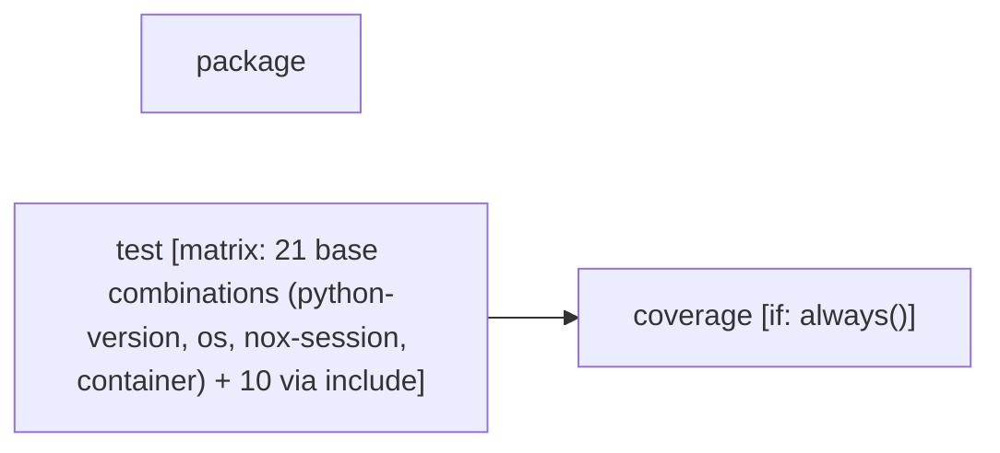

# Tier 4 scoring — urllib3_ci

Pre-registered checklist: `evaluation/tier4_checklists/urllib3_ci.checklist.yml` (open separately -- not duplicated here).

Score each condition fact-by-fact against the checklist: present / missing / false (hallucination). Presentation order below is randomized per EVALUATION_PLAN.md's Method 9 bias mitigation -- the mapping back to conditions 1/2/3 is in `urllib3_ci.answer_key.md`, intentionally kept out of this file.

---

## Condition A

Pipeline: CI
Source: /home/user/what-is-my-pipeline-doing/evaluation/held_out_workflows/urllib3_ci.yml (GitHub Actions)
Permissions: contents: read

AT A GLANCE
This workflow runs on pushes, pull requests, and manual dispatch.
It contains 3 jobs: 2 with no declared dependencies, 1 depending on other jobs.
1 of 3 jobs use a build matrix.

WHEN IT RUNS
- Runs on every push
- Runs on every pull request
- Can be triggered manually

EXECUTION SUMMARY
Independent jobs (no dependencies): package, test
coverage runs after test

IMPLEMENTATION DETAILS
1. package — runs on ubuntu-latest; 3 steps
   - Checkout repository (https://github.com/actions/checkout)
   - Setup Python (https://github.com/actions/setup-python)
   - Check packages
2. test — runs on ${{ matrix.os }}; 10 steps; matrix: 21 base combinations (python-version, os, nox-session, container) + 10 via include
   - Checkout repository (https://github.com/actions/checkout)
   - Setup Python ${{ matrix.python-version }} (https://github.com/actions/setup-python)
   - Install uv (https://github.com/astral-sh/setup-uv)
   - Install Chrome (https://github.com/browser-actions/setup-chrome)
   - Force override system chrome
   - Install Firefox (https://github.com/browser-actions/setup-firefox)
   - Install node.js (https://github.com/actions/setup-node)
   - Cache pyodide downloads in nox cache (https://github.com/actions/cache)
   - Run tests
   - Upload coverage data (https://github.com/actions/upload-artifact)
3. coverage — runs on ubuntu-24.04; 7 steps; after test; condition: always()
   - Checkout repository (https://github.com/actions/checkout)
   - Setup Python (https://github.com/actions/setup-python)
   - Install uv (https://github.com/astral-sh/setup-uv)
   - Install coverage
   - Download coverage data (https://github.com/actions/download-artifact)
   - Combine & check coverage
   - Upload report if check failed (https://github.com/actions/upload-artifact)

---

## Condition B

# CI

<!-- llm-overview:start -->
## Overview

This CI pipeline is a GitHub Actions workflow that requires `contents: read` permissions. It is configured to run automatically on every push and pull request, and can also be triggered manually. The workflow comprises three jobs: `package`, `test`, and `coverage`. Two of these jobs, `package` and `test`, run independently, while the `coverage` job depends on `test`. One of the jobs uses a build matrix for its execution.

The `package` job runs on `ubuntu-latest` and includes three steps: checking out the repository, setting up Python, and checking packages. The `test` job executes across various operating systems as defined by a build matrix, which specifies 21 base combinations and 10 additional ones for Python version, OS, nox session, and container. This job involves ten steps, including checking out the repository, setting up Python, installing `uv`, installing Chrome and Firefox, forcing a system Chrome override, installing Node.js, caching pyodide downloads, running tests, and uploading coverage data.

The `coverage` job runs on `ubuntu-24.04` after the `test` job has completed, and it is configured to always run. It performs seven steps: checking out the repository, setting up Python, installing `uv`, installing coverage, downloading coverage data, combining and checking coverage, and uploading a report if the check fails.
<!-- llm-overview:end -->

```text
Pipeline: CI
Source: /home/user/what-is-my-pipeline-doing/evaluation/held_out_workflows/urllib3_ci.yml (GitHub Actions)
Permissions: contents: read

AT A GLANCE
This workflow runs on pushes, pull requests, and manual dispatch.
It contains 3 jobs: 2 with no declared dependencies, 1 depending on other jobs.
1 of 3 jobs use a build matrix.

WHEN IT RUNS
- Runs on every push
- Runs on every pull request
- Can be triggered manually

EXECUTION SUMMARY
Independent jobs (no dependencies): package, test
coverage runs after test

IMPLEMENTATION DETAILS
1. package — runs on ubuntu-latest; 3 steps
   - Checkout repository (https://github.com/actions/checkout)
   - Setup Python (https://github.com/actions/setup-python)
   - Check packages
2. test — runs on ${{ matrix.os }}; 10 steps; matrix: 21 base combinations (python-version, os, nox-session, container) + 10 via include
   - Checkout repository (https://github.com/actions/checkout)
   - Setup Python ${{ matrix.python-version }} (https://github.com/actions/setup-python)
   - Install uv (https://github.com/astral-sh/setup-uv)
   - Install Chrome (https://github.com/browser-actions/setup-chrome)
   - Force override system chrome
   - Install Firefox (https://github.com/browser-actions/setup-firefox)
   - Install node.js (https://github.com/actions/setup-node)
   - Cache pyodide downloads in nox cache (https://github.com/actions/cache)
   - Run tests
   - Upload coverage data (https://github.com/actions/upload-artifact)
3. coverage — runs on ubuntu-24.04; 7 steps; after test; condition: always()
   - Checkout repository (https://github.com/actions/checkout)
   - Setup Python (https://github.com/actions/setup-python)
   - Install uv (https://github.com/astral-sh/setup-uv)
   - Install coverage
   - Download coverage data (https://github.com/actions/download-artifact)
   - Combine & check coverage
   - Upload report if check failed (https://github.com/actions/upload-artifact)
```

## Pipeline Diagram



---

## Condition C

This CI/CD pipeline, named "CI", is a GitHub Actions workflow designed to ensure the quality, compatibility, and test coverage of a Python project. It runs a series of automated checks and tests whenever code is pushed, a pull request is opened, or manually triggered.

Here's a breakdown of what each part does:

## Overall Pipeline Configuration

*   **`name: CI`**: The name of the workflow, which will appear in the GitHub Actions tab.
*   **`on: [push, pull_request, workflow_dispatch]`**: Defines when the workflow runs:
    *   `push`: Whenever code is pushed to the repository (e.g., to `main` branch or any branch).
    *   `pull_request`: Whenever a pull request is opened, synchronized, or reopened.
    *   `workflow_dispatch`: Allows manual triggering of the workflow from the GitHub Actions UI.
*   **`permissions: contents: "read"`**: Grants the workflow read-only access to the repository's contents. This is a good security practice, limiting potential damage if the workflow were compromised.
*   **`defaults: run: shell: bash`**: Sets the default shell for all `run` steps to `bash`.
*   **`env: FORCE_COLOR: 1`**: Forces colored output in the terminal logs, making them easier to read.

## Jobs

The pipeline consists of three main jobs: `package`, `test`, and `coverage`.

### 1. `package` Job

This job focuses on building the project's distributable packages and performing basic quality checks on them and the project's documentation.

*   **`runs-on: ubuntu-latest`**: Runs on the latest Ubuntu Linux virtual machine.
*   **`timeout-minutes: 10`**: The job will be cancelled if it takes longer than 10 minutes.

**Steps:**

1.  **`Checkout repository`**: Downloads the project's code from the repository. `persist-credentials: false` is a minor security/cleanliness setting.
2.  **`Setup Python`**: Installs Python 3.x (the latest stable 3.x version) and configures `pip` caching to speed up dependency installation.
3.  **`Check packages`**:
    *   `python -m pip install -U pip setuptools wheel build twine rstcheck`: Installs essential Python packaging tools (`build` to create distributions, `twine` to check them, `rstcheck` for reStructuredText syntax checking).
    *   `python -m build`: Builds the source distribution (`sdist`) and a wheel distribution (`bdist_wheel`) of the project, placing them in the `dist/` directory.
    *   `rstcheck --ignore-messages "(Duplicate implicit target name:.*)" CHANGES.rst`: Checks the `CHANGES.rst` file (likely a changelog or release notes) for reStructuredText syntax errors, ignoring specific duplicate target name warnings. This ensures the documentation is well-formed.
    *   `python -m twine check dist/*`: Verifies the integrity and metadata of the built packages in the `dist/` directory. This step is crucial for ensuring that the packages are valid and can be uploaded to PyPI without issues.

**Purpose:** To confirm that the project can be successfully packaged and that the resulting distributions are valid, along with basic documentation quality checks.

### 2. `test` Job

This is the most extensive job, running a comprehensive suite of tests across a wide range of environments.

*   **`strategy: matrix`**: This defines a matrix of different configurations, meaning the job will run multiple times in parallel, once for each combination of specified variables.
    *   `fail-fast: false`: If one test run in the matrix fails, the other parallel test runs will continue to completion.
    *   `matrix`:
        *   `python-version`: Tests against various Python versions (3.10, 3.11, 3.12, 3.13, 3.14, 3.14t, 3.15, `pypy-3.11`, `3.x`, and a specific `3.12.2`). This ensures broad compatibility.
        *   `os`: Tests on different operating systems (`macos-15`, `windows-latest`, `ubuntu-24.04`).
        *   `nox-session`: An empty string by default, but specific `nox` sessions are added via `include`.
        *   `container`: An empty string by default, but specific Docker containers are used for certain tests.
        *   `include`: This section adds specific, non-standard test scenarios:
            *   **Integration tests**: `test_integration` for Python 3.12 on Ubuntu.
            *   **Specific Python patch version**: `test-3.12` for Python 3.12.2 (likely to test a specific bug fix or feature).
            *   **PyPy**: `test-pypy3.11` for PyPy 3.11 on Ubuntu.
            *   **Minimum `pyOpenSSL`**: `test_min_pyopenssl` for Python 3.13 in a `python:3.13-bullseye` Docker container. This is important for testing compatibility with older OpenSSL versions (like OpenSSL 1.1.1, which was in Debian Bullseye).
            *   **`brotlipy`**: `test_brotlipy` for Python 3.x on Ubuntu, testing a specific dependency or feature.
            *   **Emscripten/WebAssembly (WASM) tests**: `emscripten(node)`, `emscripten(firefox)`, `emscripten(chrome)` for Python 3.12 on Ubuntu. These are advanced tests that compile the Python code to WebAssembly and run it in different JavaScript environments (Node.js, Firefox browser, Chrome browser). This indicates the project might support running in web environments.
            *   **Experimental Python 3.15**: Tests against a future Python version, marked as `experimental: true`.
*   **`runs-on: ${{ matrix.os }}`**: Each matrix job runs on the specified operating system.
*   **`container: ${{ matrix.container }}`**: If a container is specified in the matrix (e.g., `python:3.13-bullseye`), the job runs inside that Docker container.
*   **`name: ...`**: Dynamically generates a descriptive name for each individual test run based on its OS, Python version, and `nox` session.
*   **`continue-on-error: ${{ matrix.experimental }}`**: If a job is marked as `experimental: true` (like Python 3.15), its failure will not cause the entire pipeline to fail.
*   **`timeout-minutes: 10`**: Each individual test run will be cancelled if it takes longer than 10 minutes.

**Steps:**

1.  **`Checkout repository`**: Downloads the code. `fetch-depth: 0` is specified, which is often needed for tools that derive version information from Git history (e.g., `git describe`).
2.  **`Setup Python ${{ matrix.python-version }}`**: Installs the specific Python version for the current matrix run. `allow-prereleases: true` and `check-latest: true` are useful for testing newer/pre-release Python versions. It's skipped if running inside a container, as the container likely already has Python.
3.  **`Install uv`**: Installs `uv`, a fast Python package installer and resolver, used for managing dependencies.
4.  **`Install Chrome`, `Force override system chrome`, `Install Firefox`, `Install node.js`**: These steps are conditional (`if: ...`) and only run for the Emscripten/WASM tests. They set up the necessary browser or Node.js environments required to execute the WASM-compiled Python code.
5.  **`Cache pyodide downloads in nox cache`**: Caches Pyodide-related downloads (used for Emscripten tests) to speed up subsequent runs.
6.  **`Run tests`**:
    *   `uvx nox -s "$NOX_SESSION"`: This is the core testing command.
        *   `uvx`: `uv`'s equivalent of `npx`, used to run commands from installed packages without explicitly adding them to PATH.
        *   `nox`: A tool for running tests in isolated virtual environments.
        *   `-s "$NOX_SESSION"`: Specifies the `nox` session to run. The `NOX_SESSION` environment variable is dynamically set: if `matrix.nox-session` is defined, it uses that; otherwise, it defaults to `test-<python-version>`. This allows for highly flexible test execution.
7.  **`Upload coverage data`**: After each test run, any generated `.coverage.*` files (which contain code coverage information) are uploaded as artifacts. `if-no-files-found: error` ensures that coverage data is always expected.

**Purpose:** To thoroughly test the project's code against a wide array of Python versions, operating systems, and specialized environments (like PyPy, specific OpenSSL versions, and WebAssembly), ensuring maximum compatibility and catching regressions.

### 3. `coverage` Job

This job collects all the coverage data from the `test` job, combines it, and enforces a strict code coverage policy.

*   **`if: always()`**: This is critical. This job will run *even if* the `test` job (or some of its matrix runs) failed. This ensures that coverage reports are always generated, even for failing builds, which can be useful for debugging.
*   **`runs-on: "ubuntu-24.04"`**: Runs on a single Ubuntu Linux virtual machine.
*   **`needs: test`**: This job depends on the `test` job completing.

**Steps:**

1.  **`Checkout repository`**: Downloads the project code.
2.  **`Setup Python`**: Installs Python 3.x.
3.  **`Install uv`**: Installs `uv`.
4.  **`Install coverage`**: `uv sync --dev --frozen` installs development dependencies, which includes the `coverage.py` tool.
5.  **`Download coverage data`**: Downloads all the `coverage-data-*` artifacts that were uploaded by the individual `test` job runs. `merge-multiple: true` automatically combines these into a single set of files.
6.  **`Combine & check coverage`**:
    *   `uv run -m build`: Builds the project again (likely to ensure the package structure is available for coverage analysis).
    *   `uv run -m coverage combine`: Merges all the downloaded `.coverage.*` files into a single `.coverage` file.
    *   `uv run -m coverage html --skip-covered --skip-empty`: Generates an HTML report of the code coverage, skipping files that are fully covered or empty.
    *   `uv run -m coverage report --ignore-errors --show-missing --fail-under=100`: Generates a text-based coverage report, showing missing lines, and *critically, fails the job if the overall code coverage is less than 100%*. This enforces a very strict code coverage policy.
7.  **`Upload report if check failed`**: If the previous step (combining and checking coverage) fails (meaning coverage is not 100%), this step uploads the generated `htmlcov` directory as an artifact. This allows developers to easily download and inspect the detailed HTML coverage report to see which lines are not covered.

**Purpose:** To aggregate all code coverage data from the extensive test suite, generate reports, and enforce a strict 100% code coverage policy, ensuring that every line of code is tested.

## In Summary

This CI/CD pipeline is a robust and comprehensive system for maintaining a high-quality Python project. It performs:

*   **Package Validation**: Ensures the project can be built into valid distributions.
*   **Extensive Cross-Environment Testing**: Runs tests across multiple Python versions, operating systems, and specialized environments (PyPy, older dependencies, WebAssembly).
*   **Strict Code Coverage Enforcement**: Collects and combines coverage data from all tests, failing the pipeline if 100% code coverage is not achieved, and provides reports for debugging.

The use of `uv` for dependency management and `nox` for isolated test environments indicates a modern and efficient approach to Python development workflows. The inclusion of Emscripten/WASM tests suggests the project might have ambitions for web-based deployment or execution.

---
