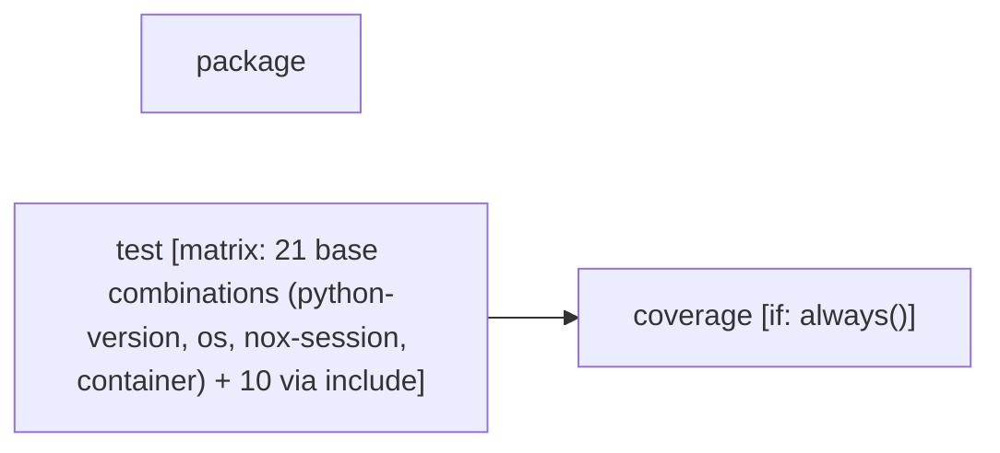

# Tier 4 scoring — urllib3_ci

Pre-registered checklist: `evaluation/tier4_checklists/urllib3_ci.checklist.yml` (open separately -- not duplicated here).

Score each condition fact-by-fact against the checklist: present / missing / false (hallucination). Presentation order below is randomized per EVALUATION_PLAN.md's Method 9 bias mitigation -- the mapping back to conditions 1/2/3 is in `urllib3_ci.answer_key.md`, intentionally kept out of this file.

---

## Condition A

Pipeline: CI
Source: /home/user/what-is-my-pipeline-doing/evaluation/held_out_workflows/urllib3_ci.yml (GitHub Actions)
Permissions: contents: read

AT A GLANCE
This workflow runs on pushes, pull requests, and manual dispatch.
It contains 3 jobs: 2 with no declared dependencies, 1 depending on other jobs.
1 of 3 jobs use a build matrix.

WHEN IT RUNS
- Runs on every push
- Runs on every pull request
- Can be triggered manually

EXECUTION SUMMARY
Independent jobs (no dependencies): package, test
coverage runs after test

IMPLEMENTATION DETAILS
1. package — runs on ubuntu-latest; 3 steps
   - Checkout repository (https://github.com/actions/checkout)
   - Setup Python (https://github.com/actions/setup-python)
   - Check packages
2. test — runs on ${{ matrix.os }}; 10 steps; matrix: 21 base combinations (python-version, os, nox-session, container) + 10 via include
   - Checkout repository (https://github.com/actions/checkout)
   - Setup Python ${{ matrix.python-version }} (https://github.com/actions/setup-python)
   - Install uv (https://github.com/astral-sh/setup-uv)
   - Install Chrome (https://github.com/browser-actions/setup-chrome)
   - Force override system chrome
   - Install Firefox (https://github.com/browser-actions/setup-firefox)
   - Install node.js (https://github.com/actions/setup-node)
   - Cache pyodide downloads in nox cache (https://github.com/actions/cache)
   - Run tests
   - Upload coverage data (https://github.com/actions/upload-artifact)
3. coverage — runs on ubuntu-24.04; 7 steps; after test; condition: always()
   - Checkout repository (https://github.com/actions/checkout)
   - Setup Python (https://github.com/actions/setup-python)
   - Install uv (https://github.com/astral-sh/setup-uv)
   - Install coverage
   - Download coverage data (https://github.com/actions/download-artifact)
   - Combine & check coverage
   - Upload report if check failed (https://github.com/actions/upload-artifact)

ENVIRONMENT VARIABLES
- FORCE_COLOR: 1
- CHROME_PATH: ${{ steps.setup-chrome.outputs.chrome-path }} (used in job: test, step: Force override system chrome)
- NOX_SESSION: ${{ matrix.nox-session != '' && matrix.nox-session || format('test-{0}', matrix.python-version) }} (used in job: test, step: Run tests)

---

## Condition B

> **⚠ GENERATION FAILED -- this condition's tool call did not succeed. The text below is fallback/unprocessed output, not a real generated result. Score it as unavailable/failed, not as a legitimate output of its underlying method.**
> Error: ServerError: 503 UNAVAILABLE. {'error': {'code': 503, 'message': 'This model is currently experiencing high demand. Spikes in demand are usually temporary. Please try again later.', 'status': 'UNAVAILABLE'}}

# CI

```text
Pipeline: CI
Source: /home/user/what-is-my-pipeline-doing/evaluation/held_out_workflows/urllib3_ci.yml (GitHub Actions)
Permissions: contents: read

AT A GLANCE
This workflow runs on pushes, pull requests, and manual dispatch.
It contains 3 jobs: 2 with no declared dependencies, 1 depending on other jobs.
1 of 3 jobs use a build matrix.

WHEN IT RUNS
- Runs on every push
- Runs on every pull request
- Can be triggered manually

EXECUTION SUMMARY
Independent jobs (no dependencies): package, test
coverage runs after test

IMPLEMENTATION DETAILS
1. package — runs on ubuntu-latest; 3 steps
   - Checkout repository (https://github.com/actions/checkout)
   - Setup Python (https://github.com/actions/setup-python)
   - Check packages
2. test — runs on ${{ matrix.os }}; 10 steps; matrix: 21 base combinations (python-version, os, nox-session, container) + 10 via include
   - Checkout repository (https://github.com/actions/checkout)
   - Setup Python ${{ matrix.python-version }} (https://github.com/actions/setup-python)
   - Install uv (https://github.com/astral-sh/setup-uv)
   - Install Chrome (https://github.com/browser-actions/setup-chrome)
   - Force override system chrome
   - Install Firefox (https://github.com/browser-actions/setup-firefox)
   - Install node.js (https://github.com/actions/setup-node)
   - Cache pyodide downloads in nox cache (https://github.com/actions/cache)
   - Run tests
   - Upload coverage data (https://github.com/actions/upload-artifact)
3. coverage — runs on ubuntu-24.04; 7 steps; after test; condition: always()
   - Checkout repository (https://github.com/actions/checkout)
   - Setup Python (https://github.com/actions/setup-python)
   - Install uv (https://github.com/astral-sh/setup-uv)
   - Install coverage
   - Download coverage data (https://github.com/actions/download-artifact)
   - Combine & check coverage
   - Upload report if check failed (https://github.com/actions/upload-artifact)

ENVIRONMENT VARIABLES
- FORCE_COLOR: 1
- CHROME_PATH: ${{ steps.setup-chrome.outputs.chrome-path }} (used in job: test, step: Force override system chrome)
- NOX_SESSION: ${{ matrix.nox-session != '' && matrix.nox-session || format('test-{0}', matrix.python-version) }} (used in job: test, step: Run tests)
```

## Pipeline Diagram



---

## Condition C

> **⚠ GENERATION FAILED -- this condition's tool call did not succeed. The text below is fallback/unprocessed output, not a real generated result. Score it as unavailable/failed, not as a legitimate output of its underlying method.**
> Error: ServerError: 503 UNAVAILABLE. {'error': {'code': 503, 'message': 'This model is currently experiencing high demand. Spikes in demand are usually temporary. Please try again later.', 'status': 'UNAVAILABLE'}}

name: CI

on: [push, pull_request, workflow_dispatch]

permissions:
  contents: "read"

defaults:
  run:
    shell: bash
env:
  FORCE_COLOR: 1

jobs:
  package:
    runs-on: ubuntu-latest
    timeout-minutes: 10

    steps:
      - name: "Checkout repository"
        uses: actions/checkout@9c091bb21b7c1c1d1991bb908d89e4e9dddfe3e0 # v7.0.0
        with:
          persist-credentials: false

      - name: "Setup Python"
        uses: actions/setup-python@ece7cb06caefa5fff74198d8649806c4678c61a1 # v6.3.0
        with:
          python-version: "3.x"
          cache: "pip"

      - name: "Check packages"
        run: |
          python -m pip install -U pip setuptools wheel build twine rstcheck
          python -m build
          rstcheck --ignore-messages "(Duplicate implicit target name:.*)" CHANGES.rst
          python -m twine check dist/*

  test:
    strategy:
      fail-fast: false
      matrix:
        python-version: ["3.10", "3.11", "3.12", "3.13", "3.14", "3.14t", "3.15"]
        os:
          - macos-15
          - windows-latest
          - ubuntu-24.04
        nox-session: ['']
        container: ['']
        include:
          - experimental: false
          - python-version: "3.12"
            os: ubuntu-24.04
            experimental: false
            nox-session: test_integration
          # Test with 3.12.2 for https://github.com/urllib3/urllib3/pull/3620 patch
          - python-version: "3.12.2"
            os: ubuntu-24.04
            experimental: false
            nox-session: test-3.12
          # pypy
          - python-version: "pypy-3.11"
            os: ubuntu-24.04
            experimental: false
            nox-session: test-pypy3.11
          # Test with the minimum supported pyOpenSSL for OpenSSL 1.1.1.
          # Debian Bullseye was the last release with OpenSSL 1.1.1, and
          # 3.13-bullsey was the last published image.
          - python-version: "3.13"
            os: ubuntu-24.04
            container: python:3.13-bullseye
            experimental: false
            nox-session: test_min_pyopenssl
          - python-version: "3.x"
          # brotli
            os: ubuntu-24.04
            experimental: false
            nox-session: test_brotlipy
          - python-version: "3.12"
            os: ubuntu-24.04
            nox-session: emscripten(node)
            experimental: true
          - python-version: "3.12"
            os: ubuntu-24.04
            nox-session: emscripten(firefox)
            experimental: true
          - python-version: "3.12"
            os: ubuntu-24.04
            nox-session: emscripten(chrome)
            experimental: true
          - python-version: "3.15"
            experimental: true

    runs-on: ${{ matrix.os }}
    container: ${{ matrix.container }}
    name: ${{ fromJson('{"macos-15":"macOS","windows-latest":"Windows","ubuntu-24.04":"Ubuntu"}')[matrix.os] }} ${{ matrix.python-version }} ${{ matrix.nox-session}}
    continue-on-error: ${{ matrix.experimental }}
    timeout-minutes: 10
    steps:
      - name: "Checkout repository"
        uses: actions/checkout@9c091bb21b7c1c1d1991bb908d89e4e9dddfe3e0 # v7.0.0
        with:
          fetch-depth: 0 # Needed to fetch the version from git
          persist-credentials: false

      - name: "Setup Python ${{ matrix.python-version }}"
        uses: actions/setup-python@ece7cb06caefa5fff74198d8649806c4678c61a1 # v6.3.0
        # pip will emit a warning about running as root if setup-python
        # is used in a container.
        if: ${{ matrix.container == '' }}
        with:
          python-version: ${{ matrix.python-version }}
          allow-prereleases: true
          check-latest: true

      - name: "Install uv"
        uses: astral-sh/setup-uv@d31148d669074a8d0a63714ba94f3201e7020bc3 # v8.3.0
        with:
          version: "0.11.7"

      - name: "Install Chrome"
        uses: browser-actions/setup-chrome@4f8e94349a351df0f048634f25fec36c3c91eded # v2.1.1
        id: setup-chrome
        if: ${{ matrix.nox-session == 'emscripten(chrome)' }}
        with:
          install-chromedriver: true
          chrome-version: canary
      - name: Force override system chrome
        env:
          CHROME_PATH: ${{ steps.setup-chrome.outputs.chrome-path }}
        run: |
          sudo rm -f /usr/bin/google-chrome
          sudo rm -f /usr/bin/chrome
          sudo ln -s $CHROME_PATH /usr/bin/google-chrome
          sudo ln -s $CHROME_PATH /usr/bin/chrome
          google-chrome --version
        if: ${{ matrix.nox-session == 'emscripten(chrome)' }}
      - name: "Install Firefox"
        uses: browser-actions/setup-firefox@fcf821c621167805dd63a29662bd7cb5676c81a8 # v1.7.1
        if: ${{ matrix.nox-session == 'emscripten(firefox)' }}
      - name: "Install node.js"
        uses: actions/setup-node@820762786026740c76f36085b0efc47a31fe5020 # v7.0.0
        if: ${{ matrix.nox-session == 'emscripten(node)' }}
        with:
          node-version: 22
      - name: Cache pyodide downloads in nox cache
        uses: actions/cache@55cc8345863c7cc4c66a329aec7e433d2d1c52a9 # v6.1.0
        if: ${{ startsWith(matrix.nox-session, 'emscripten') }}
        with:
          path: .nox/.cache
          # noxfile.py contains the Pyodide version used currently.
          key: pyodide-downloads-${{ hashFiles('noxfile.py') }}

      - name: "Run tests"
        run: |
          uvx nox -s "$NOX_SESSION"
        env:
          # If no explicit nox-session is set, run the default tests for the chosen Python version
          NOX_SESSION: ${{ matrix.nox-session != '' && matrix.nox-session || format('test-{0}', matrix.python-version) }}

      - name: "Upload coverage data"
        uses: actions/upload-artifact@bbbca2ddaa5d8feaa63e36b76fdaad77386f024f # v7.0.0
        with:
          name: coverage-data-${{ matrix.python-version }}-${{ matrix.os }}-${{ matrix.experimental }}-${{ matrix.nox-session }}
          path: ".coverage.*"
          if-no-files-found: error
          include-hidden-files: true


  coverage:
    if: always()
    runs-on: "ubuntu-24.04"
    needs: test
    steps:
      - name: "Checkout repository"
        uses: actions/checkout@9c091bb21b7c1c1d1991bb908d89e4e9dddfe3e0 # v7.0.0
        with:
          persist-credentials: false

      - name: "Setup Python"
        uses: actions/setup-python@ece7cb06caefa5fff74198d8649806c4678c61a1 # v6.3.0
        with:
          python-version: "3.x"

      - name: "Install uv"
        uses: astral-sh/setup-uv@d31148d669074a8d0a63714ba94f3201e7020bc3 # v8.3.0
        with:
          version: "0.11.7"

      - name: "Install coverage"
        # Install the same version of coverage as in the lock file.
        run: uv sync --dev --frozen

      - name: "Download coverage data"
        uses: actions/download-artifact@3e5f45b2cfb9172054b4087a40e8e0b5a5461e7c # v8.0.1
        with:
          pattern: coverage-data-*
          merge-multiple: true

      - name: "Combine & check coverage"
        run: |
          uv run -m build
          uv run -m coverage combine
          uv run -m coverage html --skip-covered --skip-empty
          uv run -m coverage report --ignore-errors --show-missing --fail-under=100

      - if: ${{ failure() }}
        name: "Upload report if check failed"
        uses: actions/upload-artifact@bbbca2ddaa5d8feaa63e36b76fdaad77386f024f # v7.0.0
        with:
          name: coverage-report
          path: htmlcov

---
