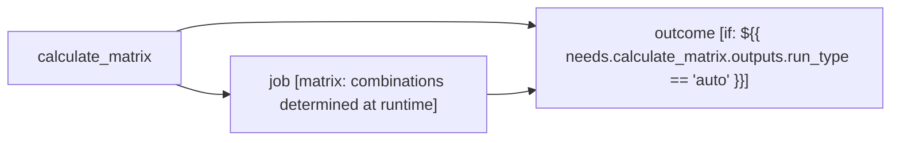

# CI

<!-- llm-overview:start -->
## Overview

The CI pipeline, defined in `tests/fixtures/rust_ci.yml`, runs on pushes to the `automation/bors/auto`, `automation/bors/try`, and `try-perf` branches, as well as on every pull request. It uses a concurrency group based on the workflow, ref, and SHA, which cancels in-progress runs. This pipeline requires `contents: read` and `packages: write` permissions.

The pipeline consists of three jobs, one of which uses a build matrix. The `calculate_matrix` job runs first on `ubuntu-24.04-arm` to checkout the source code, test `citool`, and determine the CI job matrix. Following this, the `job` job executes on the operating system specified by the matrix. It involves 33 steps, including installing cargo in AWS CodeBuild, checking out the source code, managing disk space, configuring pull request error messages, setting environment variables, ensuring channel consistency, collecting CPU statistics, and showing the current environment. This `job` deploys to the `bors` environment under specific conditions related to the `rust-lang/rust` repository and certain branches.

Finally, the `outcome` job runs on `ubuntu-24.04` after both `calculate_matrix` and `job` have completed, but only if the `calculate_matrix` job's `run_type` output is 'auto'. This job checks out the source code and publishes toolstate, deploying to the `bors` environment when the repository is `rust-lang/rust`. The pipeline requires several secrets: `TOOLSTATE_REPO_ACCESS_TOKEN`, `GITHUB_TOKEN` (used in the `job` job), `CACHES_AWS_ACCESS_KEY_ID` and `CACHES_AWS_SECRET_ACCESS_KEY` (used in the `job` job's "run the build" step), `ARTIFACTS_AWS_ACCESS_KEY_ID` and `ARTIFACTS_AWS_SECRET_ACCESS_KEY` (used in the `job` job's "upload artifacts to S3" step), and `DATADOG_API_KEY` (used in the `job` job's "upload job metrics to DataDog" step).
<!-- llm-overview:end -->

```text
Pipeline: CI
Source: tests/fixtures/rust_ci.yml (GitHub Actions)
Permissions: contents: read, packages: write
Concurrency: group ${{ github.workflow }}-${{ ((github.ref == 'refs/heads/try-perf' || github.ref == 'refs/heads/automation/bors/try') && github.sha) || github.ref }}; cancels in-progress runs

AT A GLANCE
This workflow runs on pushes to `automation/bors/auto`, `automation/bors/try`, `try-perf` and pull requests.
It contains 3 jobs: 1 with no declared dependencies, 2 depending on other jobs.
1 of 3 jobs use a build matrix.

WHEN IT RUNS
- Runs on every push to automation/bors/auto or automation/bors/try or try-perf branches
- Runs on every pull request targeting ** branch

EXECUTION SUMMARY
Independent jobs (no dependencies): calculate_matrix
job runs after calculate_matrix
outcome runs after calculate_matrix, job

IMPLEMENTATION DETAILS
1. calculate_matrix — runs on ubuntu-24.04-arm; 3 steps
   - Checkout the source code
   - Test citool
   - Calculate the CI job matrix
2. job — runs on ${{ matrix.os }}; 33 steps; matrix: combinations determined at runtime; after calculate_matrix; deployment environment: ${{ ((github.repository == 'rust-lang/rust' && (github.ref == 'refs/heads/try-perf' || github.ref == 'refs/heads/automation/bors/try' || github.ref == 'refs/heads/automation/bors/auto')) && 'bors') || '' }}
   - Install cargo in AWS CodeBuild
   - disable git crlf conversion
   - checkout the source code
   - free up disk space
   - print disk usage
   - configure the PR in which the error message will be posted
   - add extra environment variables
   - ensure the channel matches the target branch
   - collect CPU statistics
   - show the current environment
   - ... and 23 more steps
3. outcome — runs on ubuntu-24.04; 2 steps; after calculate_matrix, job; condition: ${{ needs.calculate_matrix.outputs.run_type == 'auto' }}; deployment environment: ${{ (github.repository == 'rust-lang/rust' && 'bors') || '' }}
   - checkout the source code
   - publish toolstate

SECRETS REQUIRED
- TOOLSTATE_REPO_ACCESS_TOKEN
- GITHUB_TOKEN (used in job: job)
- CACHES_AWS_ACCESS_KEY_ID (used in job: job, step: run the build)
- CACHES_AWS_SECRET_ACCESS_KEY (used in job: job, step: run the build)
- ARTIFACTS_AWS_ACCESS_KEY_ID (used in job: job, step: upload artifacts to S3)
- ARTIFACTS_AWS_SECRET_ACCESS_KEY (used in job: job, step: upload artifacts to S3)
- DATADOG_API_KEY (used in job: job, step: upload job metrics to DataDog)
```

## Pipeline Diagram


