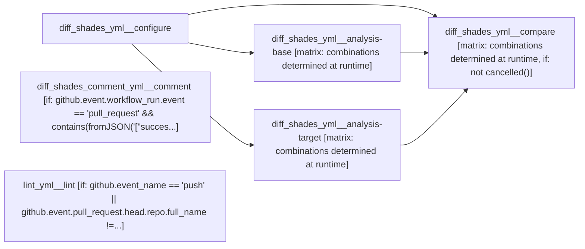
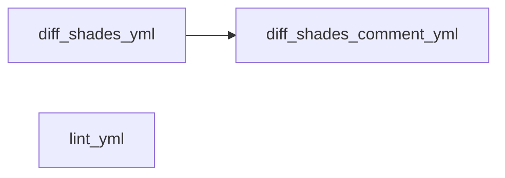

# black (unified CI documentation)

<!-- llm-overview:start -->
## Overview

This GitHub Actions workflow, named `black (unified CI documentation)`, runs on pushes to the `main` branch or pull requests that modify paths such as `src/**`, `pyproject.toml`, `scripts/diff_shades_gha_helper.py`, `.github/workflows/diff_shades.yml`, or `.github/workflows/diff_shades_comment.yml`. It also triggers on every general push and pull request, and after the `diff-shades` workflow completes.

The pipeline includes six jobs, all running on `ubuntu-latest`. Three jobs run independently: `diff_shades_yml__configure` sets up the run configuration and metadata. `diff_shades_comment_yml__comment` creates or updates a pull request comment, running only for pull request workflow runs that conclude with success or failure, and requires `pull-requests: write` permissions. `lint_yml__lint` runs pre-commit hooks and formatting, executing on pushes or when the pull request head repository differs from the base.

The remaining three jobs depend on `diff_shades_yml__configure`. `diff_shades_yml__analysis-base` and `diff_shades_yml__analysis-target` both run after `diff_shades_yml__configure`, performing analysis on baseline and target revisions respectively, and both use a build matrix. Finally, `diff_shades_yml__compare` runs after `diff_shades_yml__configure`, `diff_shades_yml__analysis-base`, and `diff_shades_yml__analysis-target`, generating and uploading a diff report, provided the workflow has not been cancelled. This job also uses a build matrix.
<!-- llm-overview:end -->

```text
Pipeline: black (unified CI documentation)
Source: tests/fixtures/multi/black/.github/workflows (GitHub Actions)

AT A GLANCE
This workflow runs on pushes to `main`, pull requests, completion of `diff-shades`, and pushes.
It contains 6 jobs: 3 with no declared dependencies, 3 depending on other jobs.
3 of 6 jobs use a build matrix.

WHEN IT RUNS
- Runs on every push to main branch; touching path src/** or pyproject.toml or scripts/diff_shades_gha_helper.py or .github/workflows/diff_shades.yml or .github/workflows/diff_shades_comment.yml
- Runs on every pull request touching path src/** or pyproject.toml or scripts/diff_shades_gha_helper.py or .github/workflows/diff_shades.yml or .github/workflows/diff_shades_comment.yml
- Runs after the 'diff-shades' workflow completes
- Runs on every push
- Runs on every pull request

EXECUTION SUMMARY
Independent jobs (no dependencies): diff_shades_yml__configure, diff_shades_comment_yml__comment, lint_yml__lint
diff_shades_yml__analysis-base runs after diff_shades_yml__configure
diff_shades_yml__analysis-target runs after diff_shades_yml__configure
diff_shades_yml__compare runs after diff_shades_yml__configure, diff_shades_yml__analysis-base, diff_shades_yml__analysis-target

IMPLEMENTATION DETAILS
1. diff_shades_yml__configure — runs on ubuntu-latest; 3 steps
   - actions/checkout
   - Set up Python
   - Calculate run configuration & metadata
2. diff_shades_yml__analysis-base — runs on ubuntu-latest; 7 steps; matrix: combinations determined at runtime; after diff_shades_yml__configure
   - Checkout this repository (full clone)
   - Set up Python
   - Configure git
   - Attempt to use cached baseline analysis
   - Build and install baseline revision
   - Analyze baseline revision
   - Upload baseline analysis
3. diff_shades_yml__analysis-target — runs on ubuntu-latest; 9 steps; matrix: combinations determined at runtime; after diff_shades_yml__configure
   - Checkout this repository (full clone)
   - Set up Python
   - Configure git
   - Build and install target revision
   - Attempt to find baseline analysis
   - Analyze target revision (with repeated projects)
   - Analyze target revision (without repeated projects)
   - Upload target analysis
   - Check for failed files for target revision
4. diff_shades_yml__compare — runs on ubuntu-latest; 8 steps; matrix: combinations determined at runtime; after diff_shades_yml__configure, diff_shades_yml__analysis-base, diff_shades_yml__analysis-target; condition: not cancelled()
   - actions/checkout
   - actions/download-artifact
   - Set up Python
   - Generate HTML diff report
   - Upload diff report
   - Generate summary file (PR only)
   - Upload summary file (PR only)
   - Verify zero changes (PR only)
5. diff_shades_comment_yml__comment — runs on ubuntu-latest; 8 steps; condition: github.event.workflow_run.event == 'pull_request' && contains(fromJSON('["success", "failure"]'), github.event.workflow_run.conclusion); permissions: pull-requests: write
   - actions/checkout
   - actions/download-artifact
   - Validate downloaded comment artifacts
   - Set up Python
   - Get PR number
   - Get details from initial workflow run
   - Try to find pre-existing PR comment
   - Create or update PR comment
6. lint_yml__lint — runs on ubuntu-latest; 6 steps; condition: github.event_name == 'push' || github.event.pull_request.head.repo.full_name != github.repository
   - actions/checkout
   - Assert PR target is main
   - Set up Python
   - Run pre-commit hooks
   - Format ourselves
   - Regenerate schema

LINKED WORKFLOWS
- triggered_by diff-shades
```

## Pipeline Diagram



## Workflow Relationships

| Workflow file | Runs when | Job behaviour | Relationship |
| --- | --- | --- | --- |
| diff_shades_yml | pushes to `main` and pull requests | 4 jobs, 1 independent | independent |
| diff_shades_comment_yml | completion of `diff-shades` | 1 job, 1 independent | follows diff_shades_yml |
| lint_yml | pushes and pull requests | 1 job, 1 independent | independent |

### Workflow-to-Workflow Diagram


