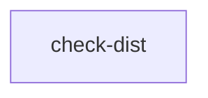

# Check dist

```text
Pipeline: Check dist
Source: tests/fixtures/checkout_check_dist.yml (GitHub Actions)

AT A GLANCE
This workflow runs on pushes to `main`, pull requests, and manual dispatch.
It contains 1 job, with no job dependencies, so GitHub may run them in parallel.

WHEN IT RUNS
- Runs on every push to main branch; excluding paths **.md
- Runs on every pull request excluding paths **.md
- Can be triggered manually

EXECUTION SUMMARY
Independent jobs (no dependencies): check-dist

IMPLEMENTATION DETAILS
1. check-dist — runs on ubuntu-latest; 6 steps
   - actions/checkout@v7
   - Set Node.js 24.x
   - Install dependencies
   - Rebuild the index.js file
   - Compare the expected and actual dist/ directories
   - actions/upload-artifact@v7
```

## Pipeline Diagram


