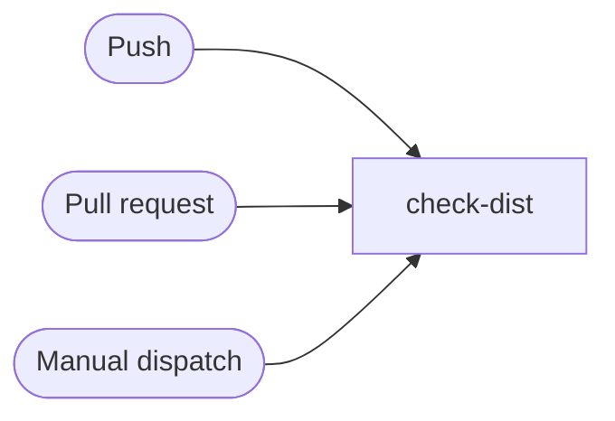

# Check dist

```text
Pipeline: Check dist
Source: tests/fixtures/checkout_check_dist.yml (GitHub Actions)

TRIGGERS
- Runs on every push to main branch; excluding paths **.md
- Runs on every pull request excluding paths **.md
- Can be triggered manually

JOBS (in order)
1. check-dist — runs on ubuntu-latest; 6 steps
```

## Pipeline Diagram


