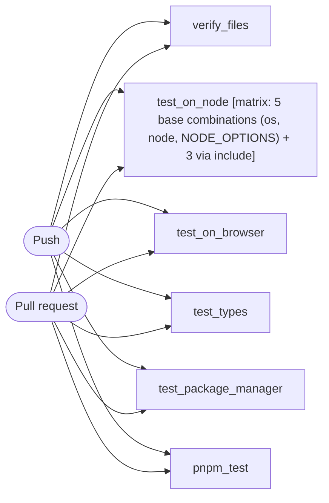

# CI

```text
Pipeline: CI
Source: tests/fixtures/eslint_ci.yml (GitHub Actions)

TRIGGERS
- Runs on every push to main branch
- Runs on every pull request targeting main branch

JOBS (in order)
1. verify_files — runs on ubuntu-latest; 14 steps
2. test_on_node — runs on ${{ matrix.os }}; 6 steps; matrix: 5 base combinations (os, node, NODE_OPTIONS) + 3 via include
3. test_on_browser — runs on ubuntu-latest; 5 steps
4. test_types — runs on ubuntu-latest; 9 steps
5. test_package_manager — 0 steps
6. pnpm_test — runs on ubuntu-latest; 4 steps

LINKED WORKFLOWS
- calls eslint/workflows/.github/workflows/ci-package-manager.yml@main
```

## Pipeline Diagram


