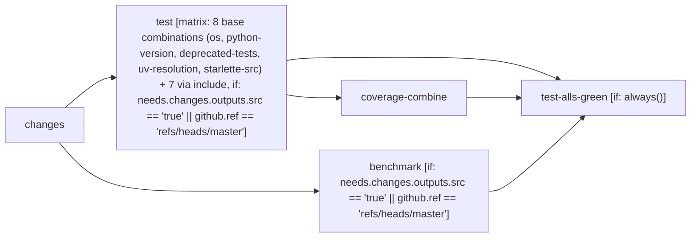

# Test

```text
Pipeline: Test
Source: tests/fixtures/fastapi_test.yml (GitHub Actions)
Permissions: none (all permissions explicitly disabled)

AT A GLANCE
This workflow runs on pushes to `master`, pull requests, and a scheduled run (cron `0 0 * * 1`).
It contains 5 jobs: 1 with no declared dependencies, 4 depending on other jobs.
1 of 5 jobs use a build matrix.

WHEN IT RUNS
- Runs on every push to master branch
- Runs on every pull request
- Runs on a schedule (0 0 * * 1)

EXECUTION SUMMARY
Independent jobs (no dependencies): changes
test runs after changes
benchmark runs after changes
coverage-combine runs after test
test-alls-green runs after test, coverage-combine, benchmark

IMPLEMENTATION DETAILS
1. changes — runs on ubuntu-latest; 2 steps; permissions: pull-requests: read
   - actions/checkout
   - dorny/paths-filter
2. test — runs on ${{ matrix.os }}; 13 steps; matrix: 8 base combinations (os, python-version, deprecated-tests, uv-resolution, starlette-src) + 7 via include; after changes; condition: needs.changes.outputs.src == 'true' || github.ref == 'refs/heads/master'
   - Dump GitHub context
   - actions/checkout
   - Set up Python
   - Setup uv
   - Install Dependencies
   - Ensure that we have the lowest supported Pydantic version
   - Install Starlette from source
   - Install deprecated libraries just for testing
   - Uninstall httpx2 to run tests with httpx
   - Reinstall SQLAlchemy without Cython extensions
   - ... and 3 more steps
3. benchmark — runs on ubuntu-latest; 6 steps; after changes; condition: needs.changes.outputs.src == 'true' || github.ref == 'refs/heads/master'
   - Dump GitHub context
   - actions/checkout
   - Set up Python
   - Setup uv
   - Install Dependencies
   - CodSpeed benchmarks
4. coverage-combine — runs on ubuntu-latest; 11 steps; after test
   - Dump GitHub context
   - actions/checkout
   - actions/setup-python
   - Setup uv
   - Install Dependencies
   - Get coverage files
   - ls -la coverage
   - uv run coverage combine coverage
   - uv run coverage html --title "Coverage for ${{ github.sha }}"
   - Store coverage HTML
   - ... and 1 more step
5. test-alls-green — runs on ubuntu-latest; 2 steps; after test, coverage-combine, benchmark; condition: always()
   - Dump GitHub context
   - Decide whether the needed jobs succeeded or failed
```

## Pipeline Diagram


