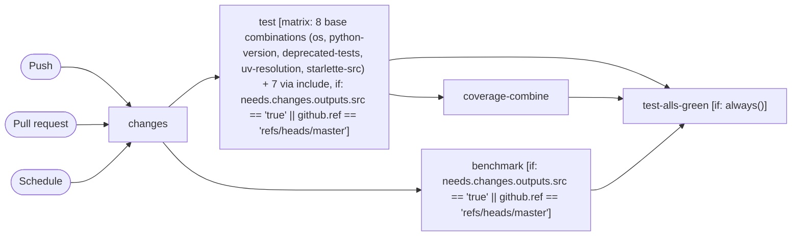

# Test

```text
Pipeline: Test
Source: tests/fixtures/fastapi_test.yml (GitHub Actions)

TRIGGERS
- Runs on every push to master branch
- Runs on every pull request
- Runs on a schedule (0 0 * * 1)

JOBS (in order)
1. changes — runs on ubuntu-latest; 2 steps
2. test — runs on ${{ matrix.os }}; 13 steps; matrix: 8 base combinations (os, python-version, deprecated-tests, uv-resolution, starlette-src) + 7 via include; after changes; condition: needs.changes.outputs.src == 'true' || github.ref == 'refs/heads/master'
3. benchmark — runs on ubuntu-latest; 6 steps; after changes; condition: needs.changes.outputs.src == 'true' || github.ref == 'refs/heads/master'
4. coverage-combine — runs on ubuntu-latest; 11 steps; after test
5. test-alls-green — runs on ubuntu-latest; 2 steps; after test, coverage-combine, benchmark; condition: always()
```

## Pipeline Diagram


