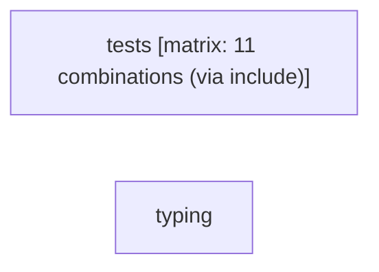

# Tests

```text
Pipeline: Tests
Source: tests/fixtures/flask_tests.yml (GitHub Actions)
Permissions: none (all permissions explicitly disabled)
Concurrency: group ${{ github.workflow }}-${{ github.event.pull_request.number || github.ref }}; cancels in-progress runs

AT A GLANCE
This workflow runs on pull requests and pushes to `main`, `stable`.
It contains 2 jobs, with no job dependencies, so GitHub may run them in parallel.
1 of 2 jobs use a build matrix; together these define 11 configured combinations.

WHEN IT RUNS
- Runs on every pull request excluding paths docs/** or README.md
- Runs on every push to main or stable branches; excluding paths docs/** or README.md

EXECUTION SUMMARY
Independent jobs (no dependencies): tests, typing

IMPLEMENTATION DETAILS
1. tests — runs on ${{ matrix.os || 'ubuntu-latest' }}; 4 steps; matrix: 11 combinations (via include)
   - actions/checkout
   - astral-sh/setup-uv
   - actions/setup-python
   - uv run --locked --no-default-groups --group dev tox run
2. typing — runs on ubuntu-latest; 5 steps
   - actions/checkout
   - astral-sh/setup-uv
   - actions/setup-python
   - cache mypy
   - uv run --locked --no-default-groups --group dev tox run -e typing
```

## Pipeline Diagram


