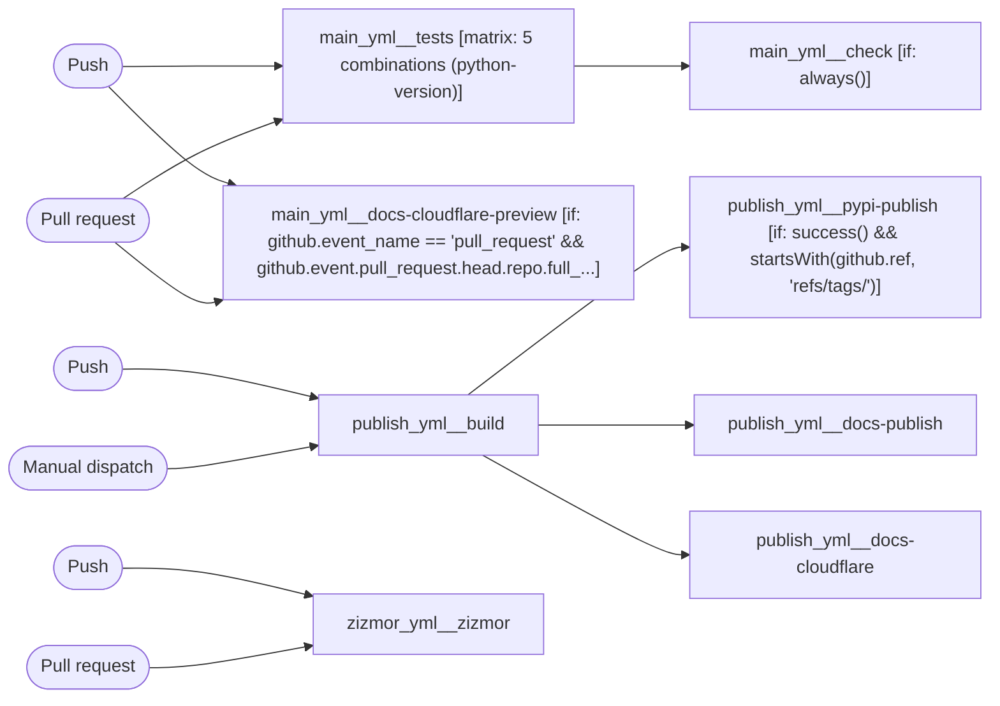

# starlette (unified CI documentation)

```text
Pipeline: starlette (unified CI documentation)
Source: tests/fixtures/multi/starlette/.github/workflows (GitHub Actions)

TRIGGERS
- Runs on every push to main branch
- Runs on every pull request targeting main branch
- Runs on every push with tag matching *
- Can be triggered manually
- Runs on every push to main branch
- Runs on every pull request targeting ** branch

JOBS (in order)
1. main_yml__tests — runs on ubuntu-latest; 7 steps; matrix: 5 combinations (python-version)
   - actions/checkout
   - Install uv
   - Install dependencies
   - Run linting checks
   - Build package & docs
   - Run tests
   - Enforce coverage
2. main_yml__check — runs on ubuntu-latest; 1 step; after main_yml__tests; condition: always()
   - Decide whether the needed jobs succeeded or failed
3. main_yml__docs-cloudflare-preview — runs on ubuntu-latest; 6 steps; condition: github.event_name == 'pull_request' && github.event.pull_request.head.repo.full_name == github.repository; permissions: contents: read, pull-requests: write
   - actions/checkout
   - Install uv
   - Install dependencies
   - Build docs
   - cloudflare/wrangler-action
   - Comment preview URL
4. publish_yml__build — runs on ubuntu-latest; 6 steps
   - actions/checkout
   - Install uv
   - Install dependencies
   - Build package & docs
   - Upload package distributions
   - Upload documentation
5. publish_yml__pypi-publish — runs on ubuntu-latest; 2 steps; after publish_yml__build; condition: success() && startsWith(github.ref, 'refs/tags/'); permissions: id-token: write
   - Download artifacts
   - Publish distribution 📦 to PyPI
6. publish_yml__docs-publish — runs on ubuntu-latest; 4 steps; after publish_yml__build; permissions: contents: read, pages: write, id-token: write
   - Configure GitHub Pages
   - Download artifacts
   - Upload Pages artifact
   - Deploy to GitHub Pages
7. publish_yml__docs-cloudflare — runs on ubuntu-latest; 3 steps; after publish_yml__build
   - actions/checkout
   - Download artifacts
   - cloudflare/wrangler-action
8. zizmor_yml__zizmor — runs on ubuntu-latest; 2 steps; permissions: security-events: write
   - Checkout repository
   - Run zizmor 🌈

SECRETS REQUIRED
- CLOUDFLARE_API_TOKEN (used in job: main_yml__docs-cloudflare-preview)
- CLOUDFLARE_API_TOKEN (used in job: main_yml__docs-cloudflare-preview, step: cloudflare/wrangler-action)
- CLOUDFLARE_ACCOUNT_ID (used in job: main_yml__docs-cloudflare-preview, step: cloudflare/wrangler-action)
- CLOUDFLARE_API_TOKEN (used in job: publish_yml__docs-cloudflare, step: cloudflare/wrangler-action)
- CLOUDFLARE_ACCOUNT_ID (used in job: publish_yml__docs-cloudflare, step: cloudflare/wrangler-action)
```

## Pipeline Diagram


