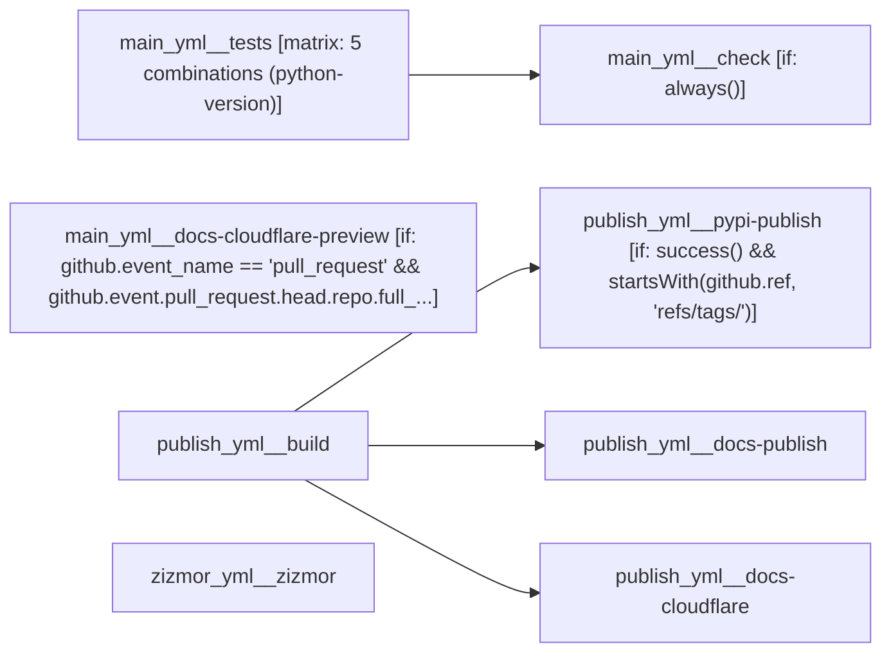

# starlette (unified CI documentation)

```text
Pipeline: starlette (unified CI documentation)
Source: tests/fixtures/multi/starlette/.github/workflows (GitHub Actions)

AT A GLANCE
This workflow runs on pushes to `main`, pull requests, pushes, and manual dispatch.
It contains 8 jobs: 4 with no declared dependencies, 4 depending on other jobs.
1 of 8 jobs use a build matrix; together these define 5 configured combinations.

WHEN IT RUNS
- Runs on every push to main branch
- Runs on every pull request targeting main branch
- Runs on every push with tag matching *
- Can be triggered manually
- Runs on every push to main branch
- Runs on every pull request targeting ** branch

EXECUTION SUMMARY
Independent jobs (no dependencies): main_yml__tests, main_yml__docs-cloudflare-preview, publish_yml__build, zizmor_yml__zizmor
main_yml__check runs after main_yml__tests
publish_yml__pypi-publish runs after publish_yml__build
publish_yml__docs-publish runs after publish_yml__build
publish_yml__docs-cloudflare runs after publish_yml__build

IMPLEMENTATION DETAILS
1. main_yml__tests — runs on ubuntu-latest; 7 steps; matrix: 5 combinations (python-version)
   - actions/checkout (https://github.com/actions/checkout)
   - Install uv (https://github.com/astral-sh/setup-uv)
   - Install dependencies
   - Run linting checks
   - Build package & docs
   - Run tests
   - Enforce coverage
2. main_yml__check — runs on ubuntu-latest; 1 step; after main_yml__tests; condition: always()
   - Decide whether the needed jobs succeeded or failed (https://github.com/re-actors/alls-green)
3. main_yml__docs-cloudflare-preview — runs on ubuntu-latest; 6 steps; condition: github.event_name == 'pull_request' && github.event.pull_request.head.repo.full_name == github.repository; permissions: contents: read, pull-requests: write
   - actions/checkout (https://github.com/actions/checkout)
   - Install uv (https://github.com/astral-sh/setup-uv)
   - Install dependencies
   - Build docs
   - cloudflare/wrangler-action (https://github.com/cloudflare/wrangler-action)
   - Comment preview URL (https://github.com/marocchino/sticky-pull-request-comment)
4. publish_yml__build — runs on ubuntu-latest; 6 steps
   - actions/checkout (https://github.com/actions/checkout)
   - Install uv (https://github.com/astral-sh/setup-uv)
   - Install dependencies
   - Build package & docs
   - Upload package distributions (https://github.com/actions/upload-artifact)
   - Upload documentation (https://github.com/actions/upload-artifact)
5. publish_yml__pypi-publish — runs on ubuntu-latest; 2 steps; after publish_yml__build; condition: success() && startsWith(github.ref, 'refs/tags/'); permissions: id-token: write
   - Download artifacts (https://github.com/actions/download-artifact)
   - Publish distribution 📦 to PyPI (https://github.com/pypa/gh-action-pypi-publish)
6. publish_yml__docs-publish — runs on ubuntu-latest; 4 steps; after publish_yml__build; permissions: contents: read, pages: write, id-token: write
   - Configure GitHub Pages (https://github.com/actions/configure-pages)
   - Download artifacts (https://github.com/actions/download-artifact)
   - Upload Pages artifact (https://github.com/actions/upload-pages-artifact)
   - Deploy to GitHub Pages (https://github.com/actions/deploy-pages)
7. publish_yml__docs-cloudflare — runs on ubuntu-latest; 3 steps; after publish_yml__build
   - actions/checkout (https://github.com/actions/checkout)
   - Download artifacts (https://github.com/actions/download-artifact)
   - cloudflare/wrangler-action (https://github.com/cloudflare/wrangler-action)
8. zizmor_yml__zizmor — runs on ubuntu-latest; 2 steps; permissions: security-events: write
   - Checkout repository (https://github.com/actions/checkout)
   - Run zizmor 🌈 (https://github.com/zizmorcore/zizmor-action)

SECRETS REQUIRED
- CLOUDFLARE_API_TOKEN (used in job: main_yml__docs-cloudflare-preview)
- CLOUDFLARE_API_TOKEN (used in job: main_yml__docs-cloudflare-preview, step: cloudflare/wrangler-action)
- CLOUDFLARE_ACCOUNT_ID (used in job: main_yml__docs-cloudflare-preview, step: cloudflare/wrangler-action)
- CLOUDFLARE_API_TOKEN (used in job: publish_yml__docs-cloudflare, step: cloudflare/wrangler-action)
- CLOUDFLARE_ACCOUNT_ID (used in job: publish_yml__docs-cloudflare, step: cloudflare/wrangler-action)
```

## Pipeline Diagram



## Workflow Relationships

| Workflow file | Runs when | Job behaviour | Relationship |
| --- | --- | --- | --- |
| main_yml | pushes to `main` and pull requests | 3 jobs, 2 independent | independent |
| publish_yml | pushes and manual dispatch | 4 jobs, 1 independent | independent |
| zizmor_yml | pushes to `main` and pull requests | 1 job, 1 independent | independent |

Some workflow files share the exact same trigger. GitHub Actions gives no ordering between separately-triggered workflow runs — these run independently of each other, not in sequence, even though they fire on the same event:

- pushes to `main`: main_yml, zizmor_yml

