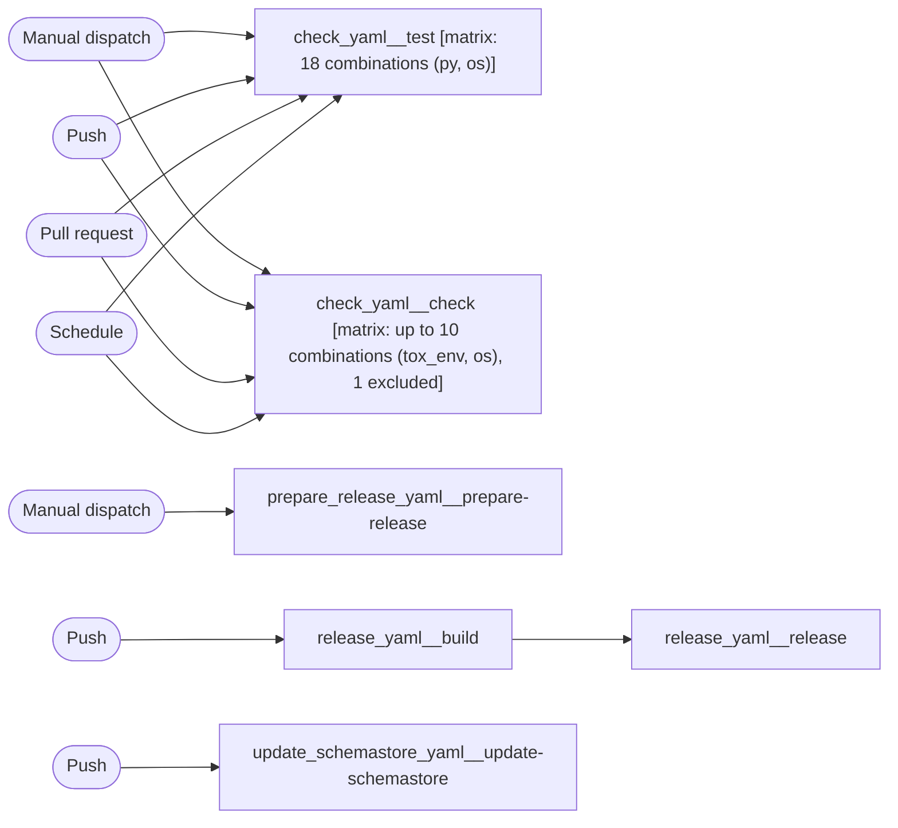

# tox (unified CI documentation)

```text
Pipeline: tox (unified CI documentation)
Source: tests/fixtures/multi/tox/.github/workflows (GitHub Actions)

TRIGGERS
- Can be triggered manually
- Runs on every push to main branch; excluding tags matching **
- Runs on every pull request
- Runs on a schedule (0 8 * * *)
- Can be triggered manually — inputs: bump
- Runs on every push with tag matching *
- Runs on every push with tag matching *

JOBS (in order)
1. check_yaml__test — runs on ${{ matrix.os.image }}; 7 steps; matrix: 18 combinations (py, os)
   - actions/checkout
   - Install the latest version of uv
   - Cache wheel downloads
   - Add .local/bin to Windows PATH
   - Install tox@self
   - Setup test suite
   - Run test suite
2. check_yaml__check — runs on ${{ matrix.os.image }}; 8 steps; matrix: up to 10 combinations (tox_env, os), 1 excluded
   - actions/checkout
   - Install the latest version of uv
   - Cache wheel downloads
   - Add .local/bin to Windows PATH
   - Install tox@self
   - Install Python 3.10 for type-min
   - Setup check suite
   - Run check for ${{ matrix.tox_env }}
3. prepare_release_yaml__prepare-release — runs on ubuntu-24.04; 8 steps; permissions: contents: write; deployment environment: release-auth
   - actions/checkout
   - Install the latest version of uv
   - Configure git
   - Set up remote tracking
   - Calculate next version
   - Install tox
   - Run release process
   - Display completion message
4. release_yaml__build — runs on ubuntu-24.04; 4 steps
   - actions/checkout
   - Install the latest version of uv
   - Build package
   - Store the distribution packages
5. release_yaml__release — runs on ubuntu-24.04; 2 steps; after release_yaml__build; permissions: id-token: write
   - Download all the dists
   - Publish to PyPI
6. update_schemastore_yaml__update-schemastore — runs on ubuntu-24.04; 7 steps; deployment environment: schemastore
   - actions/checkout
   - Fork and clone SchemaStore
   - Sync fork's master with upstream
   - Create or reset branch from synced fork
   - Update schema and check for changes
   - Commit and push
   - Create or update pull request

SECRETS REQUIRED
- GITHUB_TOKEN (used in job: check_yaml__test, step: Install the latest version of uv)
- GITHUB_TOKEN (used in job: check_yaml__check, step: Install the latest version of uv)
- RELEASE_PAT (used in job: prepare_release_yaml__prepare-release, step: actions/checkout)
- GITHUB_TOKEN (used in job: prepare_release_yaml__prepare-release, step: Install the latest version of uv)
- RELEASE_PAT (used in job: prepare_release_yaml__prepare-release, step: Run release process)
- GITHUB_TOKEN (used in job: release_yaml__build, step: Install the latest version of uv)
- SCHEMASTORE_TOKEN (used in job: update_schemastore_yaml__update-schemastore)
```

## Pipeline Diagram


