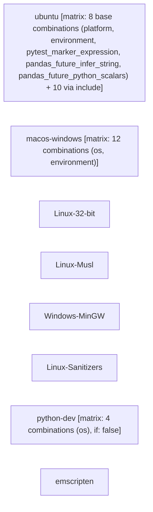

# Unit Tests

```text
Pipeline: Unit Tests
Source: tests/fixtures/pandas_unit_tests.yml (GitHub Actions)
Permissions: none (all permissions explicitly disabled)

AT A GLANCE
This workflow runs on pushes to `main`, `3.0.x` and pull requests.
It contains 8 jobs, with no job dependencies, so GitHub may run them in parallel.
3 of 8 jobs use a build matrix; 2 of them define 16 configured combinations between them (1 more job's matrix size not reflected in that total).

WHEN IT RUNS
- Runs on every push to main or 3.0.x branches
- Runs on every pull request targeting main or 3.0.x branches; excluding paths doc/** or web/**

EXECUTION SUMMARY
Independent jobs (no dependencies): ubuntu, macos-windows, Linux-32-bit, Linux-Musl, Windows-MinGW, Linux-Sanitizers, python-dev, emscripten

IMPLEMENTATION DETAILS
1. ubuntu — runs on ${{ matrix.platform }}; 8 steps; matrix: 8 base combinations (platform, environment, pytest_marker_expression, pandas_future_infer_string, pandas_future_python_scalars) + 10 via include; permissions: contents: read; concurrency: group ${{ github.event_name == 'push' && github.run_number || github.ref }}-${{ matrix.environment }}-${{ matrix.pytest_marker_expression }}-${{ matrix.extra_apt || '' }}-${{ matrix.pandas_future_infer_string }}-${{ matrix.platform }}; cancels in-progress runs
   - Checkout
   - Generate extra locales
   - Create virtual environment with Pixi
   - Build pandas
   - Import check
   - Test (not single_cpu)
   - Test (single_cpu)
   - Upload test coverage to Codecov
2. macos-windows — runs on ${{ matrix.os }}; 5 steps; matrix: 12 combinations (os, environment); permissions: contents: read; concurrency: group ${{ github.event_name == 'push' && github.run_number || github.ref }}-${{ matrix.environment }}-${{ matrix.os }}; cancels in-progress runs
   - Checkout
   - Create virtual environment with Pixi
   - Remove link.EXE for Windows
   - Build pandas
   - Test
3. Linux-32-bit — runs on ubuntu-24.04; 3 steps; permissions: contents: read; concurrency: group ${{ github.event_name == 'push' && github.run_number || github.ref }}-32bit; cancels in-progress runs
   - Checkout pandas Repo
   - Build environment
   - Run Tests
4. Linux-Musl — runs on ubuntu-24.04; 4 steps; permissions: contents: read; concurrency: group ${{ github.event_name == 'push' && github.run_number || github.ref }}-musl; cancels in-progress runs
   - Checkout pandas Repo
   - Configure System Packages
   - Build environment
   - Run Tests
5. Windows-MinGW — runs on windows-2025; 3 steps; permissions: contents: read; concurrency: group ${{ github.event_name == 'push' && github.run_number || github.ref }}-mingw; cancels in-progress runs
   - Checkout
   - Create virtual environment with Pixi
   - Build pandas
6. Linux-Sanitizers — runs on ubuntu-24.04; 5 steps; permissions: contents: read; concurrency: group ${{ github.event_name == 'push' && github.run_number || github.ref }}-sanitizers; cancels in-progress runs
   - Checkout
   - Create virtual environment with Pixi
   - Build pandas
   - Get Sanitizer Path
   - Test
7. python-dev — runs on ${{ matrix.os }}; 4 steps; matrix: 4 combinations (os); condition: false; permissions: contents: read; concurrency: group ${{ github.event_name == 'push' && github.run_number || github.ref }}-${{ matrix.os }}-python-dev; cancels in-progress runs
   - actions/checkout
   - Set up Python Dev Version
   - Build Environment
   - Run Tests
8. emscripten — runs on ubuntu-24.04; 8 steps; permissions: contents: read; concurrency: group ${{ github.event_name == 'push' && github.run_number || github.ref }}-wasm; cancels in-progress runs
   - Checkout pandas Repo
   - Set up Node.js
   - Set up Python
   - Save Emscripten version
   - Set up Emscripten toolchain
   - Build pandas for Pyodide
   - Set up Pyodide virtual environment
   - Test pandas for Pyodide

SECRETS REQUIRED
- CODECOV_TOKEN (used in job: ubuntu, step: Upload test coverage to Codecov)
```

## Pipeline Diagram


