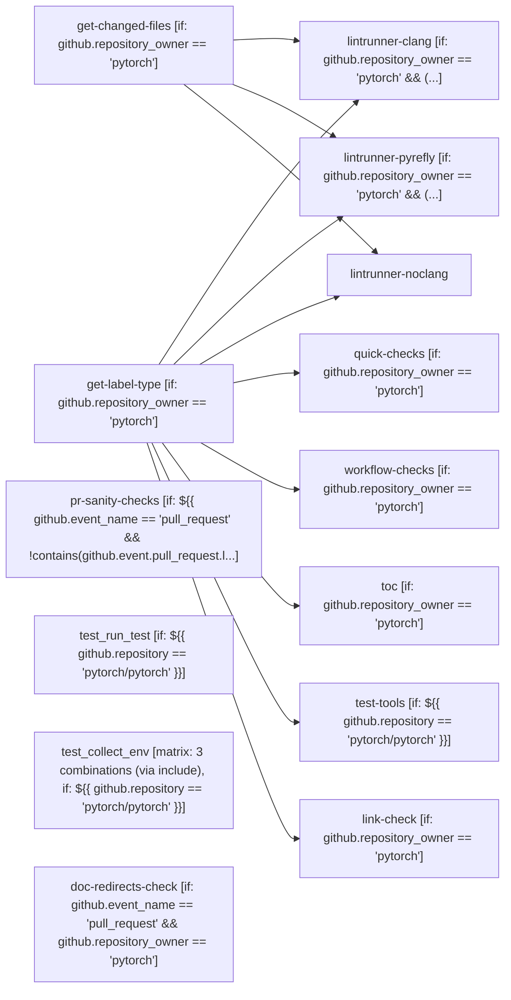

# Lint

```text
Pipeline: Lint
Source: tests/fixtures/pytorch_lint.yml (GitHub Actions)
Permissions: read-all
Concurrency: group ${{ github.workflow }}-${{ github.event.pull_request.number || github.sha }}-${{ github.event_name == 'workflow_dispatch' && github.run_id }}; cancels in-progress runs

AT A GLANCE
This workflow runs on pull requests, pushes to `main`, `release/*`, `landchecks/*`, and manual dispatch.
It contains 14 jobs: 6 with no declared dependencies, 8 depending on other jobs.
1 of 14 jobs use a build matrix; together these define 3 configured combinations.

WHEN IT RUNS
- Runs on every pull request except branch nightly
- Runs on every push to main or release/* or landchecks/* branches; with tag matching ciflow/pull/* or ciflow/trunk/*
- Can be triggered manually

EXECUTION SUMMARY
Independent jobs (no dependencies): get-label-type, get-changed-files, pr-sanity-checks, test_run_test, test_collect_env, doc-redirects-check
lintrunner-clang runs after get-label-type, get-changed-files
lintrunner-pyrefly runs after get-label-type, get-changed-files
lintrunner-noclang runs after get-label-type, get-changed-files
quick-checks runs after get-label-type
workflow-checks runs after get-label-type
toc runs after get-label-type
test-tools runs after get-label-type
link-check runs after get-label-type

IMPLEMENTATION DETAILS
1. get-label-type — delegates to reusable workflow pytorch/pytorch/.github/workflows/_runner-determinator.yml@main; with: triggering_actor: ${{ github.triggering_actor }}, issue_owner: ${{ github.event.pull_request.user.login || github.event.issue.user.login }}, curr_branch: ${{ github.head_ref || github.ref_name }}; condition: github.repository_owner == 'pytorch'
2. get-changed-files — delegates to reusable workflow ./.github/workflows/_get-changed-files.yml; with: all_files: ${{ contains(github.event.pull_request.labels.*.name, 'lint-all-files') || contains(github.event.pull_request.labels.*.name, 'Reverted') || github.event_name == 'push' }}; condition: github.repository_owner == 'pytorch'
3. lintrunner-clang — delegates to reusable workflow ./.github/workflows/_lint.yml; with: runner: mt-l-x86iamx-8-16, docker-image: 308535385114.dkr.ecr.us-east-1.amazonaws.com/pytorch/ci-image:pytorch-linux-jammy-cuda13.0-cudnn9-py3.10-linter-${{ needs.get-label-type.outputs.ci-docker-hash }}, script: CHANGED_FILES="${{ needs.get-changed-files.outputs.changed-files }}"
if [ "$CHANGED_FILES" = "*" ]; then
  export ADDITIONAL_LINTRUNNER_ARGS="--take CLANGTIDY,CLANGFORMAT --all-files"
else
  export ADDITIONAL_LINTRUNNER_ARGS="--take CLANGTIDY,CLANGFORMAT $CHANGED_FILES"
fi
export CLANG=1
# Cap parallelism to the pod's CPU budget; os.cpu_count() overcounts on k8s and OOMs.
export MAX_JOBS="$(nproc --ignore=2)"
.github/scripts/lintrunner.sh; after get-label-type, get-changed-files; condition: github.repository_owner == 'pytorch' && (
  needs.get-changed-files.outputs.changed-files == '*' ||
  contains(needs.get-changed-files.outputs.changed-files, '.h') ||
  contains(needs.get-changed-files.outputs.changed-files, '.cpp') ||
  contains(needs.get-changed-files.outputs.changed-files, '.cc') ||
  contains(needs.get-changed-files.outputs.changed-files, '.cxx') ||
  contains(needs.get-changed-files.outputs.changed-files, '.hpp') ||
  contains(needs.get-changed-files.outputs.changed-files, '.hxx') ||
  contains(needs.get-changed-files.outputs.changed-files, '.cu') ||
  contains(needs.get-changed-files.outputs.changed-files, '.cuh') ||
  contains(needs.get-changed-files.outputs.changed-files, '.mm') ||
  contains(needs.get-changed-files.outputs.changed-files, '.metal')
)

4. lintrunner-pyrefly — delegates to reusable workflow ./.github/workflows/_lint.yml; with: runner: mt-l-x86iamx-8-16, docker-image: 308535385114.dkr.ecr.us-east-1.amazonaws.com/pytorch/ci-image:pytorch-linux-jammy-linter-${{ needs.get-label-type.outputs.ci-docker-hash }}, script: CHANGED_FILES="${{ needs.get-changed-files.outputs.changed-files }}"
echo "Running pyrefly"
ADDITIONAL_LINTRUNNER_ARGS="--take PYREFLY --all-files" .github/scripts/lintrunner.sh; after get-label-type, get-changed-files; condition: github.repository_owner == 'pytorch' && (
  needs.get-changed-files.outputs.changed-files == '*' ||
  contains(needs.get-changed-files.outputs.changed-files, '.py') ||
  contains(needs.get-changed-files.outputs.changed-files, '.pyi')
)

5. lintrunner-noclang — delegates to reusable workflow ./.github/workflows/_lint.yml; with: runner: mt-l-x86iamx-8-16, docker-image: 308535385114.dkr.ecr.us-east-1.amazonaws.com/pytorch/ci-image:pytorch-linux-jammy-linter-${{ needs.get-label-type.outputs.ci-docker-hash }}, script: CHANGED_FILES="${{ needs.get-changed-files.outputs.changed-files }}"
echo "Running all other linters"
# Cap parallelism to the pod's CPU budget; os.cpu_count() overcounts on k8s and OOMs.
export MAX_JOBS="$(nproc --ignore=2)"
if [ "$CHANGED_FILES" = '*' ]; then
  ADDITIONAL_LINTRUNNER_ARGS="--skip CLANGTIDY,CLANGTIDY_EXECUTORCH_COMPATIBILITY,CLANGFORMAT,PYREFLY --all-files" .github/scripts/lintrunner.sh
else
  ADDITIONAL_LINTRUNNER_ARGS="--skip CLANGTIDY,CLANGTIDY_EXECUTORCH_COMPATIBILITY,CLANGFORMAT,PYREFLY ${CHANGED_FILES}" .github/scripts/lintrunner.sh
fi; after get-label-type, get-changed-files
6. quick-checks — delegates to reusable workflow ./.github/workflows/_lint.yml; with: runner: mt-l-x86iamx-8-16, docker-image: 308535385114.dkr.ecr.us-east-1.amazonaws.com/pytorch/ci-image:pytorch-linux-jammy-linter-${{ needs.get-label-type.outputs.ci-docker-hash }}, script: # Ensure no non-breaking spaces
# NB: We use 'printf' below rather than '\u000a' since bash pre-4.2
# does not support the '\u000a' syntax (which is relevant for local linters)
(! git --no-pager grep -In "$(printf '\xC2\xA0')" -- . || (echo "The above lines have non-breaking spaces (U+00A0); please convert them to spaces (U+0020)"; false))

# Ensure cross-OS compatible file names
(! git ls-files | grep -E '([<>:"|?*]|[ .]$)' || (echo "The above file names are not valid across all operating systems. Please ensure they don't contain the characters '<>:""|?*' and don't end with a white space or a '.' "; false))

# Ensure no versionless Python shebangs
(! git --no-pager grep -In '#!.*python$' -- . || (echo "The above lines have versionless Python shebangs; please specify either python2 or python3"; false))

# Ensure ciflow tags mentioned in config
python3 .github/scripts/collect_ciflow_labels.py --validate-tags

# C++ docs check
pushd docs/cpp/source
./check-doxygen.sh
popd

# CUDA kernel launch check
set -eux
python3 torch/testing/_internal/check_kernel_launches.py |& tee cuda_kernel_launch_checks.txt; after get-label-type; condition: github.repository_owner == 'pytorch'
7. pr-sanity-checks — runs on linux.24_04.4x; 2 steps; condition: ${{ github.event_name == 'pull_request' && !contains(github.event.pull_request.labels.*.name, 'skip-pr-sanity-checks') && github.repository_owner == 'pytorch' }}
   - Checkout PyTorch
   - PR size check (nonretryable)
8. workflow-checks — delegates to reusable workflow ./.github/workflows/_lint.yml; with: runner: mt-l-x86iamx-8-16, docker-image: 308535385114.dkr.ecr.us-east-1.amazonaws.com/pytorch/ci-image:pytorch-linux-jammy-linter-${{ needs.get-label-type.outputs.ci-docker-hash }}, script: # Regenerate workflows
.github/scripts/generate_ci_workflows.py

RC=0
# Assert that regenerating the workflows didn't change them
if ! .github/scripts/report_git_status.sh .github/workflows; then
  echo
  echo 'As shown by the above diff, the committed .github/workflows'
  echo 'are not up to date according to .github/templates.'
  echo 'Please run this command, commit, and push again to your PR:'
  echo
  echo '    .github/scripts/generate_ci_workflows.py'
  echo
  echo 'If running that command does nothing, you may need to rebase'
  echo 'onto a more recent commit from the PyTorch main branch.'
  RC=1
fi

# Check that jobs will be cancelled
.github/scripts/ensure_actions_will_cancel.py

exit $RC; after get-label-type; condition: github.repository_owner == 'pytorch'
9. toc — delegates to reusable workflow ./.github/workflows/_lint.yml; with: runner: mt-l-x86iamx-8-16, docker-image: 308535385114.dkr.ecr.us-east-1.amazonaws.com/pytorch/ci-image:pytorch-linux-jammy-linter-${{ needs.get-label-type.outputs.ci-docker-hash }}, script: # Regenerate ToCs and check that they didn't change
set -eu

export PATH=~/.npm-global/bin:"$PATH"
for FILE in $(git grep -Il '<!-- toc -->' -- '**.md'); do
  markdown-toc --bullets='-' -i "$FILE"
done

if ! .github/scripts/report_git_status.sh .; then
  echo
  echo 'As shown by the above diff, the table of contents in one or'
  echo 'more Markdown files is not up to date with the file contents.'
  echo 'You can either apply that Git diff directly to correct the'
  echo 'table of contents, or if you have npm installed, you can'
  echo 'install the npm package markdown-toc and run the following'
  # shellcheck disable=SC2016
  echo 'command (replacing $FILE with the filename for which you want'
  echo 'to regenerate the table of contents):'
  echo
  # shellcheck disable=SC2016
  echo "    markdown-toc --bullets='-' -i \"\$FILE\""
  false
fi; after get-label-type; condition: github.repository_owner == 'pytorch'
10. test-tools — delegates to reusable workflow ./.github/workflows/_lint.yml; with: runner: mt-l-x86iamx-8-16, docker-image: 308535385114.dkr.ecr.us-east-1.amazonaws.com/pytorch/ci-image:pytorch-linux-jammy-linter-${{ needs.get-label-type.outputs.ci-docker-hash }}, script: # Test tools
PYTHONPATH=$(pwd) pytest tools/stats
PYTHONPATH=$(pwd) pytest tools/test -o "python_files=test*.py"
PYTHONPATH=$(pwd) pytest .github/scripts -o "python_files=test*.py"; after get-label-type; condition: ${{ github.repository == 'pytorch/pytorch' }}
11. test_run_test — runs on linux.24_04.4x; 4 steps; condition: ${{ github.repository == 'pytorch/pytorch' }}
   - Checkout PyTorch
   - Setup Python 3.10
   - Install dependencies
   - Run run_test.py (nonretryable)
12. test_collect_env — runs on ${{ matrix.runner }}; 6 steps; matrix: 3 combinations (via include); condition: ${{ github.repository == 'pytorch/pytorch' }}
   - Checkout PyTorch
   - Get min python version
   - Setup Old Python version
   - Setup Min Python version
   - Install torch
   - Run collect_env.py (nonretryable)
13. link-check — delegates to reusable workflow ./.github/workflows/_link_check.yml; with: runner: ${{ needs.get-label-type.outputs.label-type }}, docker-image: 308535385114.dkr.ecr.us-east-1.amazonaws.com/pytorch/ci-image:pytorch-linux-jammy-linter-${{ needs.get-label-type.outputs.ci-docker-hash }}, ref: ${{ github.event_name == 'pull_request' && github.event.pull_request.head.sha || github.sha }}; after get-label-type; condition: github.repository_owner == 'pytorch'
14. doc-redirects-check — runs on linux.24_04.4x; 2 steps; condition: github.event_name == 'pull_request' && github.repository_owner == 'pytorch'
   - Checkout PyTorch
   - Doc redirects check (nonretryable)

LINKED WORKFLOWS
- calls pytorch/pytorch/.github/workflows/_runner-determinator.yml@main
- calls ./.github/workflows/_get-changed-files.yml
- calls ./.github/workflows/_lint.yml
- calls ./.github/workflows/_link_check.yml
```

## Pipeline Diagram


