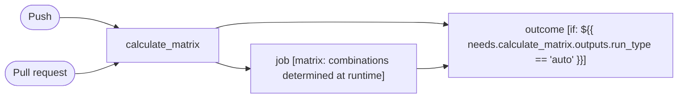

# CI

```text
Pipeline: CI
Source: tests/fixtures/rust_ci.yml (GitHub Actions)

TRIGGERS
- Runs on every push to automation/bors/auto or automation/bors/try or try-perf branches
- Runs on every pull request targeting ** branch

JOBS (in order)
1. calculate_matrix — runs on ubuntu-24.04-arm; 3 steps
2. job — runs on ${{ matrix.os }}; 33 steps; matrix: combinations determined at runtime; after calculate_matrix
3. outcome — runs on ubuntu-24.04; 2 steps; after calculate_matrix, job; condition: ${{ needs.calculate_matrix.outputs.run_type == 'auto' }}

SECRETS REQUIRED
- TOOLSTATE_REPO_ACCESS_TOKEN
- GITHUB_TOKEN (used in job: job)
- CACHES_AWS_ACCESS_KEY_ID (used in job: job.26)
- CACHES_AWS_SECRET_ACCESS_KEY (used in job: job.26)
- ARTIFACTS_AWS_ACCESS_KEY_ID (used in job: job.30)
- ARTIFACTS_AWS_SECRET_ACCESS_KEY (used in job: job.30)
- DATADOG_API_KEY (used in job: job.32)
```

## Pipeline Diagram


