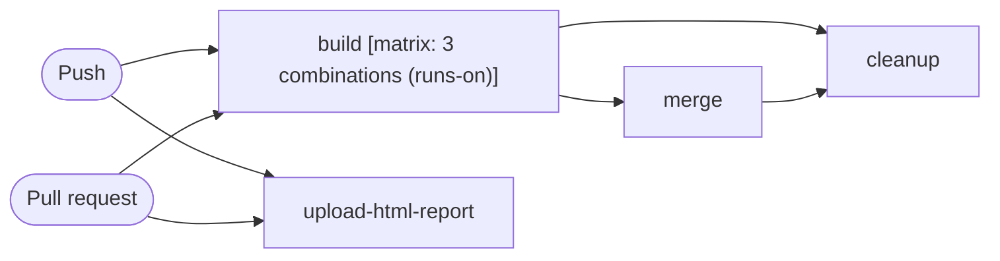

# Test

```text
Pipeline: Test
Source: tests/fixtures/upload_artifact_test.yml (GitHub Actions)

TRIGGERS
- Runs on every push to main branch; excluding paths **.md
- Runs on every pull request excluding paths **.md

JOBS (in order)
1. build — runs on ${{ matrix.runs-on }}; 28 steps; matrix: 3 combinations (runs-on)
2. upload-html-report — runs on ubuntu-latest; 6 steps
3. merge — runs on ubuntu-latest; 7 steps; after build
4. cleanup — runs on ubuntu-latest; 1 step; after build, merge
```

## Pipeline Diagram


