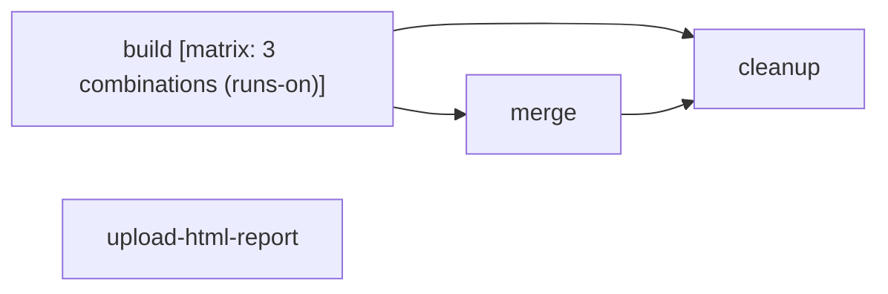

# Test

```text
Pipeline: Test
Source: tests/fixtures/upload_artifact_test.yml (GitHub Actions)
Permissions: contents: read, actions: write

AT A GLANCE
This workflow runs on pushes to `main` and pull requests.
It contains 4 jobs: 2 with no declared dependencies, 2 depending on other jobs.
1 of 4 jobs use a build matrix; together these define 3 configured combinations.

WHEN IT RUNS
- Runs on every push to main branch; excluding paths **.md
- Runs on every pull request excluding paths **.md

EXECUTION SUMMARY
Independent jobs (no dependencies): build, upload-html-report
merge runs after build
cleanup runs after build, merge

IMPLEMENTATION DETAILS
1. build — runs on ${{ matrix.runs-on }}; 28 steps; matrix: 3 combinations (runs-on)
   - Checkout
   - Setup Node 24
   - Install dependencies
   - Compile
   - Lint
   - Format
   - Test
   - Create artifact files
   - Upload artifact #1
   - Upload artifact #2
   - ... and 18 more steps
2. upload-html-report — runs on ubuntu-latest; 6 steps
   - Checkout
   - Setup Node 24
   - Install dependencies
   - Compile
   - Create HTML report
   - Upload HTML report (no archive)
3. merge — runs on ubuntu-latest; 7 steps; after build
   - Checkout
   - Merge all artifacts in run
   - Download merged artifacts
   - Check merged artifact has directories for each artifact
   - Merge all Artifact-A
   - Download merged artifacts
   - Verify merged artifacts
4. cleanup — runs on ubuntu-latest; 1 step; after build, merge
   - Delete test artifacts
```

## Pipeline Diagram


